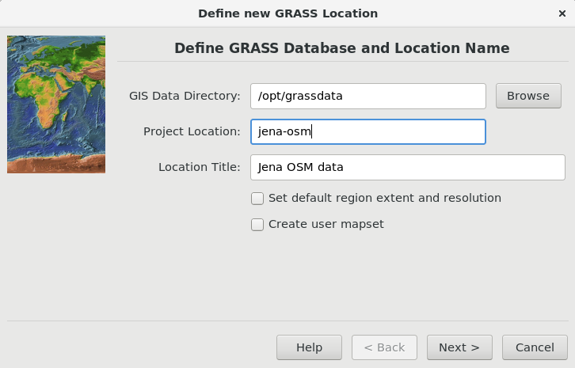
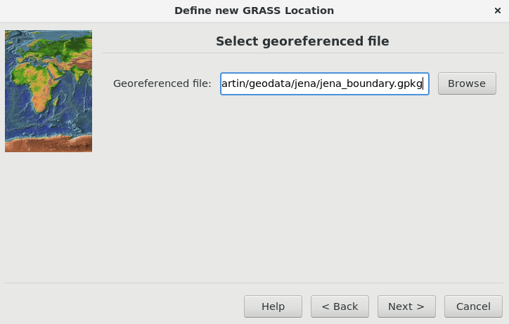
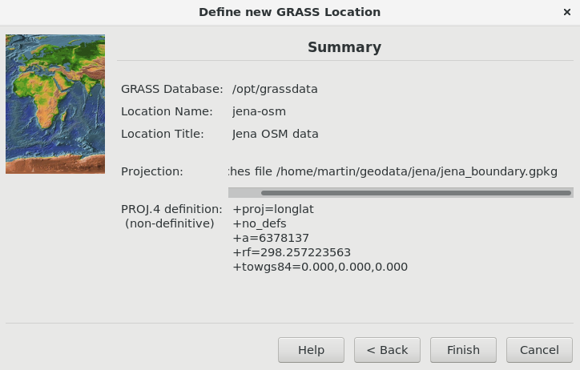
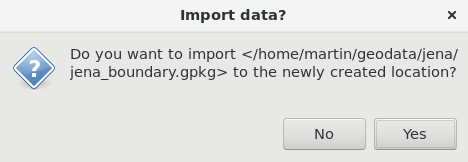
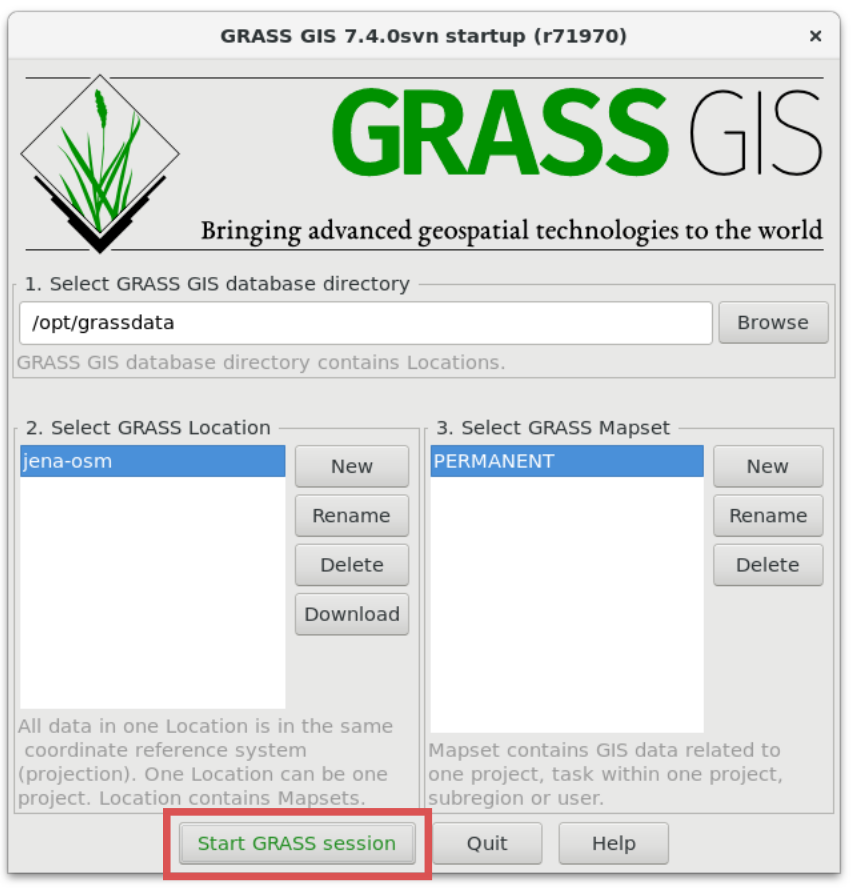
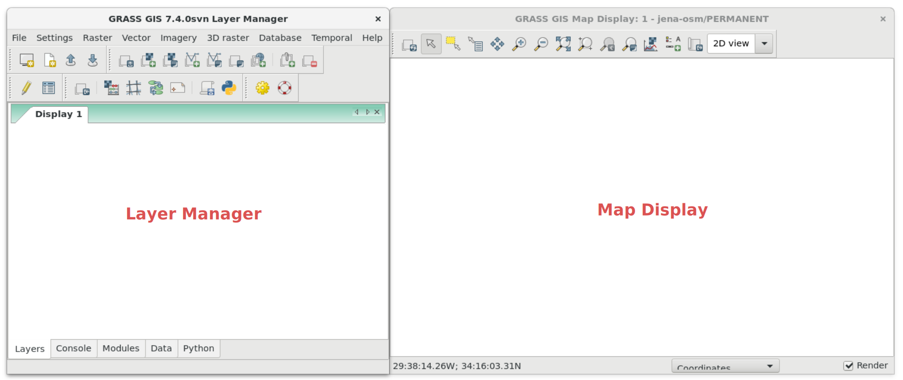
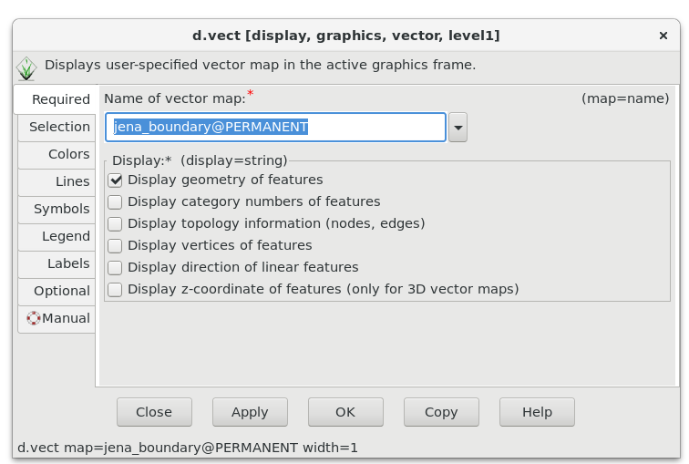
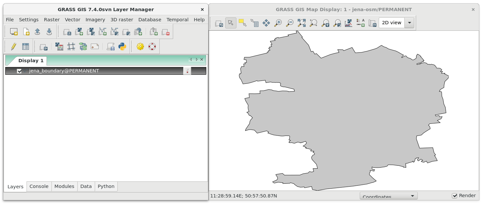
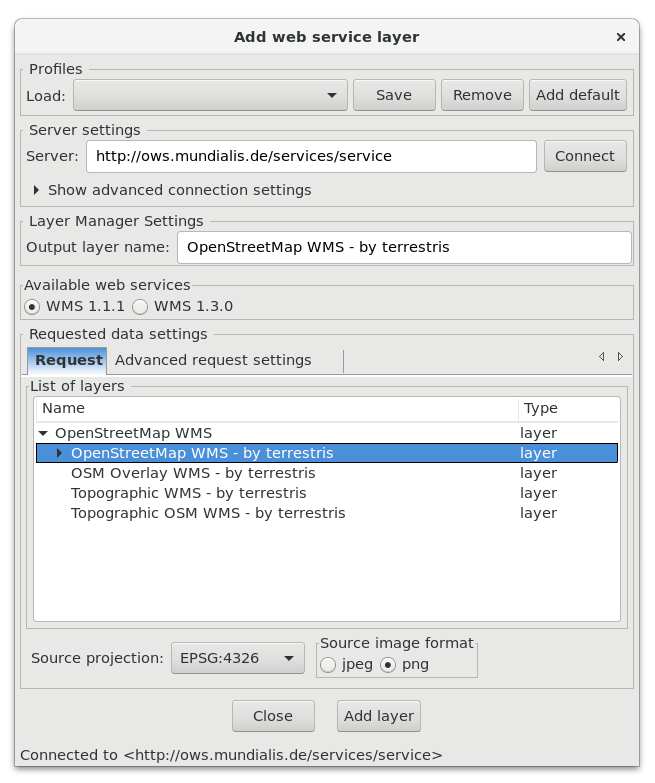
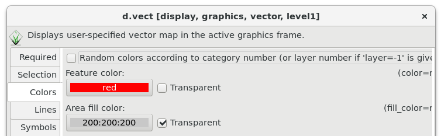

Unit 01 - First steps in GRASS GIS
==================================

About
-----

**GRASS GIS**, commonly referred as GRASS (Geographic Resources
Analysis Support System), is a free and open source Geographic
Information System (GIS) software suite used for geospatial data
management and analysis, image processing, graphics and maps
production, spatial modeling, and visualization. GRASS GIS is
currently used in academic and commercial settings around the world,
as well as by many governmental agencies and environmental consulting
companies. It is a founding member of the Open Source Geospatial
Foundation (OSGeo).

Originally developed by the U.S. Army Construction Engineering
Research Laboratories (USA-CERL, 1982-1995, see history of GRASS
1.0-4.2 and 5beta), a branch of the US Army Corp of Engineers, as a
tool for land management and environmental planning by the military,
GRASS GIS has evolved into a powerful utility with a wide range of
applications in many different areas of applications and scientific
research. (source: http://grass.osgeo.org)

.. youtube:: U3Hf0qI4JLc

   GRASS GIS promo video from 1987.

In Nutshell
-----------

**Advantages**:

* open source, you can use it freely, modify, improve, share
* strong user community, commercial support
* large scale functionality, large amount of tools (2D/3D
  raster/vector, topology, imagery, map production, spatial-temporal
  data, ...)
* both GUI and CMD (easy for scripting)
* Python API and libraries

**Disadvantages** (turning out to be advantages in some cases):

* open source ;-)
* complicated startup
* native format (requires importing data, be aware of possibility of linking external formats)
* topology (not good idea to link external vector formats)

**When to use GRASS GIS?**

* doing data analysis
* working with topological data
* working with spatial-temporal datasets
* doing Python scripting
* deploying server-side applications (e.g. as WPS process)
* *add your point here*
  
**When to use something else?**

* want to display geodata, symbolize, or create map output in easy way
  (use QGIS instead)
* *add your point here*

.. todo:: review, extent

Startup
-------

Starting GRASS GIS requires some user knowledge, the users doesn't
like it ;-) GRASS requires to organize your data from early beginning.

Before entering GRASS a startup screen appears, the user must define
working project in which GRASS session will operate. Without this step
you cannot enter GRASS. This approach is not so common. Applications
like Esri ArcGIS or QGIS just starts. The user loads different data
from various data source in different projects, and starts to work on
his/her project. GRASS is different, which makes this software harder
to enter for newcomers. *We will cross a red border in few steps.*

The GRASS GIS startup screen requires to set up three items:

#. **Database directory.** A directory on local or network disc which
   contains all data accessed by GRASS. It's usually directory called
   :file:`grassdata` located in user's home directory. *This item is set up
   automatically on Windows, so usually you don't need to care.*

#. **Location**. Plays a role of "a project". All geodata stored
   within one location must have the same spatial coordinate system
   (GRASS doesn't support on-the-fly projects).

#. **Mapset** Contains data related to task within one project. Helps
   organizing data into logical groups or to separate parallel work of
   more users on the same project.

.. _startup0:
   
.. figure:: ../images/units/01/startup-0.svg

   GRASS GIS startup screen.

Let's define database directory (:fignote:`1.`). Then a new location
can be created (:fignote:`2a.`) or official GRASS sample location(s)
downloaded (:fignote:`2b.`). We will create our own location, a
project related to Jena region.

Example of downloading Jena administrative boundary from OpenStreetMap
using Overpass API using GDAL library (ogr2ogr utility). Downloaded
data are stored in OGC GeoPackage format (*we don't like old school
Esri Shapefile format*):

.. code:: bash

   ogr2ogr -f GPKG jena_boundary.gpkg -a_srs EPSG:4326 \
   /vsicurl_streaming/"http://overpass-api.de/api/interpreter?data=%28relation\
   %5B%22boundary%22%3D%22administrative%22%5D%5B%22admin%5Flevel%22%3D%226%22%5D%5B%22\
   name%22%3D%22Jena%22%5D%3B%29%3B%28%2E%5F%3B%3E%3B%29%3Bout%3B%0A" multipolygons

.. note::

   The URL has been generated by http://overpass-turbo.eu
   (:menuselection:`Export --> Query --> compact OverpassQL`) using
   the query below:

   .. code:: xml

      (
      relation
      ["boundary"="administrative"]
      ["admin_level"="6"]
      ["name"="Jena"]
      );
      /*added by auto repair*/
      (._;>;);
      /*end of auto repair*/
      out;

The initial location can be easily created from an existing data
set. After pressing :item:`New` button, see :num:`#startup0`
(:fignote:`2.`), the location wizard shows up.

.. todo:: why fig reference is broken?

In first page location name is defined, optionally also short
description can be added.

   Define a name for new GRASS location.

Then a method for creating new location is chosen. Usually the user
creates a new location using EPSG code (*Select EPSG code of spatial
reference system*) or existing data (*Read projection and datum terms
from a georeferenced data file*). In our case we will create a new
location based on dataset downloaded from OSM.

.. figure:: ../images/units/01/create-location-1.png

   Choose method for creating a new GRASS location.

In next page input file is defined.

   Define an input file.

Spatial reference system is chosen based on input file (here
*latlong*, ie. WGS-84 :epsg:`4326`).

   Check the summary.

After creating a new location (:item:`Finish` button) the user can
optionally import data used for defining the new location.

   Let's import data to simply our first steps in GRASS GIS.

Now we can *finally* start a GRASS session and enter our first GRASS
location.

   Entering a GRASS session.

.. note:: By default GRASS creates in the new location always a
   PERMANENT mapset. The input data were imported into this
   mapset. Let's keep it simply at this moment and enter PERMANENT
   mapset. Later we will organize our work into more mapsets.

Display data
------------

GRASS GUI was designed as simple user interface. Basically it is just
a GUI front-end calling GRASS commands on background. After startup,
the GUI consists of the major windows: *Layer Manager* and *Map
Display*, see :num:`#gui-windows`.

.. todo:: fig link
.. todo:: add reference to GRASS commands unit.
   
.. _gui-windows:

           
   Main GUI components: Layer Manager and Map Display.

First task, not surprisingly, is to display imported data. It can be
done from menu :menuselection:`File --> Map display --> Add vector` or
more easily from a main toolbar |grass-layer-vector-add| :sup:`Add vector map layer`.

In next dialog we choose vector (in GRASS terminology *vector map*) to display.

   Choose vector map to display.

           
   Polygon defining Jena city administrative boundary.
   
We can also add OSM WMS layer by |grass-layer-wms-add| :sup:`Add web
service layer` to ensure that our data is spatially correct. Let's use
WMS provided by `Mundialis
<https://www.mundialis.de/ows-mundialis/>`__ company:
http://ows.mundialis.de/services/service

After defining WMS URL in the dialog, we can connect the service and
choose desired layer.

            
   Choose WMS layer to display.

We can also change map layer properties to display only outline of
the polygon in red color.

            
   Change vector map layer properties to display only outline of
   the city polygon.

.. figure:: ../images/units/01/jena-boundary-wms.png
   :class: large

   Final composition, OSM WMS layer as a basemap, boundary of Jena
   city region in red color.
      
   
