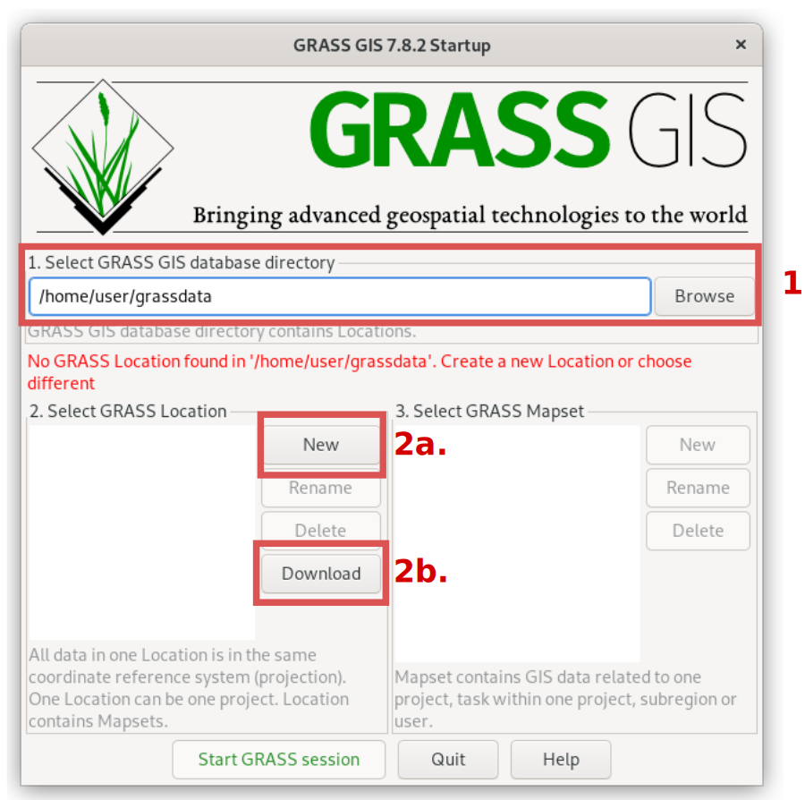
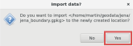
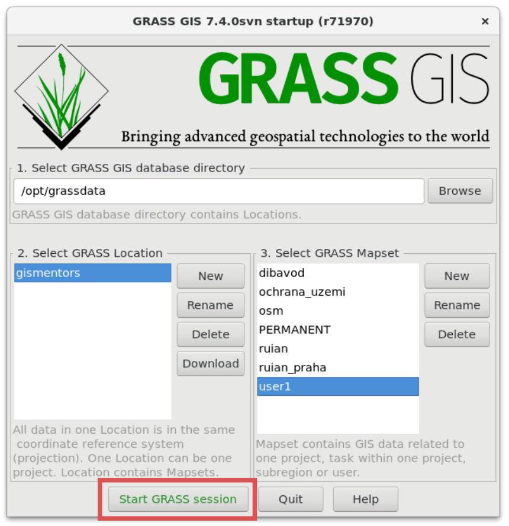
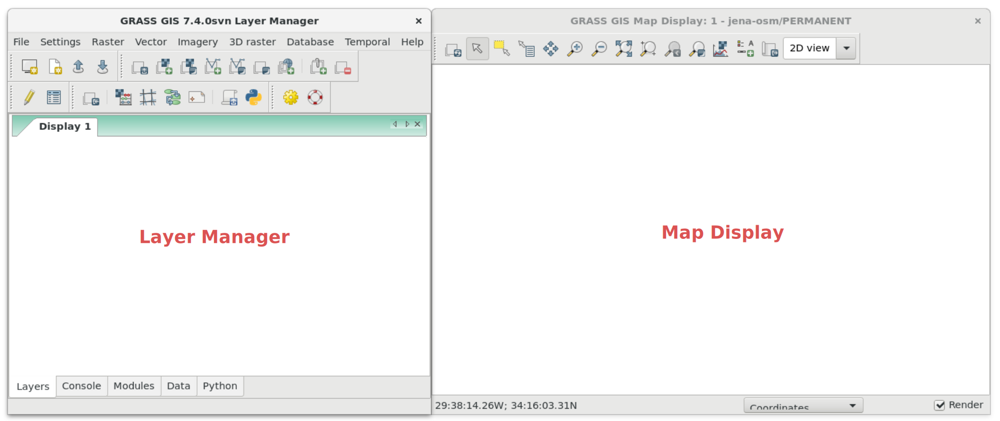
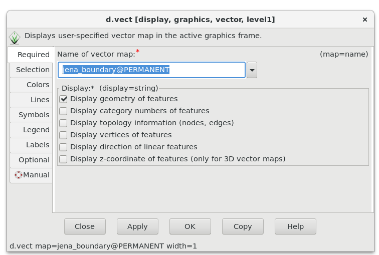
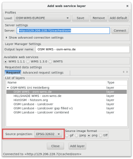

Unit 02 - First steps
=====================

Startup
-------

Starting a GRASS session requires basic knowledge about software
itself, the users usually do not like it ;-) In other words GRASS
forces organizing your data from early beginning.

Before entering GRASS a startup screen appears, the user must define
working project in which GRASS session will operate. Without this step
you cannot enter GRASS. This approach is not so common. Applications
like Esri ArcGIS or QGIS just starts. The user loads different data
from various data sources in different projections, and starts working
on his/her project. GRASS is different, which makes this software
harder to enter for newcomers. *But don't worry, we will enter GRASS
in few steps.*

The GRASS GIS startup screen requires to set up three items:

#. **Database directory.** A directory on local or network disc which
   contains all data accessed by GRASS. It's usually directory called
   :file:`grassdata` located in user's home directory. *This item is
   set up on Windows automatically, so usually you don't need to
   care.*

#. **Location**. Plays a role of "a project". All geodata stored
   within one location must have the same spatial coordinate system
   (GRASS doesn't support on-the-fly projection).

#. **Mapset** Contains task-related data within one project. Helps
   organizing data into logical groups or to separate parallel work of
   more users on the same project.

.. _startup0:
   

   GRASS GIS startup screen.

Let's define database directory (:fignote:`1.`). Then a new location
can be created (:fignote:`2a.`) or official GRASS sample location(s)
downloaded (:fignote:`2b.`). We will create our own location, a
project related to *Jena region*.

.. note:: Download sample location functionality is available only in
   GRASS 7.4+.
          
Input data is required. We will start with Jena administration boundary
in OGC GeoPackage format: `jena_boundary.gpkg
<../_static/data/jena_boundary.gpkg>`__.

.. _city_region_download:

.. note:: Data above has been downloaded from OpenStreetMap project
   using Overpass API by GDAL library (`ogr2ogr` utility). Downloaded
   data are stored in OGC GeoPackage format (*we don't like old school
   Esri Shapefile format*). Data are reprojected to UTM zone 32N
   (:epsg:`32632`) since we want to work with Sentinel data
   afterwards, see :doc:`03`.
   
   .. code:: bash

      ogr2ogr -f GPKG jena_boundary.gpkg -a_srs EPSG:4326 -t_srs EPSG:32632 \
      /vsicurl_streaming/"http://overpass-api.de/api/interpreter?data=%28relation\
      %5B%22boundary%22%3D%22administrative%22%5D%5B%22admin%5Flevel%22%3D%226%22%5D%5B%22\
      name%22%3D%22Jena%22%5D%3B%29%3B%28%2E%5F%3B%3E%3B%29%3Bout%3B%0A" multipolygons

   The URL has been generated by http://overpass-turbo.eu
   (:menuselection:`Export --> Query --> compact OverpassQL`) using
   the query below:

   .. code:: xml

      (
      relation
      ["boundary"="administrative"]
      ["admin_level"="6"]
      ["name"="Jena"]
      );
      /*added by auto repair*/
      (._;>;);
      /*end of auto repair*/
      out;

.. _create-location:
   
The initial location can be easily created from the input data
set. After pressing :item:`New` button, see :numref:`startup0`
(:fignote:`2a.`), the location wizard shows up.

In the first page, location name is defined, optionally also short
description can be added.

.. figure:: ../images/units/02/create-location-0.png

   Define a name for new GRASS location.

Then a method for creating new location is chosen. Usually the user
creates a new location using EPSG code (*Select EPSG code of spatial
reference system*) or from existing data (*Read projection and datum
terms from a georeferenced data file*). In our case we will create a
new location based on dataset downloaded from OSM.

.. figure:: ../images/units/02/create-location-1.png

   Choose method for creating a new GRASS location.

In the next page input file is defined.

.. figure:: ../images/units/02/create-location-2.png

   Define an input file.

Spatial reference system is chosen based on input file (here
UTM zone 32N :epsg:`32632`).

.. figure:: ../images/units/02/create-location-3.png

   Check the summary.

After creating a new location (:item:`Finish` button) the user can
optionally import data used for defining the new location (in our case
*jena_boundary.gpkg*).

   Let's import data to simplify our first steps in GRASS GIS.

Now we can *finally* start a GRASS session to enter our first GRASS
location.

   Entering a GRASS session.

.. note:: By default GRASS creates in the new location always a
   PERMANENT mapset. The input data were imported into this
   mapset. Let's keep it simple at this moment and enter PERMANENT
   mapset. Later we will organize our work into more mapsets.

Display data
------------

GRASS GUI is designed as simple user interface. Basically it is just
a GUI front-end calling GRASS commands (see :ref:`grass-modules`) in
the background. After startup, the GUI consists of two main windows:
*Layer Manager* and *Map Display*, see :numref:`gui-windows`.

.. _gui-windows:

           
   Main GUI components: Layer Manager and Map Display.

First task, not surprisingly, is to display imported (vector) data. It can be
done from menu :menuselection:`File --> Map display --> Add vector` or
more easily from a main toolbar |grass-layer-vector-add| :sup:`Add
vector map layer`.

In next dialog we choose vector (in GRASS terminology *vector map*) to display.

   Choose vector map to display.

.. figure:: ../images/units/02/jena-boundary.png
   :class: large
           
   Polygon defining Jena city administrative boundary.
   
We can also add OSM WMS layer by |grass-layer-wms-add| :sup:`Add web
service layer` to ensure that our data is spatially correct. We can
use WMS provided by *OSM-WMS-EUROPE* (http://129.206.228.72/cached/osm)
which can be added by :item:`Add default`.

After defining WMS URL in the dialog, we can connect the service and
choose desired layer.

            
   Choose WMS layer to display. Don't forget to change source
   projection to UTM zone 32N to avoid reprojection.

We can also change map layer properties to display only outline of
Jena city region polygon in red color.

.. figure:: ../images/units/02/d-vect-colrs.png
            
   Choose :item:`Properties` in order to change vector map layer
   properties to display only outline of the city polygon.

.. figure:: ../images/units/02/jena-boundary-wms.png
   :class: large

   Final composition, OSM WMS layer as a basemap, boundary of Jena
   city region in red color.
