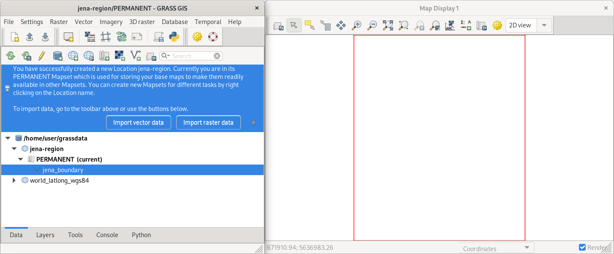
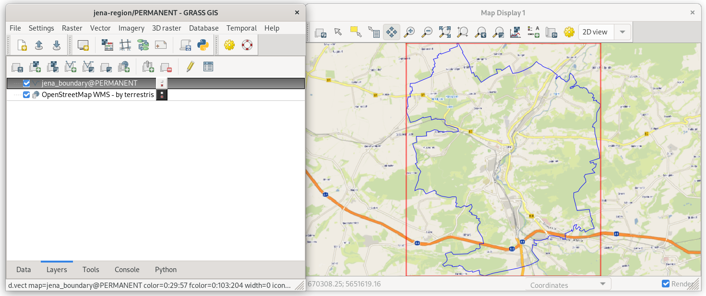

Unit 02 - First steps
=====================

Starting a GRASS session requires basic knowledge about the software
itself. GRASS motivates users to organize their data from an early
beginning. GRASS uses a consistent structure of so-called
**locations** and **mapsets** to organize its data. This has not 
changed in GRASS 8.

.. _location-mapset-section:

The GRASS data structure has three levels:

#. **Database directory.** A directory on local or network disc which
   contains all data accessed by GRASS. It's usually a directory called
   :file:`grassdata` located in users' home directory. 

#. **Location**. All geodata stored within one location must have the
   same spatial coordinate system (GRASS doesn't support on-the-fly
   projection for several reasons).

#. **Mapset**. Contains task-related data within one project. Helps
    organizing data into logical groups or to separate parallel work of
    different users on the same project.

.. note:: In GRASS 7, a startup screen (:numref:`startup7`) appeared 
   before entering a session. The user had to define the working
   environment in which the GRASS session started. This step 
   was required to enter GRASS. Such an approach is not so
   common. Applications like Esri ArcGIS or QGIS just start. Users
   load different data from various sources in different
   projections and start working on their project.

   .. _startup7:
   
   .. figure:: ../images/units/02/grass7-start.png

      GRASS GIS startup screen in version 7.

Obstacles (especially for newcomers) related to the startup screen have
been reduced in GRASS 8. The startup screen has been
replaced by a completely new mechanism. On the first launch, GRASS 8 
sets up the *database directory* automatically and launches GUI in a
default location *World LatLong WGS84*. Also, a sample *world* vector
layer (in GRASS terminology *vector map*) is shown.

GRASS GUI is designed as a *simple and lightweight* graphical user
interface. Basically, it is a GUI front-end calling GRASS commands (see
:ref:`grass-modules`) in the background. The GUI consists of two main
windows, see :numref:`startup8`.

.. _startup8:

.. figure:: ../images/units/02/grass8-start.png
   :class: large
           
   GRASS GIS 8 on startup.

.. tip:: If GUI crashes, it can be started again by :grasscmd:`g.gui`
   command from the underlying terminal (command prompt).
         
GRASS GUI guides users by means of tooltips as shown in
:numref:`startup8`. The default location is not designed for real
work. The next step is usually to create new "project(s)" (in GRASS
terminology *a location*) with user-defined spatial coordinate systems.

.. _create-location:

Create a new location
---------------------

By clicking on :item:`Create new Location` button in the tooltip (or by
|grass-location-add| from the toolbar) the wizard appears. A new GRASS
location can be easily created using :wikipedia:`EPSG` codes or
user-defined geodata.

In the first page of the location wizard, the location name is defined. 
Optionally, also a short description can be added.
          
.. figure:: ../images/units/02/create-location-0.png

   Define a name for the new GRASS location.

In the next page, a coordinate reference system (CRS) is chosen. CRS
is usually defined by EPSG code (:item:`Select CRS from a list by EPSG
or description`) or by user-defined geodata (:item:`Read CRS from a
georeferenced data file`).
   
.. figure:: ../images/units/02/create-location-1.png

   Choose "Read CRS from a georeferenced data file" for creating a new
   GRASS location.
            
In our case, a new location will be created by defining CRS from
`jena_boundary.gpkg <../_static/data/jena_boundary.gpkg>`__ input
file.

.. figure:: ../images/units/02/create-location-2.png

   Define an input file `jena_boundary.gpkg
   <../_static/data/jena_boundary.gpkg>`__ (available from
   :file:`geodata/osm` directory).

.. _city_region_download:

.. note:: Jena administrative boundary has been downloaded from
   OpenStreetMap project using Overpass API by GDAL library (`ogr2ogr`
   utility). Downloaded data is stored in OGC GeoPackage format (*we
   don't like an old-school Esri Shapefile format*). Data is
   reprojected to UTM zone 32N (:epsg:`32632`) since we want to work
   with Sentinel data afterwards, see :doc:`03`.
   
   .. code:: bash

      ogr2ogr -f GPKG jena_boundary.gpkg -a_srs EPSG:4326 -t_srs EPSG:32632 \
      /vsicurl_streaming/"http://overpass-api.de/api/interpreter?data=%28relation\
      %5B%22boundary%22%3D%22administrative%22%5D%5B%22admin%5Flevel%22%3D%226%22%5D%5B%22\
      name%22%3D%22Jena%22%5D%3B%29%3B%28%2E%5F%3B%3E%3B%29%3Bout%3B%0A" multipolygons

   The URL has been generated by http://overpass-turbo.eu
   (:menuselection:`Export --> Query --> compact OverpassQL`) using
   the query below:

   .. code:: xml

      (
      relation
      ["boundary"="administrative"]
      ["admin_level"="6"]
      ["name"="Jena"]
      );
      /*added by auto repair*/
      (._;>;);
      /*end of auto repair*/
      out;

Spatial reference system is chosen based on input file (UTM zone 32N
:epsg:`32632`).

.. figure:: ../images/units/02/create-location-3.png
            
   Check the summary.
   
A new GRASS user-defined location will be created by clicking on
:item:`Finish` button.
      
After creating a new location (:item:`Finish` button) the user can
optionally import data used for defining the new location (in our case
*jena_boundary.gpkg*).

.. figure:: ../images/units/02/create-location-4.png
   :class: small

   Let's import data to simplify our first steps in GRASS GIS.

By default GRASS creates a *PERMANENT mapset* in the new location.
Here, all location settings are stored. This mapset is commonly used
for importing input geodata used in the location.

           
   GRASS GUI automatically switches to the new location.

Display data
------------
        
Imported :map:`jena_boundary` data layer can be easily displayed from
:item:`Data` tab.

.. figure:: ../images/units/02/jena-boundary.png
   :class: large
           
   Display Jena city administrative boundary vector layer. Select
   :item:`Display layer` from contextual menu in Data tab or simply
   use double-click on the specified layer.

Let's also add a basemap from freely available OpenStreeMap map
service. In our case *OpenStreetMap WMS* provided by `mundialis
<https://mundialis.de>`__ company
(http://ows.mundialis.de/services/service?). WMS layer can be added
from :item:`Layers` tab |grass-layer-wms-add| :sup:`Add web service
layer`.

.. figure:: ../images/units/02/d-wms-0.png

   Connect to the defined WMS server.

After connecting to the WMS server, desired layer can be chosen.

.. figure:: ../images/units/02/d-wms-1.png

   Choose WMS layer to be displayed.

.. note:: On MS Windows is currently WMS functionality broken. Use
   :file:`geodata/osm/basemap.pack` file which can be loaded into
   GRASS in :item:`Data` tab by |grass-layer-import| :sup:`Unpack
   GRASS raster map [r.unpack]`. New raster map :map:`basemap` should
   appear in :item:`Data` tab. In opposite case refresh content by
   |grass-reload| :sup:`Reload GRASS mapset only`.
          
In :item:`Layers` tab change order of layers (move
:map:`jena-boundary` on the top) and tune display properities of
:map:`jena-boundary` layer.

.. figure:: ../images/units/02/d-vect-menu.png

   Choose :item:`Properties` from contextual menu (right click on
   selected layer).

.. figure:: ../images/units/02/d-vect-colrs.png

   Change map layer properties: outline in blue color, fill color
   transparent.
   

   A map composition of basemap and boundary of Jena city region in
   blue color.
