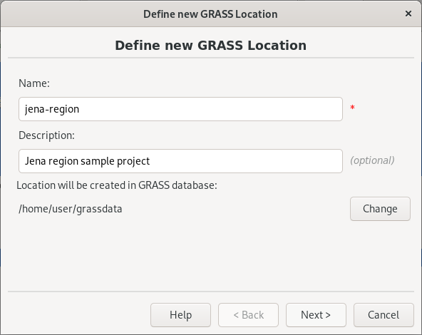
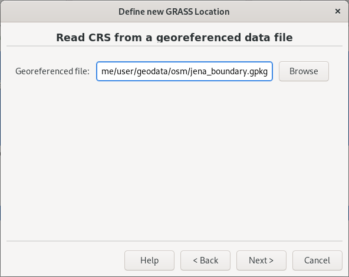
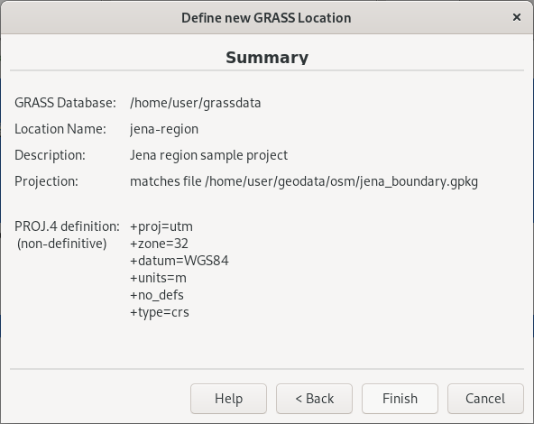

Unit 02 - First steps
=====================

Starting a GRASS session requires basic knowledge about software
itself. It is an obstacle especially for newcomers. In other words
GRASS forces organizing your data from early beginning.

Before entering GRASS a startup screen appears, the user must define
working project in which GRASS session will operate. Without this step
you cannot enter GRASS. Such approach is not so common. Applications
like Esri ArcGIS or QGIS just starts. The user loads different data
from various data sources in different projections, and starts working
on his/her project. GRASS is different, which makes this software
harder to enter for newcomers. *But don't worry, we will enter our
first GRASS sessions in few steps.*

.. _location-mapset-section:

The GRASS GIS startup screen requires to set up three items:

#. **Database directory.** A directory on local or network disc which
   contains all data accessed by GRASS. It's usually directory called
   :file:`grassdata` located in a user's home directory. *This item is
   set up on Windows automatically, so usually you don't need to
   care about it.*

#. **Location**. Plays a role of "a project". All geodata stored
   within one location must have the same spatial coordinate system
   (GRASS doesn't support on-the-fly projection from several reasons).

#. **Mapset** Contains task-related data within one project. Helps
   organizing data into logical groups or to separate parallel work of
   more users on the same project.

.. _startup0:
   
.. figure:: ../images/units/02/startup-0.svg

   GRASS GIS startup screen.

At first define database directory (:fignote:`1.`) if not already set
up. Then a new location can be created (:fignote:`2a.`) or official
GRASS sample location(s) downloaded (:fignote:`2b.`). Let's create our
own location, a project related to *Jena region*.

.. note:: Download sample location functionality is available only in
   GRASS 7.4+.

.. _create-location:

Create a new location
---------------------

A new GRASS location can be easily created by :wikipedia:`EPSG` code
or available input geodata. After pressing :item:`New` button, see
:numref:`startup0` (:fignote:`2a.`), the Location Wizard shows up.

In the first page of a wizard, a location name is defined, optionally
also short description can be added.
          

   Define a name for new GRASS location. 

Then a method for creating new location is chosen. Usually a location
is created using given EPSG code (*Select EPSG code of spatial
reference system*) or from existing data (*Read projection and datum
terms from a georeferenced data file*). In our case a new location
will be created based on sample Jena administrative boundary vector
layer.

.. figure:: ../images/units/02/create-location-1.png

   Choose method for creating a new GRASS location.

In the next page define an input file.

   Define an input file `jena_boundary.gpkg
   <../_static/data/jena_boundary.gpkg>`__ (available from
   :file:`geodata/osm` directory).

.. _city_region_download:

.. note:: Jena administrative boundary has been downloaded from
   OpenStreetMap project using Overpass API by GDAL library (`ogr2ogr`
   utility). Downloaded data is stored in OGC GeoPackage format (*we
   don't like an old-school Esri Shapefile format*). Data is
   reprojected to UTM zone 32N (:epsg:`32632`) since we want to work
   with Sentinel data afterwards, see :doc:`03`.
   
   .. code:: bash

      ogr2ogr -f GPKG jena_boundary.gpkg -a_srs EPSG:4326 -t_srs EPSG:32632 \
      /vsicurl_streaming/"http://overpass-api.de/api/interpreter?data=%28relation\
      %5B%22boundary%22%3D%22administrative%22%5D%5B%22admin%5Flevel%22%3D%226%22%5D%5B%22\
      name%22%3D%22Jena%22%5D%3B%29%3B%28%2E%5F%3B%3E%3B%29%3Bout%3B%0A" multipolygons

   The URL has been generated by http://overpass-turbo.eu
   (:menuselection:`Export --> Query --> compact OverpassQL`) using
   the query below:

   .. code:: xml

      (
      relation
      ["boundary"="administrative"]
      ["admin_level"="6"]
      ["name"="Jena"]
      );
      /*added by auto repair*/
      (._;>;);
      /*end of auto repair*/
      out;

Spatial reference system is chosen based on input file (UTM zone 32N
:epsg:`32632`).

   Check the summary.

After creating a new location (:item:`Finish` button) the user can
optionally import data used for defining the new location (in our case
*jena_boundary.gpkg*).

.. figure:: ../images/units/02/create-location-4.svg
   :class: small

   Let's import data to simplify our first steps in GRASS GIS.

Now we can *finally* start a GRASS session by entering our first GRASS
location.

.. figure:: ../images/units/02/startup-1.svg

   Entering a GRASS session.

.. note:: By default GRASS creates in a new location a PERMANENT
   mapset. Let's keep it simple at this moment and enter PERMANENT
   mapset. Later we will try organizing our work into more mapsets.

Display data
------------

GRASS GUI is designed as a *simple and lightweight* user
interface. Basically it is just a GUI front-end calling GRASS commands
(see :ref:`grass-modules`) in the background. After startup, the GUI
appears. It consists of two main windows: *Layer Manager* and *Map
Display*, see :numref:`gui-windows`.

.. _gui-windows:

.. figure:: ../images/units/02/gui-windows.svg
   :class: large
           
   Main GUI components: Layer Manager and Map Display.

.. tip:: If GUI crashes, it can be started again by :grasscmd:`g.gui`
   command from underlaying terminal (command prompt).
         
Let's display already imported vector data layer
:map:`jena_boundary`. Use :item:`Data` tab, main menu :menuselection:`File -->
Map display --> Add vector` or a toolbar |grass-layer-vector-add|
:sup:`Add vector map layer` icon.

.. figure:: ../images/units/02/jena-boundary.png
   :class: large
           
   Display Jena city administrative boundary vector layer. Select
   :menuselection:`Display layer` from contextual menu in Data tab or
   simply use double-click on the desired layer.

..                  
   We can also add OSM WMS layer by |grass-layer-wms-add| :sup:`Add web
   service layer` to ensure that our data is spatially correct. Let's use
   WMS provided by *OSM-WMS-EUROPE* (http://129.206.228.72/cached/osm)
   which can be added by :item:`Add default`.

   After defining WMS URL in the dialog, a service can be connected and
   desired layer chosen.

   .. figure:: ../images/units/02/d-wms.svg
            
      Choose WMS layer to display. Don't forget to change source
      projection to UTM zone 32N to avoid reprojection.

   Let's change map properties in order to display outline of Jena city
   region polygon in red color. Switch to :item:`Layer` tab and choose
   :item:`Properties` from contextual menu (right click on selected
         layer). Set also :item:`Area fill color` to transparent.

   .. figure:: ../images/units/02/d-vect-colrs.png
            
      Change map layer properties.

.. tip:: Unpack basemap layer from :file:`geodata/osm/basemap.pack`
   (:menuselection:`File --> Import raster map --> Unpack raster
   map`).

   .. figure:: ../images/units/02/jena-boundary-wms.png
      :class: large

      A map composition of basemap and boundary of Jena city region in
      red color.

.. todo:: Fix WMS reprojection in GRASS GIS.
