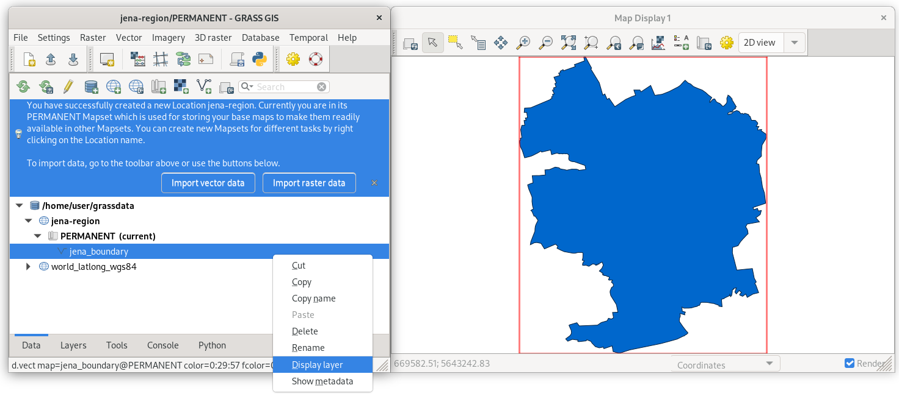

Unit 02 - First steps
=====================

Starting a GRASS session requires basic knowledge about the software
itself. GRASS motivates users to organize their data from an early
beginning. GRASS uses a consistent structure of so-called **projects**
(formerly "locations") and **mapsets** to organize its data.

.. _project-mapset-section:

The GRASS data structure has three levels:

#. **Database directory.** A directory on local or network disc which
   contains all data accessed by GRASS. It's usually a directory called
   :file:`grassdata` located in users' home directory. 

#. **Project** (formerly "Location"). All geodata stored within one
   project must have the same spatial coordinate system (GRASS
   doesn't support on-the-fly projection for several reasons).

#. **Mapset**. Contains task-related data within one project. Helps
   organizing data into logical groups or to separate parallel work of
   different users on the same project.

.. note:: In GRASS 7, a startup screen (:numref:`startup7`) appeared 
   before entering a session. The user had to define the working
   environment in which the GRASS session started. This step 
   was required to enter GRASS. Such an approach is not so
   common. Applications like Esri ArcGIS or QGIS just start. Users
   load different data from various sources in different
   projections and start working on their project.

   .. _startup7:
   
   .. figure:: ../images/units/02/grass7-start.png

      GRASS startup screen in version 7.

Obstacles (especially for newcomers) related to the startup screen have
been reduced in GRASS 8. The startup screen has been
replaced by a completely new mechanism. On the first launch, GRASS 8 
sets up the *database directory* automatically and launches GUI in a
default project *World LatLong WGS84*. Also, a sample *world* vector
layer (in GRASS terminology *vector map*) is shown.

GRASS GUI is designed as a *simple and lightweight* graphical user
interface, see :numref:`startup8`. Basically, it is a GUI front-end
calling GRASS commands (see :ref:`grass-tools`) in the background.

.. _startup8:

.. figure:: ../images/units/02/grass8-start.png
   :class: large
           
   GRASS 8 on startup.

.. tip:: If GUI crashes, it can be started again by :grasscmd:`g.gui`
   command from the underlying terminal (command prompt).
         
GRASS GUI guides users by means of tooltips as shown in
:numref:`startup8`. The default project is not designed for real
work. The next step is usually to create a new project with
user-defined spatial coordinate systems.

.. note:: Consider changing language settings to English in
   :menuselection:`Settings --> Preferences --> Appearance`. Change
   `Language settings` to ``en`` and restart GRASS.

.. _create-project:

Create a new project
---------------------

By clicking on :item:`Create new Project` button in the tooltip (or by
|grass-location-add| from the toolbar) the wizard appears. A new GRASS
project can be easily created using :wikipedia:`EPSG` codes or
user-defined geodata.

In the first page of the project wizard, the project name is defined. 
Optionally, also a short description can be added.
          
.. figure:: ../images/units/02/create-project-0.png

   Define a name for the new GRASS project.

In the next page, a coordinate reference system (CRS) is chosen. CRS
is usually defined by EPSG code (:item:`Select CRS from a list by EPSG
or description`) or by user-defined geodata (:item:`Read CRS from a
georeferenced data file`).
   
.. figure:: ../images/units/02/create-project-1.png

   Choose "Read CRS from a georeferenced data file" for creating a new
   GRASS project.
            
In our case, a new project will be created by defining CRS from
:file:`jena_boundary.gpkg` input file (located in the sample dataset
in :file:`osm` directory).

.. figure:: ../images/units/02/create-project-2.png

   Define an input file :file:`jena_boundary.gpkg`.

.. _city_region_download:

.. note:: Jena administrative boundary has been downloaded from OSM using
   `Overpass API <https://overpass-turbo.eu/>`__.

   .. code:: xml

      (
      relation["boundary"="administrative"]
          ["admin_level"="6"]
          ["name"="Jena"];
      );
      (._;>;);
      out body;
   
   Exported GeoJSON file has been converted to GeoPackage (and reprojected to
   UTM zone 32N (:epsg:`32632`) since we want to work with Sentinel
   data afterwards, see :doc:`03`) by GDAL :program:`ogr2ogr` utility:
   
   .. code:: bash

      ogr2ogr -f GPKG -dialect SQLite \
      -sql "select * from export where st_geometrytype(geometry) IN ('POLYGON', 'MULTIPOLYGON')" \
      -nln jena_boundary -t_srs EPSG:32632 jena_boundary.gpkg export.geojson

Spatial reference system is chosen based on input file (UTM zone 32N
:epsg:`32632`).

.. figure:: ../images/units/02/create-project-3.png
            
   Check the summary.
   
A new GRASS user-defined project will be created by clicking on
:item:`Finish` button.
      
After creating a new project (:item:`Finish` button) the user can
optionally import data used for defining the new project (in our case
:file:`jena_boundary.gpkg`).

.. figure:: ../images/units/02/create-project-4.png
   :class: small

   Let's import data to simplify our first steps in GRASS.

By default GRASS creates a *PERMANENT mapset* in the new project.
Here, all project settings are stored. This mapset is commonly used
for importing input geodata used in the project.

.. figure:: ../images/units/02/create-project-5.png
   :class: large
           
   GRASS GUI automatically switches to the new project.

Display data
------------
        
Imported :map:`jena_boundary` data layer can be easily displayed from
:item:`Data` tab.

           
   Display Jena city administrative boundary vector layer. Select
   :item:`Display layer` from contextual menu in Data tab or simply
   use double-click on the specified layer.

Let's also add a basemap from freely available OpenStreeMap map
service. In our case *OpenStreetMap WMS* provided by `mundialis
<https://mundialis.de>`__ company
(https://ows.mundialis.de/osm/service). WMS layer can be added from
:item:`Layers` tab |grass-layer-wms-add| :sup:`Add web service layer`.

.. figure:: ../images/units/02/d-wms-0.png

   Connect to the defined WMS server.

After connecting to the WMS server, desired layer can be chosen.

.. figure:: ../images/units/02/d-wms-1.png

   Choose WMS layer to be displayed.

In :item:`Layers` tab change order of layers (move
:map:`jena-boundary` on the top) and tune display properities of
:map:`jena-boundary` layer.

.. figure:: ../images/units/02/d-vect-menu.png

   Choose :item:`Properties` from contextual menu (right click on
   selected layer).

.. figure:: ../images/units/02/d-vect-colrs.png

   Change map layer properties: outline in blue color, fill color
   transparent.
   
.. figure:: ../images/units/02/jena-boundary-wms.png
   :class: large

   A map composition of basemap and boundary of Jena city region in
   blue color.
