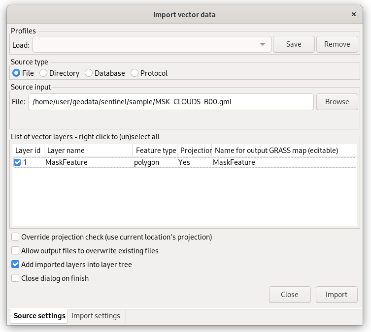
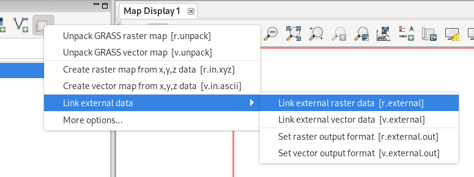

Unit 03 - Data Management
=========================

Data import
-----------

Raster data
^^^^^^^^^^^

Raster data is possible to import from the menu :menuselection:`File
--> Import raster data --> Common import formats`, from the main
toolbar, or from command line using :grasscmd:`r.import` module.

.. figure:: ../images/units/03/import-raster-toolbar.png

   Import raster data from the main toolbar.

Import dialog allows importing single raster file (:item:`File`) or
multiple files from directory (:item:`Directory`). If spatial
reference system of raster file differs from GRASS location
(:item:`Project match`) the raster data are automatically reprojected.

.. _import-raster:

.. figure:: ../images/units/03/import-raster-dialog.svg

   Dialog for importing raster file(s).

.. figure:: ../images/units/03/display-band4.png
   :class: large
   
   Imported raster file is added into layer tree and displayed in map
   window.

GRASS imports raster bands as separate raster maps. Raster maps are
represented by regular grid. Three different data types are supported:

* CELL (integer)
* FCELL (float)
* DCELL (double)

.. _raster-metadata:
  
Basic raster metadata can be printed by :grasscmd:`r.info` or from
Layer Manager.

.. figure:: ../images/units/03/raster-metadata.png

   Display raster map metadata from Layer Manager.

   Raster metadata of imported file.
   
Vector data
^^^^^^^^^^^

Dialog for importing vector data is accessible from menu
:menuselection:`File --> Import vector data --> Common import
formats`, from the main toolbar, or from command line using
:grasscmd:`v.import` module.

.. figure:: ../images/units/03/import-vector-toolbar.png

   Import vector data from the main toolbar.

Procedure of importing vector files is similar to raster files.

   Dialog for importing vector file(s).

.. note:: In some cases SRS of imported file can be missing or
          invalid. This is our case. GRASS reports this issue as *In
          case of no significant differences in the projection
          definitions, use the -o flag to ignore them and use current
          location definition.  Consider generating a new location
          from the input dataset using the 'location' parameter.*

          GRASS allows importing such file by overriding project check
          (and you are sure that SRS of input file is really the same
          as GRASS location).

          .. figure:: ../images/units/03/override-projection-check.svg

             Override projection check.
          
.. figure:: ../images/units/03/display-band4-clouds.png
   :class: large
   
   Map composition of Sentinel band and cloud mask features.

Vector metadata can be printed similarly to raster from Layer Manager
by :item:`Metadata` or by :grasscmd:`v.info` module from console.

.. _grass-topo:

Vector topology
---------------

Let's take a closer look at vector metadata. There are no "polygons"
but "areas" and other kind of priminites (points, lines, boundaries,
centroids, isles).

.. figure:: ../images/units/03/vector-metadata-features.png

   Vector metadata of imported file.

GRASS is a **topological GIS**. Importing vector data into GRASS also
means converting features from simple feature model into GRASS topological
model, see figure bellow.

.. figure:: ../images/units/03/grass7-topo.png
   :class: middle
                    
   GRASS topological model with primitives like nodes, lines,
   boundaries, centroids, areas, and isles.
          
During this process also topological errors are checked and repaired,
for this procedure is important :option:`snap` option of
:grasscmd:`v.import` module.

Some topological errors is not possible to repair automatically
without user specification, in this case the user can fix remaining
errors using :grasscmd:`v.clean`.
   
Linking external formats
------------------------

To avoid data duplication GRASS also allows linking raster data using
:grasscmd:`r.external` (*Link external raster data*) and vector data
by :grasscmd:`v.external` (*Link external vector data*).

   Link raster or vector data from Layer Manager.

Linking is mainly recommended when working with raster data such large
datasets of imagery data. GRASS can handle linked raster data
similarly as native raster maps. Both from point of stability and
accessibility.

GUI dialog for linking is same as for import,
:numref:`import-raster`. Let's create a link to 8th Sentinel band JP2
file.

From metadata it's visible than 4th band was imported into
native GRASS format, while 8th band is linked directly from original
OpenJPEG2000 format.

.. figure:: ../images/units/03/raster-linked.png

   Linked raster file in external GRASS format by :grasscmd:`r.external`.

.. figure:: ../images/units/03/raster-imported.png

   Imported raster file in native GRASS format by
   :grasscmd:`r.in.gdal` (or :grasscmd:`r.import`).
