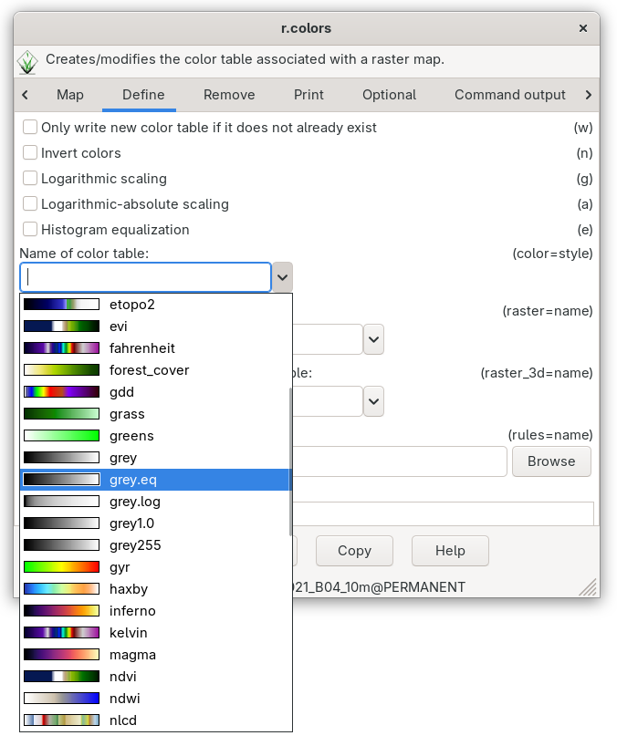

Unit 04 - Modules, Region
=========================

.. _grass-modules:

Accessing GRASS modules
-----------------------

GRASS is a **modular system** which consists of several hundreds tools
(called "modules"). Modules are accessible from the Layer Manager menu,
:item:`Modules` tab, and from command prompt (:item:`Console` tab).

Let's find a tool for clipping cloud mask vector map by Jena city
area.

.. figure:: ../images/units/04/modules-tab.svg

   Searching module in Layer Manager by 'clip' keyword.

The module which we are looking for is :grasscmd:`v.overlay`.

.. figure:: ../images/units/04/modules-cmd.png

   Launching :grasscmd:`v.overlay` module from Layer Manager console.

.. note:: Since GRASS 7.4.0 there is a better choice for vector clipping
   than generic :grasscmd:`v.overlay` module: :grasscmd:`v.clip`.

The commands (modules) can be called using GUI dialogs, from command
line (:item:`Console` or "real" terminal), or by using Python API (see
:doc:`10`). Figure bellow shows GUI dialog of :grasscmd:`v.overlay`
module. The corresponding command for console would be:

.. code-block:: bash

   v.overlay ainput=MaskFeature binput=jena_boundary operator=and output=jena_clouds

.. figure:: ../images/units/04/v-overlay.svg

   GUI dialog for launching :grasscmd:`v.overlay` module (syntax for
   CLI displayed in statusbar).

.. figure:: ../images/units/04/jena-clouds.png

   Clipped clouds mask by Jena city area.

All GRASS commands start by a prefix. This prefix groups modules into
several sections, see table below.

.. cssclass:: border

+----------+--------------------------------+-----------------------------------------------+
| prefix   | section                        | description                                   |
+==========+================================+===============================================+
| ``db.``  | :grasscmd:`database`           | attribute data management                     |
+----------+--------------------------------+-----------------------------------------------+
| ``d.``   | :grasscmd:`display`            | display commands                              |
+----------+--------------------------------+-----------------------------------------------+
| ``g.``   | :grasscmd:`general`            | generic commands                              |
+----------+--------------------------------+-----------------------------------------------+
| ``i.``   | :grasscmd:`imagery`            | imagery data processing                       |
+----------+--------------------------------+-----------------------------------------------+
| ``ps.``  | :grasscmd:`postscript`         | map outputs                                   |
+----------+--------------------------------+-----------------------------------------------+
| ``r.``   | :grasscmd:`raster`             | 2D raster data processing                     |
+----------+--------------------------------+-----------------------------------------------+
| ``r3.``  | :grasscmd:`raster3D`           | 3D raster data processing                     |
+----------+--------------------------------+-----------------------------------------------+
| ``v.``   | :grasscmd:`vector`             | 2D/3D vector data processing                  |
+----------+--------------------------------+-----------------------------------------------+

 
.. _region:

Computational region
--------------------

Computation region is **key issue** in GRASS raster processing. Unlike
GIS software like Esri ArcGIS which sets computation region based on
input data, GRASS is leaving this operation to the user.

.. important:: **The user must define computation region before any
   raster computation is performed!**

Computational region is defined by *extent* (north, south, east, west)
and by *spatial resolution* in the both directions (east-west,
north-south). GRASS supports only regular grids.

.. figure:: ../images/units/04/region2d.png
              
   2D computation region grid.

.. note:: For 3D raster data there is an extension to 3D computation
   grid.

Majority of raster processing modules (``r.*``) in GRASS respect
computational region, there are few exceptions like import modules
(:grasscmd:`r.import`). On the other hand, the most of vector
processing modules (``v.*``) ignore computation region completely.

Computational region can be easily set on existing raster or vector
map from Layer Manager.

.. figure:: ../images/units/04/comp-region-raster.png

   Set computational region from raster map.

When setting up computational region from vector map, only extent is
adjusted. It's good idea to align a grid based on raster map used for
computation (*Align computational region to selected map*).
          
.. tip:: Current computation extent can be displayed in map window.

   .. figure:: ../images/units/04/show-comp-region.png

      Show computation region extent in map display.

Full flexibility for operating with computation region allows
:grasscmd:`g.region` module.

.. _color-table:

Color table
-----------

With knowledge of computational region let's enhance color table using
histogram equalization (which is influenced by computation region as
we already know) by using :grasscmd:`r.colors`.

.. code-block:: bash

   r.colors map=L2A_T32UPB_20170706T102021_B04_10m color=grey.eq

.. tip:: Color table can be easily set also from Layer Manager or
         managed interactively by :menuselection:`Raster --> Manage
         colors --> Manage color rules interactively`.

         .. figure:: ../images/units/04/r-colors-menu.png

            Set color table from Layer Manager.

   Set 'grey.eq' color table.
   
.. figure:: ../images/units/04/r-colors-jena.png
   :class: middle
   
   Sentinel 4th band with enhanced grey color table.
