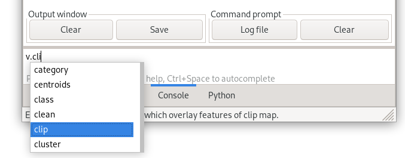

Unit 04 - Modules, Region
=========================

Accessing GRASS modules
-----------------------

GRASS is **modular system** which consists of several hundreds tools
(called "modules"). They are accessible from the Layer Manager menu,
:item:`Modules` tab, and from command prompt (:item:`Console` tab).

Let's find a tool for clipping cloud mask vector map by Jena city
area.

.. figure:: ../images/units/04/modules-tab.svg

   Searching module in Layer Manager by 'clip' keyword.

   Launching :grasscmd:`v.overlay` module from Layer Manager console.

.. note:: Since GRASS 7.4.0 there is a better choice for vector clipping
   than generic :grasscmd:`v.overlay` module: :grasscmd:`v.clip`.

The commands (modules) can be called from GUI dialogs and from command
line. Figure bellow shows GUI dialog of :grasscmd:`v.overlay`
module. The corresponding command for console would be:

.. code-block:: bash

   v.overlay ainput=MaskFeature binput=jena_boundary operator=and output=jena_clouds

.. figure:: ../images/units/04/v-overlay.svg

   GUI dialog for lanching :grasscmd:`v.overlay` module.

   Clipped clouds mask by Jena city area.

.. _region:

Computational region
--------------------

Computation region is key for raster processing in GRASS. Unlike GIS
software like Esri ArcGIS which sets computation region based on input
data, GRASS is leaving this operation to the user. **The user must
define computation region before any raster computation is performed!**

Computational region is defined by *extent* (north, south, east, west)
and by *spatial resolution* in both direction (east-west,
north-south). GRASS supports only regular grid.

.. figure:: ../images/units/04/region2d.png
              
   2D computation region grid.

.. note:: For 3D raster data there is an extension to 3D computation
   grid.

Majority of raster proccessing modules (``r.*``) in GRASS respect
computational region, there are few exceptions like import modules
(:grasscmd:`r.import`). On the other side most of vector processing
modules (``v.*``) ignores computation region.

Computational region can be easily set on existing raster or vector
map.

.. figure:: ../images/units/04/comp-region-raster.png

   Set computational region from raster map.

When setting up computational region from vector map, only
extent is adjusted. It's good idea to align the grid based on
raster map used for computation (*Align computational region to
selected map*).
          
.. tip:: Current computation extent can be displayed in map window.

   .. figure:: ../images/units/04/show-comp-region.png

      Show computation region extent in map display.

Full flexibility for operating with computation region allows
:grasscmd:`g.region` module.

With this knowledge let's enhance color table using histogram
equalization (which is influenced by computation region as we know):

.. code-block:: bash

   r.colors map=L2A_T32UPB_20170706T102021_B04_10m color=grey.eq

.. tip:: Color table can easily set also from Layer Manager.

         .. figure:: ../images/units/04/r-colors-menu.png

            Set color table from Layer Manager.
            

   
   Display Sentinel band with enhanced color table.
