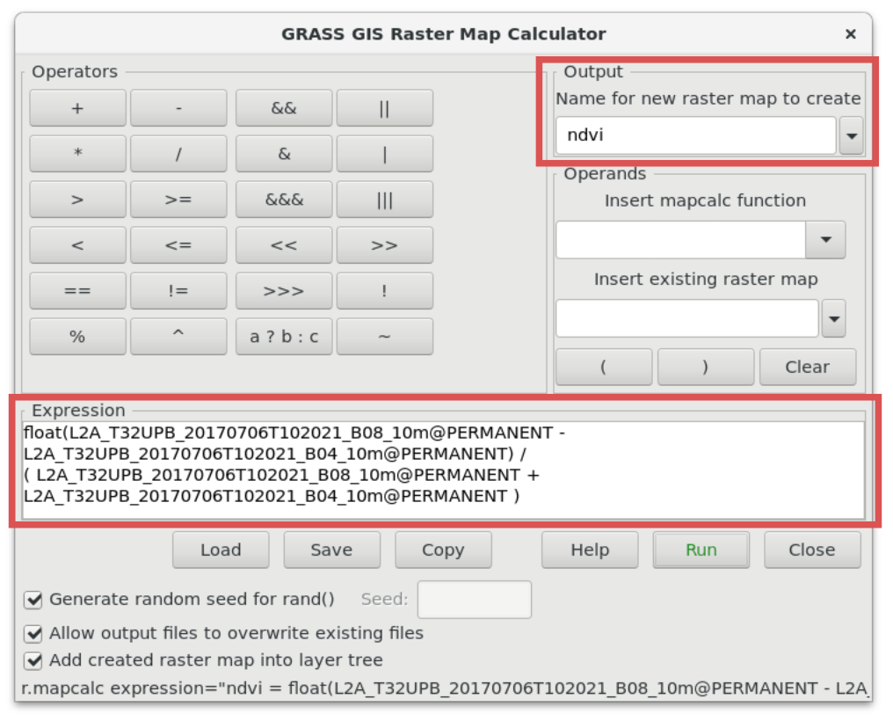

Unit 05 - Perform computation
=============================

Computing :wikipedia-en:`NDVI` is well known "discipline" in remote
sensing. It's simple task which requires basic knowledge of map
algebra. The key module in GRASS related to map algebra is
:grasscmd:`r.mapcalc`.

.. math::
        
   NDVI = (NIR - VIS) / (NIR  + VIS)
          
To compute NDVI, the red (VIS) and near-infrared (NIR) channels are
required. In the case of Sentinel-2, it refers to 4th and 8th band.

The GUI tool for map algebra can be launched from
:menuselection:`Raster --> Raster map calculator` or from main toolbar
in Layer Manager |grass-raster-calculator| :sup:`Raster map calculator`.

.. important:: Be aware that :grasscmd:`r.mapcalc` as other raster
   processing modules are sensitive to computational region which
   needs to be set before any computation, see :ref:`region` section
   for details.

   Compute NDVI using GUI raster map calculator by
   :item:`Expression`. The result is defined by :item:`Output`
   section.

Corresponding command for CLI (map names shorten):

.. code-block:: bash

   r.mapcalc expression="ndvi = float(B08_10m - B04_10m) / ( B08_10m + B04_10m )"

.. note:: Because all input raster maps are CELL type (integer) at
          least one sub-result must be converted to floating-point (here
          by ``float()`` function). Otherwise result would be also CELL map
          (integer: -1, 0, 1).

.. figure:: ../images/units/05/ndvi-mapcalc.png
   :class: middle
           
   NDVI computed by map algebra module (Jena city in red color).

Result is not perfect:

* default color table *viridis* is not suitable for NDVI values
* NDVI has been computed also in cloudy areas

The first issue can be easily fixed by :grasscmd:`r.colors`
(:menuselection:`Raster --> Manage colors --> Color tables`). The
second issue requires setting a mask to ignore cloudy areas for
computation. This operation can be done by :grasscmd:`r.mask`
(:menuselection:`Raster --> Mask`).

There is also specialized module for computing various vegetation
indices including NDVI - :grasscmd:`i.vi`. This module makes NDVI
computing even simpler, and it also solves first issue since the
module sets *ndvi* color table automatically.

At first let's define a mask based on cloud mask vector map (note that
mask is created only within current computation region).

.. code-block:: bash

   r.mask -i vector=MaskFeature

.. note:: Cloud mask provided by Sentinel products is not perfect, but
   for us it's a good starting point.
          
Then let's recompute `ndvi` map with :grasscmd:`i.vi` (map names shorten):

.. code-block:: bash

   i.vi --overwrite red=B04_10m output=ndvi viname=ndvi nir=B08_10m

We can also add simple legend to map display by |grass-overlay-add|
:sup:`Add map elements` (*Add raster legend*).

.. figure:: ../images/units/05/ndvi-vi.png
   :class: middle
           
   Final NDVI result with cloud mask and simple legend.

