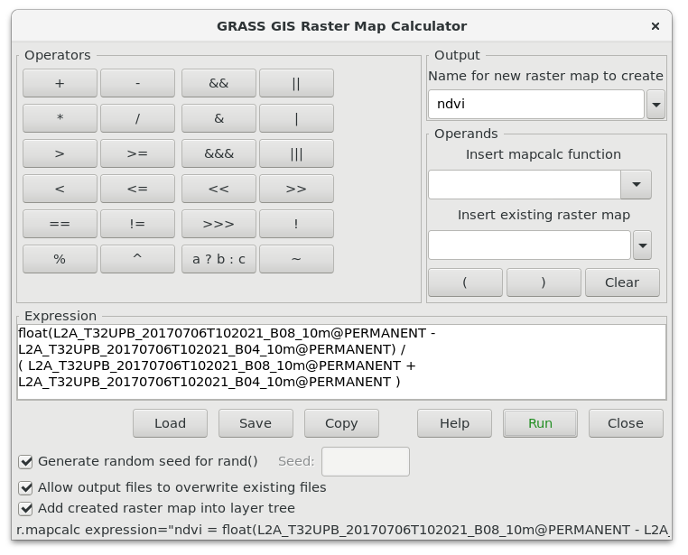
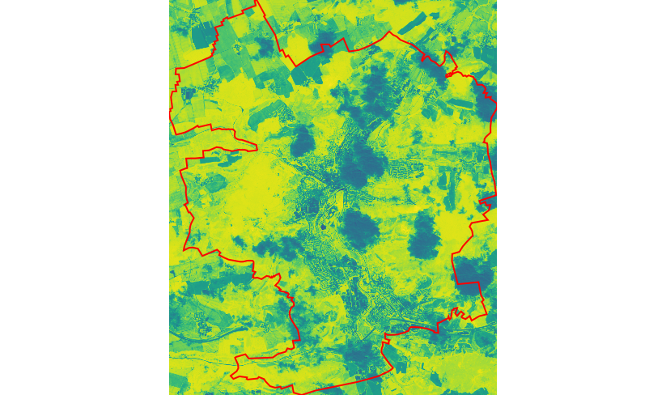
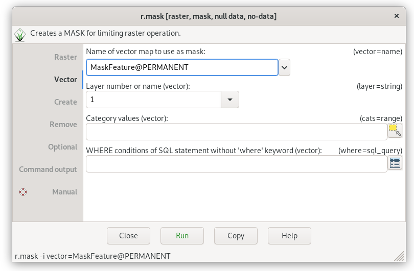
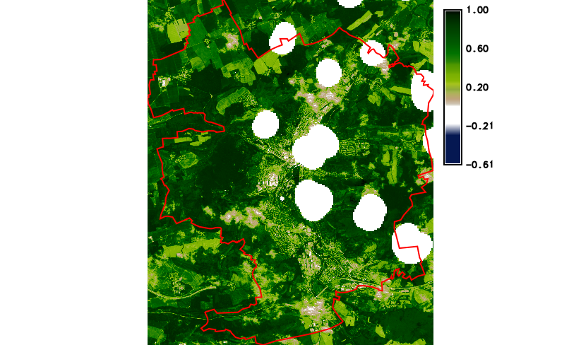

Unit 05 - Raster processing
===========================

Raster data processing is **always** limited to the current
:ref:`computational region <region>`.
     
Let's demostrate raster processing on :wikipedia:`map algebra` based
computation of :wikipedia:`NDVI` (Normalized difference vegetation
index). The key GRASS module that allows a user to do the map algebra
is :grasscmd:`r.mapcalc`. A GUI tool for map algebra can be launched
from :menuselection:`Raster --> Raster map calculator` or by
|grass-raster-calculator| :sup:`Raster map calculator` from the main
toolbar.

To compute NDVI, the red (VIS) and near-infrared (NIR) bands are
required. In the case of Sentinel-2, it refers to 4th and 8th
band. Missing Sentinel-2 8th band can be imported as explained in
:doc:`03` from :file:`L2A_T32UPB_20170706T102021_B08_10m.jp2` file.
      
.. math::
        
   NDVI = (NIR - VIS) / (NIR  + VIS)

   GUI map algebra tool. Compute NDVI by :item:`Expression`. Result of
   computation is defined by :item:`Output` section.

Corresponding command (map names shorten):

.. code-block:: bash

   r.mapcalc expression="ndvi = float(B08_10m - B04_10m) / ( B08_10m + B04_10m )"

.. note:: Because all input raster maps are CELL type (integer) at
          least one sub-result must be converted to floating-point by
          ``float()`` function. Otherwise result would be also CELL
          map (integer: -1, 0, 1).

           
   NDVI computed by :grasscmd:`r.mapcalc` map algebra module (Jena
   city in red color).

Result requires some improvements:

* default color table *viridis* is not suitable for NDVI values
* NDVI was computed also in cloudy areas

The first shortcoming can be easily solved by changing color table to
`ndvi` as described in :ref:`color-table` section. The second requires
setting a mask to ignore cloudy areas by the computation. Raster mask
can be created by :grasscmd:`r.mask`. Like other modules from the
``r.*`` family, it operates in the current computational region.

Let's create raster mask from cloud mask vector map in inverse manner.

   Creating raster mask from an input vector map.
   
.. code-block:: bash

   r.mask -i vector=MaskFeature

.. note:: Cloud mask provided by Sentinel products is not perfect, but
   it is a good starting point for us.

           
   Final NDVI result with cloud mask and simple legend added to map
   display by |grass-overlay-add| :sup:`Add map elements` (*Add raster
   legend*) from Map Display toolbar.

A mask can be deactivated ``r.mask -r`` command.

Recommended approach for computing NDVI
---------------------------------------

Note that there is specialized module for computing various vegetation
indices including NDVI - :grasscmd:`i.vi`. This module makes NDVI
computing even simpler.

Let's recompute :map:`ndvi` map using :grasscmd:`i.vi` (map names
shorten):

.. code-block:: bash

   i.vi red=B04_10m output=ndvi viname=ndvi nir=B08_10m
