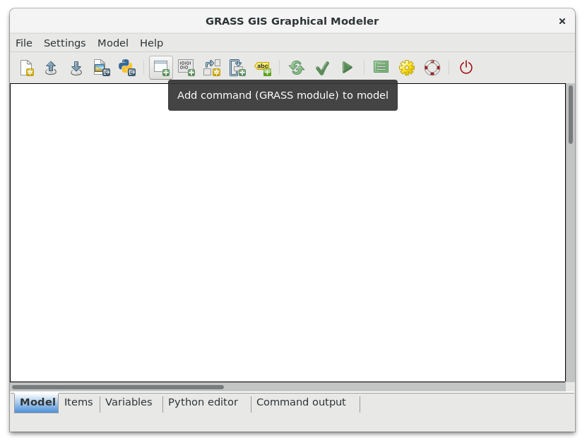
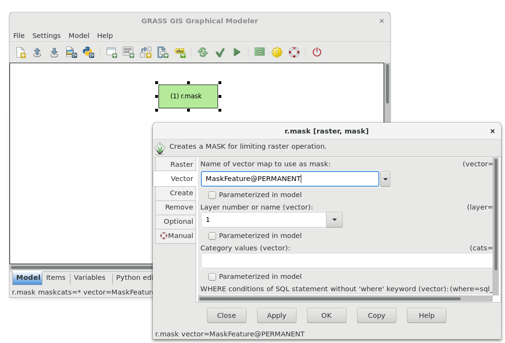
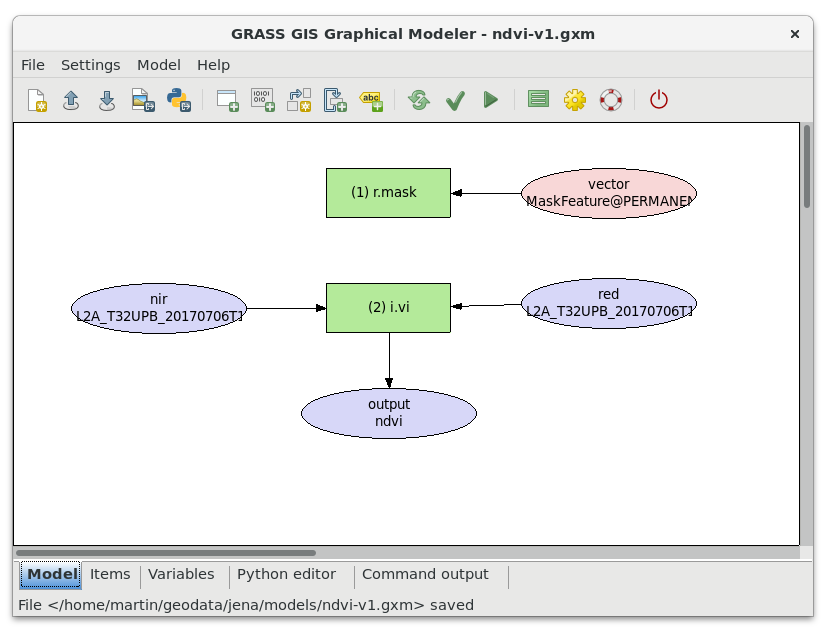
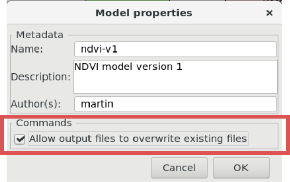
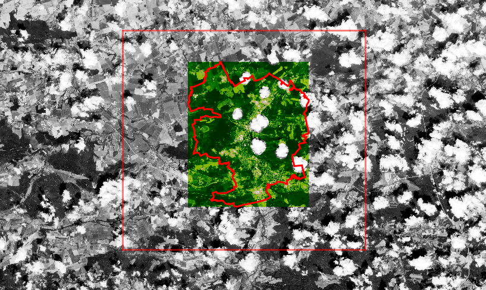
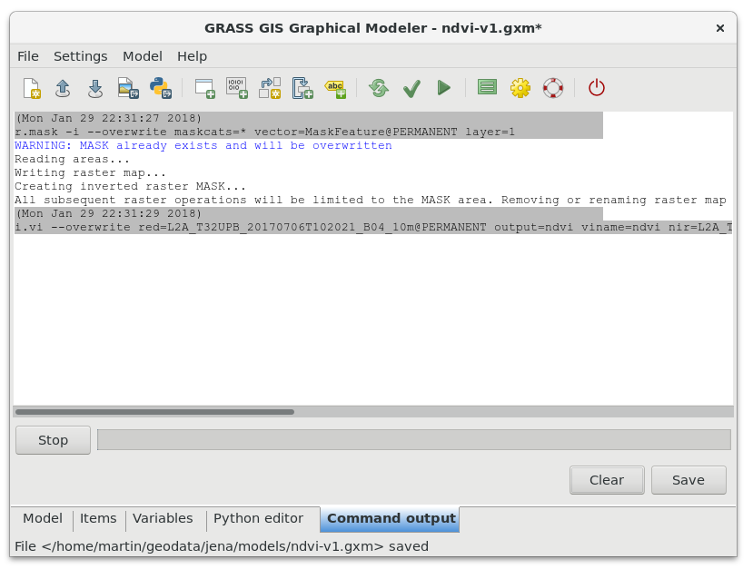
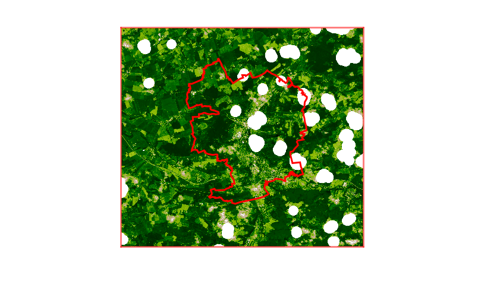

Unit 06 - Modeler
=================

**Graphic Modeler** allows creating, editing, and managing complex
models in easy-to-use user interface. Using Graphical Modeler, that
chain of processes (ie. GRASS modules) can be wrapped into one process
(ie. model). So it's easier to execute the model repeatedly with
slightly different inputs or parameters.

We will start with simple model based on :doc:`05`. Our tool will
compute in current computational region NDVI by :grasscmd:`i.vi`
module. Actually the model will perform two operations:

#. Set mask based on vector cloud mask file (:grasscmd:`r.mask`)
#. Compute NDVI (:grasscmd:`i.vi`)

Graphical Modeler can be launched from menu :menuselection:`File -->
Graphical modeler` or by |grass-modeler-main| :sup:`Graphical Modeler`
from main toolbar (or alternatively as :grasscmd:`g.gui.gmodeler`
module from console).

   Graphical Modeler.
   
GRASS modules can be added to the model by :menuselection:`Model -->
Add command` or by |grass-module-add| :sup:`Add command (GRASS module) to the
model` from main toolbar.

.. figure:: ../images/units/06/add-module.png
   :class: small
   
   Add commands (GRASS modules) to the model, in this case :grasscmd:`r.mask`.

After adding :grasscmd:`r.mask` let's open properties dialog by
double-click and enter vector map used as a mask. Don't forget to
enable inverse mask by :option:`-i` flag.

   
   Define parameters for :grasscmd:`r.mask`, a vector map used for
   creating a mask.

In similar way will be added to the model second command
:grasscmd:`i.vi` (Properties dialog for this command is open
automatically because there are required options which must be set).

   NDVI model version 1.

It's good idea to set metadata for the model and enable overwriting
data produced by model (:menuselection:`Model --> Model properties`).

   
   Define model properties and enable overwriting data produced by
   model.

Let's try out our first model. Before running the model we should
change computation region. The easier way is to use *Set computation
region extent interactively* from |grass-zoom-more| :sup:`Various zoom
options` in Map Display.

.. note:: Before changing the region it's useful to remove existing
          mask in order to see whole Sentinel scene.

          .. code-block:: bash

             r.mask -r

   Changed computation region before running the model.

Now let's run our model by |grass-execute| :sup:`Run model`. Progress
is printed into :item:`Command output`.

   Model computation progress.

After redrawing map display |grass-layer-redraw| :sup:`Render map` (assuming
that we have already displayed raster map of NDVI in map display), we
should see a difference.

   New NDVI raster map computed by the model.

Model to download: `ndvi-v1.gxm <../_static/models/ndvi-v1.gxm>`__
