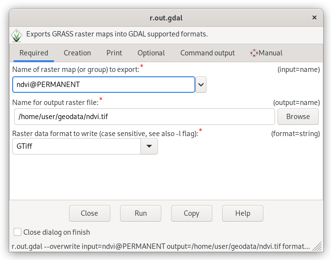
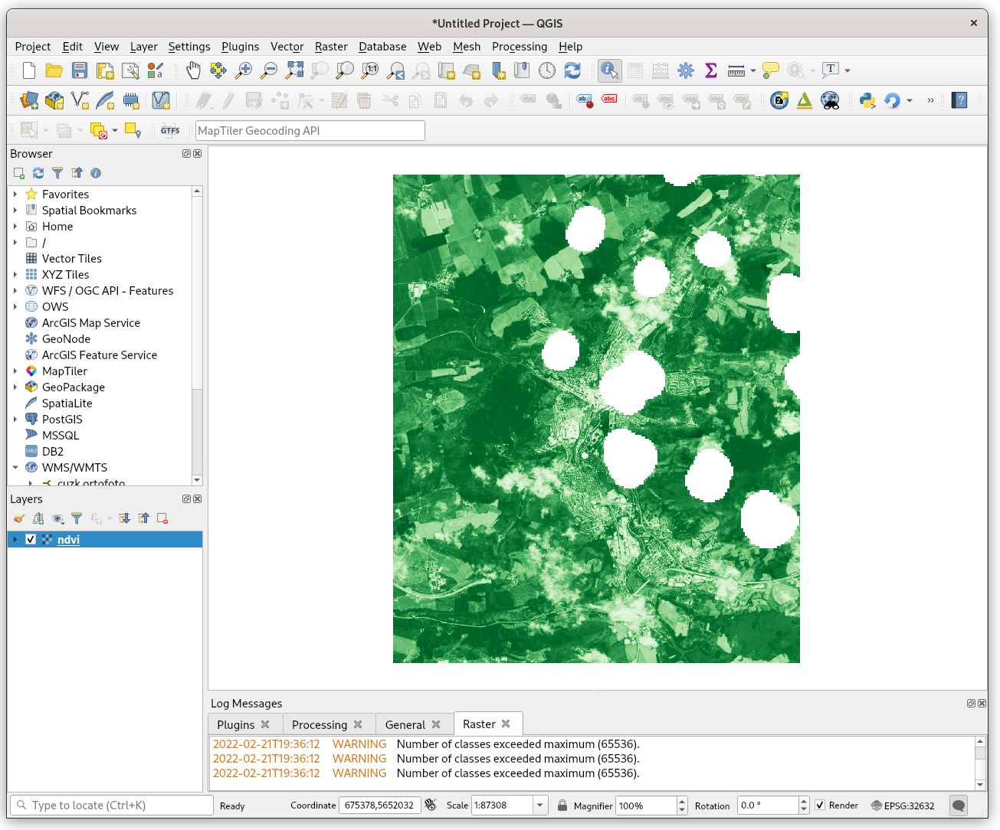

 Unit 06 - Data export
======================

Data produced by GRASS modules (like :grasscmd:`i.vi` in :doc:`05`) is
stored always in the current mapset. *It's a rule.* To store data in
different mapset, such mapset must be set as current
(:menuselection:`Settings --> GRASS working environment --> Change
mapset`) before computation.

There are two fundamental modules for exporting data:

* :grasscmd:`r.out.gdal` for exporting raster data
  (:menuselection:`File --> Export raster map --> Common export
  formats`)
* :grasscmd:`v.out.ogr` for exporting vector data (:menuselection:`File
  --> Export vector map --> Common export formats`)

Both the modules are based on well-known `GDAL <http://gdal.org>`__
library for reading and writing raster and vector geospatial data
formats. Thanks to this library GRASS is able to export data into
various GIS formats, see supported `raster
<http://www.gdal.org/formats_list.html>`__ and `vector
<http://www.gdal.org/ogr_formats.html>`__ formats.

.. figure:: ../images/units/06/export-menu.png

   Export raster map from Layer Manager.

.. important:: Remember that raster export module operates on current
   computation region. So don't forget to set desired computation
   region before exporting data. In this way, for example, you can
   easily export only subregion.

   Export NDVI raster into GeoTIFF format.

Try to load created raster in your favorite GIS software like Esri
ArcGIS or QGIS. Note that color table is not exported in the case of
floating-point data, so you need to set up suitable color
interpretation in your software on your own.

      
   NDVI TIFF file loaded in QGIS.

.. _vector-notes:

Useful notes
============

* Most of vector formats are based on **simple feature model**. It means
  that GRASS export module converts topological primitives (lines,
  boundaries, centroids, areas, isles) into simple features
  (linestrings, polygons). Points have no topology, so no conversion is
  involved.
* GRASS does not distinguish between **single and multi parts**
  (features and multifeatures). Attributes are simply linked to
  primitives (usually points, lines, or centroids) via so called
  category. More primitives can have the same category, so the same
  attributes linked. This is a way how GRASS handles multiparts. By
  default :grasscmd:`v.out.ogr` exports such primitives like single
  parts, ie. featutes. Multi parts (multifeatures) are written only
  when :option:`-m` flag is given.
* GRASS supports also one of few topological formats, **PostGIS
  Topology**, see :grasscmd:`v.out.postgis` for details.
* To increase interoperability with your Esri colleagues, GRASS data
  can be exported directly also to **Esri File Geodatabase
  format**. This requires GDAL with `FileGDB
  <http://gdal.org/drv_filegdb.html>`__ support. But we highly
  recommend to use for data exchange open standards like **OGC
  GeoPackage** which Esri products can (usually) read. BTW, this
  format is default for :grasscmd:`v.out.ogr` since GRASS 7.4.

Output data in external formats
===============================

GRASS environment can be set to produce data directly in external
formats. It can be useful at the end of a workflow when final output
data are produced. Writing output data directly to desired format
saves one step, exporting data outside GRASS (:grasscmd:`r.out.gdal`,
:grasscmd:`v.out.ogr`). External format can be set using
:grasscmd:`r.external.out` for raster outputs or by
:grasscmd:`v.external.out` in the case of vector outputs.

Example for our workflow (map names shorten):

.. code-block:: bash

   g.region vector=jena_boundary align=B04_10m
   r.mask --overwrite -i vector=MaskFeature
   r.external.out directory=/opt/geodata/jena format=GTiff extension=tif
   i.vi --overwrite red=B04_10m output=ndvi nir=B08_10m

Produced data are stored directly (without any data conversion) in
external format (GeoTIFF in this case). GRASS also creates
automatically link to such data (similarly as :grasscmd:`r.external`
do), so you can access produced data as normal raster maps.

Interoperability with Esri ArcGIS
=================================
               
GRASS is able to ready data stored in Esri File Geodatabase out of the
box. Thanks to GDAL library which comes with `OpenFileGDB
<http://gdal.org/drv_openfilegdb.html>`__ support. Note that only
vector data (feature classes) are supported, it's not possible to read
raster data from this format. As already noted in :ref:`vector-notes`,
vector data can be written to Esri File Geodatabase format only when
GDAL is installed with proprietary-based `FileGDB
<http://gdal.org/drv_filegdb.html>`__ support.

In any case we recommend modern OGC-based **OGC GeoPackage** format for
exchanging data between various GIS packages. This format allows to
store multiple raster or vector layers in one file (GeoPackage is
based on file-based SQLite DB format).
