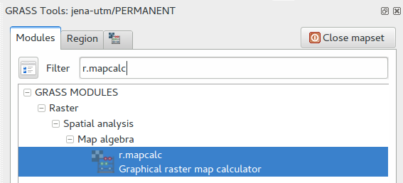
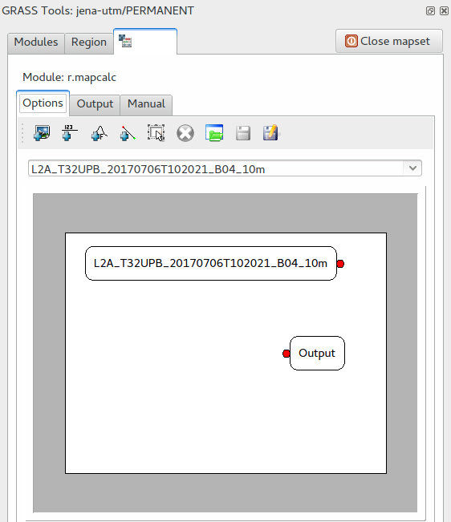
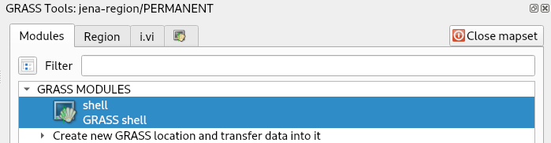

Unit 07 - QGIS loves GRASS
==========================

Let's step out of the GRASS GIS for a moment. **QGIS** is a very
popular open source GIS package which made a significant progress in
the last years. Nowadays it's used in education, academic environment,
but also in commercial settings. The project started originally more
or less as a multiplatform browser for geospatial data. This is not
true any more, QGIS made important steps for being an analytic
tool. Beside native algoritms QGIS offers also connection to external
software packages like SAGA, Orfeo or GRASS GIS. In other words, you
can run GRASS tools from QGIS without starting GRASS explicitly.

There two options how to access GRASS tools from QGIS environment:

* generic **Processing** plugin
* specialized **GRASS** plugin

Both plugins can be easily activated from :menuselection:`Plugins -->
Manage and Install Plugins`.

Let's focus on our "favorite" GRASS module - :grasscmd:`i.vi`. At
first, we load into QGIS input data, Jena city region and Sentinel
bands (red and near-infrared channels).

.. figure:: ../images/units/07/qgis-input-data.png
   :class: large
           
   Input data loaded in QGIS.

Processing plugin
-----------------

Processing plugin is a generic toolbox which allows to use processing
tools provided by various software packages. Let's open
:menuselection:`Processing --> Toolbox` and search for
:grasscmd:`i.vi` GRASS module.

.. figure:: ../images/units/07/processing-i-vi.png
   :class: small
           
   Search for :grasscmd:`i.vi` GRASS module in Processing toolbox.

.. figure:: ../images/units/07/processing-i-vi-params.svg
   :class: middle
                    
   Set input parameters. Computation extent can be defined in Advanced
   parameters section.

:numref:`processing-result` nicely shows how Processing plugin
is working. First of all a temporal GRASS location is created by
:grasscmd:`g.proj`, then input data are linking into this location by
:grasscmd:`r.external`. Then computation can finally starts by running
:grasscmd:`i.vi`. In the last step output data are exported outside of
GRASS using :grasscmd:`r.out.gdal`. The resultant GTIFF file can be
displayed in QGIS map window.

.. _processing-i-vi-running:

.. figure:: ../images/units/07/processing-i-vi-running.png
           
   Running tool, most of time takes exporting data outside of GRASS
   temporal session.
   
.. _processing-result:

.. figure:: ../images/units/07/processing-result.png
   :class: large
           
   Resultant NDVI raster displayed to QGIS map window (with better
   color interpretation than grayscale).

.. note:: We skipped masking cloud mask areas. There is a room for
          improvements ;-)

GRASS plugin
------------

GRASS plugin has been designed to support GRASS as processing toolbox
in more straightforward way. This also includes ability to display
data stored in GRASS native format, raster and vector maps located in
GRASS locations. And, of course, ability to run any GRASS command with
full flexibility of GRASS environment. On the other hand, in contrast
to **Processing** plugin, the GRASS plugin requires at least basic
knowledge of GRASS GIS. User have to understand concept of locations
and mapset, and control computational region. Data created by GRASS
plugin are persistent and accessible also by GRASS itself.

GRASS plugin behaves similarly to GRASS itself. In order to use GRASS
tools, there must be location and mapset to be entered. New
location/mapset can be created by :menuselection:`Plugins --> GRASS
--> New Mapset`. Creating new mapsets in GRASS plugin is a very
similar procedure to creating location/mapset in native GRASS
environment, see :ref:`Creating new location <create-location>` (Unit
02). As we already have GRASS location and mapset prepared from
:doc:`02`, we can easily open it by :menuselection:`Plugins --> GRASS
--> Open Mapset`.

.. figure:: ../images/units/07/grass-open-mapset.png
   :class: small
           
   Open existing location and mapset by GRASS plugin.

After opening mapset, the GRASS tools are activated and accessible
from menu :menuselection:`Plugins --> GRASS --> Open GRASS Tools`.

As advanced GRASS users, we know that before any computation desired
computational region must be defined. For this task, GRASS plugin
offers GUI tool in :item:`Region` tab. In any case, for more advanced
operations can be used :grasscmd:`g.region` GRASS module.

.. figure:: ../images/units/07/grass-region.svg

   Set computation region from map display. Don't forget to set
   correct spatial resolution (for real work it's better to use
   :grasscmd:`g.region` with `align` option).
   
We can try to compute NDVI index using :grasscmd:`r.mapcalc`, and
well-known map algebra technique.

   
   Search :grasscmd:`r.mapcalc` module in GRASS plugin.

GRASS plugin offers native graphical front-end for map algebra.

   Graphical Map Calculator in GRASS plugin.

Or simply launch :grasscmd:`i.vi` from **GRASS modules** tab or
alternatively from **GRASS Shell** as shows the figure below.

        
   GRASS Shell.

.. tip:: If you add special flag :param:`--ui` at the end of command,
   a native GRASS GUI dialog appears. In this way you can start other
   GRASS tools like :grasscmd:`g.gui.gmodeler` (see :doc:`08`) or
   whole GRASS GUI by :grasscmd:`g.gui`. But it seems schizophrenic a
   bit to start GRASS GUI from GRASS plugin in QGIS
   environment. Someone could ask, why don't you use GRASS directly
   ;-)

   .. figure:: ../images/units/07/grass-i-vi-shell.svg
      :class: large
           
      Launch native GUI dialog for :grasscmd:`i.vi` GRASS module.

In any case, output data are stored in current mapset open by GRASS
plugin. And GRASS data can be directly accessed by QGIS *Browse panel*
in standard way as other data sources, see
:numref:`qgis-grass-browse`.

.. _qgis-grass-browse:

.. figure:: ../images/units/07/grass-data-browse.png
   :class: large
        
   Browse GRASS data similarly as other data sources.
