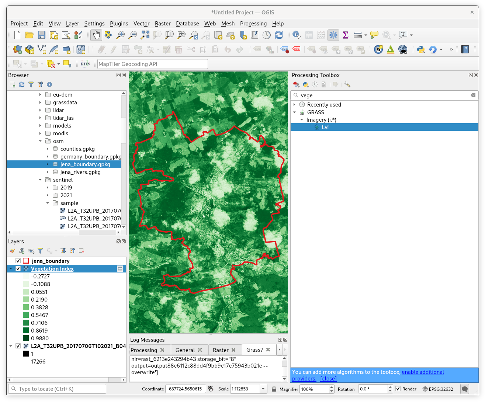

Unit 07 - QGIS loves GRASS
==========================

Let's step out from GRASS for a moment. QGIS is very popular open
source GIS package. QGIS did significant progress in the last few
years. Nowadays it's used in education, academic environment, but also
in commercial settings. There are a lot of companies which offers
technical service for QGIS which is fundamental issue when setting
QGIS in commercial environment. QGIS is very easy-to use. The project
started originally more or less a browser for geospatial data. This
not true any more, in last years QGIS made important steps to being an
analytical tool. Beside native tools QGIS offers also connection to
external software packages like SAGA, Orfeo or GRASS GIS. In other
words, you can run GRASS tools from QGIS without starting GRASS
explicitely.

There two options when using GRASS tools from QGIS:

* genering **Processing** plugin
* specialized **GRASS** plugin

Both plugins can be activated from :menuselection:`Plugins --> Manage
and Install Plugins`.

Let's focus on our favourite GRASS module - :grasscmd:`i.vi`. At first
load into QGIS input data, Jena city region and Sentinel bands (red
and near-infrared channels).

.. figure:: ../images/units/07/qgis-input-data.png
   :class: large
           
   Input data loading in QGIS.

Processing plugin
-----------------

Processing plugin is generic tool which allows to use processing
module from various software packages. Let's open
:menuselection:`Processing --> Toolbox` and search for
:grasscmd:`i.vi` in GRASS tools.

.. figure:: ../images/units/07/processing-i-vi.png
   :class: small
           
   Search for :grasscmd:`i.vi` in Processing toolbox.

.. figure:: ../images/units/07/processing-i-vi-params.svg
   :class: middle
                    
   Set input paramaters, don't forget about computation region.

:numref:`processing-i-vi-running` nicely shows how Processing plugin
is working. First of all a temporal GRASS location is created by
:grasscmd:`g.proj`, then input data are linking into this location by
:grasscmd:`r.external`. Then computation can finally starts
(:grasscmd:`i.vi`). In the last step outdata are exported outside of
GRASS using :grasscmd:`r.out.gdal` which can be displayed in QGIS map
window, see :numref:`processing-result`.

.. _processing-i-vi-running:

.. figure:: ../images/units/07/processing-i-vi-running.png
           
   Running tool, most of time takes exporting data outside GRASS
   temporal session.
   
.. _processing-result:

           
   Resultant NDVI raster displayed to QGIS map window (with better
   color interpretation than grayscale).
   
GRASS plugin
------------

GRASS plugin has been designed to support GRASS as processing tools in
more straighforward way. This includes also abitity to display in QGIS
data stored in GRASS native formats, in other words raster and vector
maps located in GRASS locations. And, of course, ability to run any
GRASS command with full flexibility of GRASS environment.
