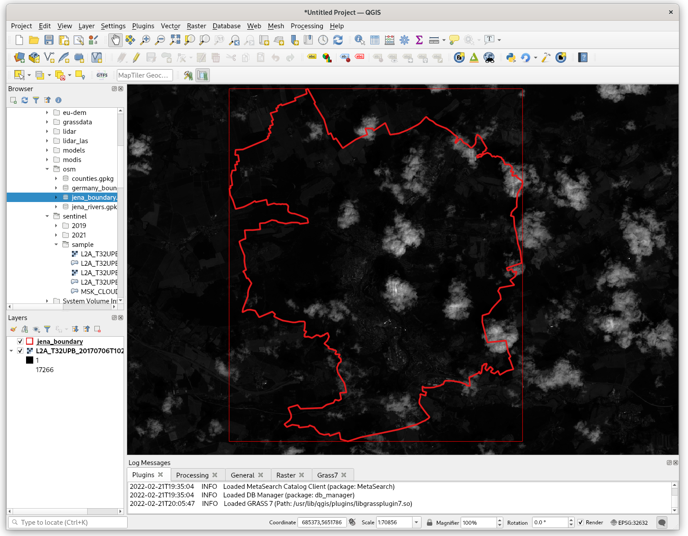

Unit 07 - QGIS loves GRASS
==========================

.. todo:: To be reviewed
          
Let's step out of the GRASS GIS for a moment. `QGIS
<http://qgis.org>`__ is a very popular open source GIS package which
made a significant progress in the last years. Nowadays it's used in
education, academic environment, but also in commercial settings. The
project started originally more or less as a multiplatform browser for
geospatial data. This is not a true any more, QGIS made important
steps for being an analytic tool. Beside native algoritms QGIS offers
also connection to external software packages like SAGA, Orfeo or
GRASS GIS. In other words, GRASS tools can be run directly from QGIS
enviroment without starting GRASS explicitly.

There are two options how to access GRASS tools from QGIS environment:

* generic **Processing** plugin
* specialized **GRASS** plugin

Both plugins can be easily activated from :menuselection:`Plugins -->
Manage and Install Plugins`.

Let's focus on our "favorite" GRASS module - :grasscmd:`i.vi`. At
first, load into QGIS input data, Jena city region and Sentinel bands
(red and near-infrared channels).

           
   Input data loaded in QGIS.

Processing plugin
-----------------

Processing plugin is a generic toolbox which allows to run processing
tools provided by various software packages. Let's open
:menuselection:`Processing --> Toolbox` and search for
:grasscmd:`i.vi` GRASS module.

.. figure:: ../images/units/07/processing-i-vi.png
   :class: small
           
   Search for :grasscmd:`i.vi` GRASS module in Processing toolbox.

.. figure:: ../images/units/07/processing-i-vi-params.svg
   :class: middle
                    
   Set input parameters (red and nir channels). Computation extent can
   be optionally defined in :item:`Advanced parameters` section.

:numref:`processing-i-vi-running` shows how Processing plugin
works. First of all a temporary GRASS location is created by
:grasscmd:`g.proj`, input data is linked into temporary location by
:grasscmd:`r.external`. Then computation can finally starts by running
:grasscmd:`i.vi` module. In the last step output data are exported out
of GRASS using :grasscmd:`r.out.gdal`. The resultant GeoTiff file is
displayed in QGIS map window.

.. _processing-i-vi-running:

           
   Running :grasscmd:`i.vi` tool, significant portion of computation
   time takes exporting data out of GRASS temporary session.
   
.. _processing-result:

.. figure:: ../images/units/07/processing-result.png
   :class: large
           
   Resultant NDVI raster displayed in QGIS map window (with better
   color interpretation than grayscale). No clouds mask involved.

GRASS plugin
------------

GRASS plugin has been designed to support GRASS as a *native*
processing toolbox.  This also includes ability to display data stored
in GRASS native format (raster and vector maps located in GRASS
locations). And, of course, ability to run any GRASS command with full
flexibility of GRASS GIS environment. On the other hand, in contrast
to *Processing* plugin, the GRASS plugin requires at least a basic
knowledge of GRASS GIS concept. User have to understand concept of
locations and mapsets, and control of computational region. In
opposite to Processing plugin a data created by GRASS plugin are
persistent, so accessible also by GRASS GIS itself.

In order to use GRASS tools, there must be a location and a mapset
available to be entered. New location/mapset can be created by
:menuselection:`Plugins --> GRASS --> New Mapset`. Creating a new
mapset using GRASS plugin is a very similar procedure to creating
location/mapset in native GRASS GIS environment, see :ref:`Creating
new location <create-location>` (Unit 02). Since there is already
GRASS location and mapset prepared from :doc:`02` it can be entered
by :menuselection:`Plugins --> GRASS --> Open Mapset`.

.. figure:: ../images/units/07/grass-open-mapset.png
   :class: small
           
   Enter existing location and mapset by GRASS plugin.

After entering an existing mapset, the GRASS tools are activated from
menu :menuselection:`Plugins --> GRASS --> Open GRASS Tools`.

As advanced GRASS users it is clear that before any raster-related
computation a desired computational region must be defined. For this
task, GRASS plugin offers GUI tool in :item:`Region` tab. In any case,
for more advanced operations can be used :grasscmd:`g.region` module.

.. figure:: ../images/units/07/grass-region.svg

   Set computation region from map display. Don't forget to set
   correct spatial resolution (for real work it's better to use
   :grasscmd:`g.region` with `align` option).

Simply launch :grasscmd:`i.vi` from :item:`Modules` tab.

.. figure:: ../images/units/07/grass-i-vi.png

   Launch :grasscmd:`i.vi` module from GRASS plugin.
          
.. tip:: GRASS modules can be launched from *GRASS shell* as shows
   the figure below.

   .. figure:: ../images/units/07/grass-shell.png
        
      Start a GRASS Shell.

   By adding a flag :param:`--ui` to the end of command, a native
   GRASS GUI dialog appears. In this way other GRASS tools like
   :grasscmd:`g.gui.gmodeler` (see :doc:`08`) or a whole GRASS GUI by
   :grasscmd:`g.gui` can started. Yes, it seems schizophrenic a bit to
   start GRASS GUI from GRASS plugin in QGIS environment. Someone can
   ask, why don't you use GRASS directly ;-)

   .. figure:: ../images/units/07/grass-i-vi-shell.svg
      :class: large
           
      Launch native GUI dialog for :grasscmd:`i.vi` GRASS module.

.. note:: NDVI can be alternatively computed using
   :grasscmd:`r.mapcalc`.

   .. figure:: ../images/units/07/grass-r-mapcalc.png
      :class: small
   
      Search :grasscmd:`r.mapcalc` module in GRASS plugin.

   GRASS plugin offers a native graphical front-end for map algebra.

      .. figure:: ../images/units/07/grass-map-calc.png

         Graphical Map Calculator in GRASS plugin.

Resultant output data are stored in the current mapset open by GRASS
plugin. Native GRASS data can be directly accessed from QGIS *Browse
Panel* in a standard way as other data sources, see
:numref:`qgis-grass-browser`.

.. _qgis-grass-browser:

.. figure:: ../images/units/07/grass-data-browse.png
   :class: large
        
   Browse GRASS data similarly as other data sources.
