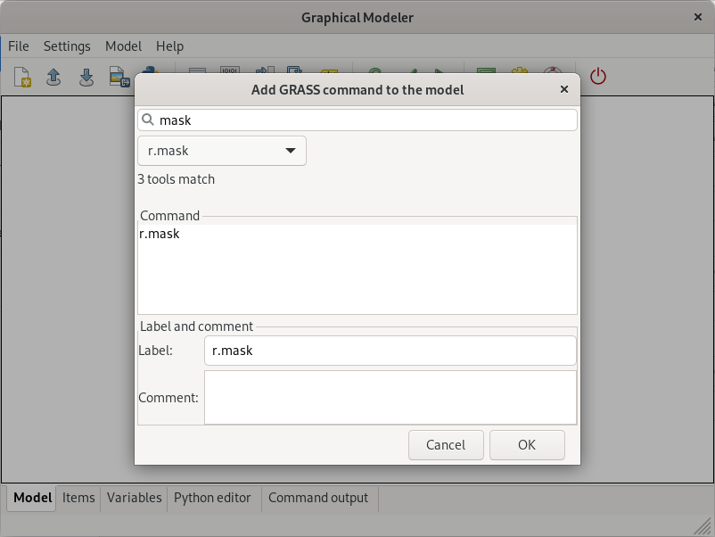
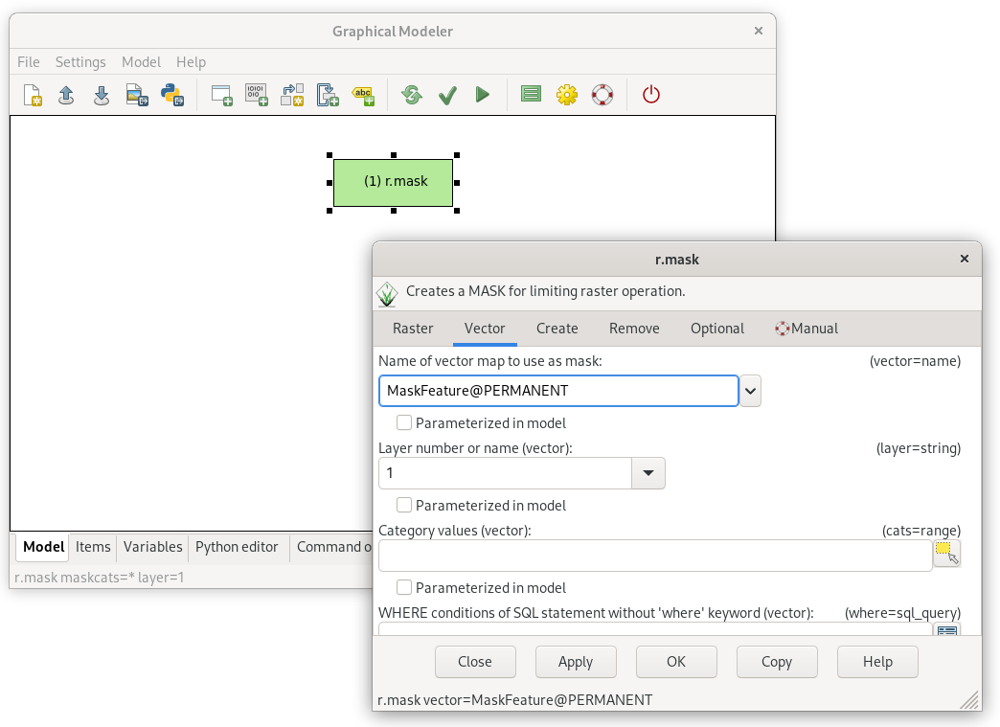
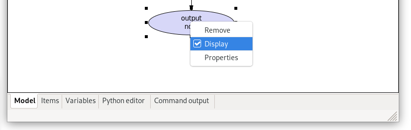

Unit 08 - Modeler
=================

**Graphic Modeler** allows creating, editing, and managing complex
models in easy-to-use graphical user interface. Using Graphical
Modeler, that chain of processes (ie. GRASS modules) can be wrapped
into one process (model). The model can be executed repeatedly with
slightly different inputs or parameters.

Our first model will be simple as much as possible based on :doc:`05`.
Actually the model will perform two operations:

#. set mask based on vector cloud mask file (:grasscmd:`r.mask`) and
#. compute NDVI (:grasscmd:`i.vi`)

Graphical Modeler can be launched from menu :menuselection:`File -->
Graphical modeler` or by |grass-modeler-main| :sup:`Graphical Modeler`
from main toolbar (or alternatively as :grasscmd:`g.gui.gmodeler`
module from console).

.. figure:: ../images/units/08/gmodeler.png

   Graphical Modeler.
   
GRASS modules can be added to the model from menu
:menuselection:`Model --> Add command` or by |grass-module-add|
:sup:`Add command (GRASS module) to the model` from main toolbar.

   
   Add commands (GRASS modules) to the model, in this case :grasscmd:`r.mask`.

After adding :grasscmd:`r.mask` module to the model let's open its
properties dialog by double-click and enter vector map to be used as a
mask. Don't forget to enable inverse mask by :param:`-i` flag.

   
   Define parameters for :grasscmd:`r.mask`, a vector map used for
   creating a mask.

In similar way will be added to the model second command
:grasscmd:`i.vi` (properties dialog for this command is open
automatically because there are required options which must be set).

   NDVI model version 1.

It's good idea to set metadata for the model and enable overwriting
data produced by model (:menuselection:`Model --> Model properties`).

.. figure:: ../images/units/08/model-v1-props.svg
   :class: small
   
   Define model properties and enable overwriting data produced by
   model.

   
   Set the output raster map to be automatically displayed in the map
   window.
   
Now let's run our model by |grass-execute| :sup:`Run model`. Progress
is printed into :item:`Command output`.

.. figure:: ../images/units/08/model-v1-output.png

   Model computation progress.

   
   New NDVI raster map computed by the model.

Run the model repeatedly on different computation regions. Current
computation region can be change easily by *Set computation region
extent interactively* from |grass-zoom-more| :sup:`Various zoom
options` in Map Display.

.. figure:: ../images/units/08/model-v1-region.png

   Change computation region before running the model.

.. important:: Before changing the region it's good idea to remove mask if
   exists.

   .. code-block:: bash

      r.mask -r

Sample model to download: `ndvi-v1.gxm <../_static/models/ndvi-v1.gxm>`__
