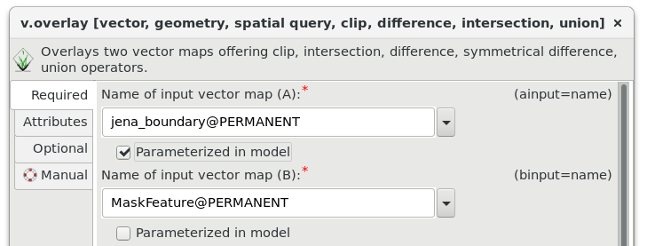

Unit 09 - Model tuning
======================

Let's improve our NDVI model created in :doc:`08`. The model operates
in a current computation region, it would be better to define region
based on user input. 

NDVI values range from +1.0 to -1.0. Areas of barren rock, sand, or
snow usually show very low NDVI values (less than 0.1). Sparse
vegetation such as shrubs and grasslands or senescing crops may result
in moderate NDVI values (approximately between 0.2 and 0.5). High NDVI values
(approximately between 0.6 and 1.0) correspond to dense vegetation such as that
found in temperate and tropical forests or crops at their peak growth
stage. Let's classify NDVI into 3 major classes:

* Class 1: from -1.0 to 0.2
* Class 2: from 0.2 to 0.6
* Class 3: from 0.6 to 1.0

The desired output will be a simplified vector map with NDVI
classes

From GRASS perspective a computation workflow can be decomposed to the
following steps:

#. Erase cloud mask in input region (:grasscmd:`v.overlay`: ``not`` operator)
#. Set computation region based on modified input region (:grasscmd:`g.region`)
#. Set mask (:grasscmd:`r.mask`)
#. Compute NDVI values (:grasscmd:`i.vi`)
#. Reclassify NDVI values into classes (:grasscmd:`r.recode`)
#. Set desired color table for NDVI classes
   (:grasscmd:`r.colors`)
#. Convert raster classes into vector areas (:grasscmd:`r.to.vect`)
#. Remove small areas (join them with adjacent areas by :grasscmd:`v.clean`)
#. Set color table based on NDVI raster classes (:grasscmd:`v.colors`)
   
Overview of commands below:

.. code-block:: bash

   v.overlay ainput=jena_region binput=MaskFeature operator=not output=region_mask
   g.region vector=region_mask align=L2A_T32UPB_20170706T102021_B04_10m
   r.mask vector=region_mask
   i.vi red=L2A_T32UPB_20170706T102021_B04_10m output=ndvi nir=L2A_T32UPB_20170706T102021_B08_10m
   r.recode input=ndvi output=ndvi_class rules=reclass.txt
   r.colors map=ndvi_class rules=colors.txt
   r.to.vect -s -v input=ndvi_class output=ndvi_class type=area
   v.clean input=ndvi_class output=ndvi_vector tool=rmarea threshold=1600
   v.colors map=ndvi_class raster=ndvi_class

.. note::

   Small areas can be also removed by raster-based workflow:

   .. code-block:: bash

      r.reclass.area input=ndvi_class output=ndvi_class2 mode=greater value=0.12
      r.grow.distance input=ndvi_class2 value=ndvi_class_c
          
The tools can be added to the existing model by |grass-module-add|
:sup:`Add GRASS tool (module) to model`. Note that newly added tools
are placed at the end of a computation workflow which is not
desired. Commands order can be changed in :item:`Items` tab.

.. figure:: ../images/units/09/reorder-items.png

   Reorder model items (GRASS tools) by :item:`Up/Down` buttons. In
   this case move :grasscmd:`v.overlay` up to the first position.

.. note:: Don't forget to align region bounds to input raster data
   (use :param:`align` option in :grasscmd:`g.region` tool).

Reclassification of floating point raster maps can be done by
:grasscmd:`r.recode`. An example of reclassification table:
          
.. code-block:: bash

   -1:0.2:1
   0.2:0.6:2
   0.6:1:3                

Beside predefined color tables :grasscmd:`r.colors` (see
:ref:`color-table` section) also allows to use user-defined color
table by :param:`rules` option. In our case a color table can be quite
simple:

.. code-block:: bash

   1 grey
   2 yellow
   3 green                

.. tip:: Reclassification and color table is recommended to be stored into
   files otherwise it can be lost when opening model next time:
   `reclass.txt <../_static/models/reclass.txt>`__ and `colors.txt
   <../_static/models/colors.txt>`__
         
.. figure:: ../images/units/09/model-v2.png

   Extended model.

Sample model to download: `ndvi-v2.gxm <../_static/models/ndvi-v2.gxm>`__
(note: don't forget to fix path to reclass and colors file for
:grasscmd:`r.recode` and :grasscmd:`r.colors` modules)

Parameterization
----------------

The model has all parameters hard-coded. User lacks possibility to
control input parameters before running model.

In Graphical Modeler a user input can be defined by two mechanisms:

* **parametrization** of tools parameters 
* using self-defined **variables** (ideal when multiple tools are
  sharing same user-defined input value)

Let's start with parametrization. Change the model in order to provide
the user ability to:

* define own area of interest (:param:`ainput` option in
  :grasscmd:`v.overlay`)
* set threshold for small areas (:param:`threshold` option in
  :grasscmd:`v.clean`)

To parameterize a command open its properties dialog. Option
parametrization can be easily enabled by :item:`Parameterized in
model` checkbox as shown below.

           
   Parametrization of :param:`ainput` option for :grasscmd:`v.overlay`
   command.

.. note:: Parameterized tools are highlighted in the model by a
          bold border.

After pressing |grass-execute| :sup:`Run model` the model is not run
immediately. GUI dialog is shown to allow entering user-defined
parameters before lauching model computation.

.. figure:: ../images/units/09/model-params.png
   :class: small

   Parameterized options are organized into tabs based on relevant tools.

After setting the input parameters the model can be :item:`Run`.
   
.. tip:: Saved models can be run directly from Layer Manager
   :menuselection:`File --> Run model` without opening Graphical Model
   itself.

.. task:: Test the model with different settings.

.. figure:: ../images/units/09/ndvi-no-reduction.png
   :class: large
           
   NDVI vector class without small area reduction.

.. figure:: ../images/units/09/ndvi-2000m2.png
   :class: large
           
   NDVI classes smaller than 2000m :sup:`2` (so 20 pixel) removed.

.. task:: Change computation region, eg. by buffering Jena city region
   (:grasscmd:`v.buffer`) and run the model.

.. code-block:: bash

   v.buffer input=jena_boundary output=jena_boundary_5km distance=5000

.. figure:: ../images/units/09/ndvi-jena-5km.png
   :class: large
   
   NDVI vector classes computed in 5km buffer around Jena city region.

Sample model to download: `ndvi-v3.gxm <../_static/models/ndvi-v3.gxm>`__
