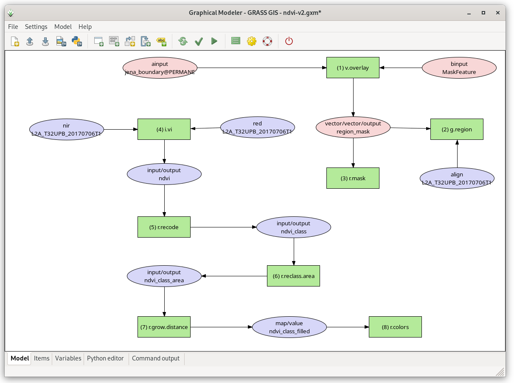
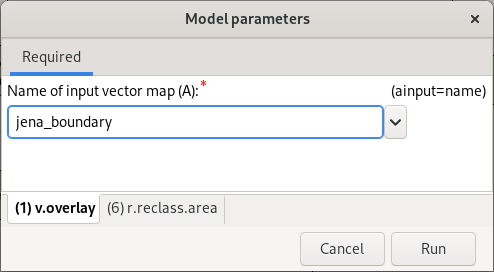

Unit 09 - Model tuning
======================

Let's improve our NDVI model created in :doc:`08`. Current model
operates in a current computation region, it would be better to define
region based on user input. Then NDVI would be computed only within
user defined area.

NDVI values range from +1.0 to -1.0. Areas of barren rock, sand, or
snow usually show very low NDVI values (for example, 0.1 or
less). Sparse vegetation such as shrubs and grasslands or senescing
crops may result in moderate NDVI values (approximately 0.2 to
0.5). High NDVI values (approximately 0.6 to 0.9) correspond to dense
vegetation such as that found in temperate and tropical forests or
crops at their peak growth stage. Let's classify NDVI into 3 major
classes:

* Class 1: from -1.0 to 0.2
* Class 2: from 0.2 to 0.6
* Class 3: from 0.6 to 1.0

The desired output will be a vector map with NDVI classes. Let's also
eliminate too small areas.

From GRASS perspective a computation will be performed by several steps/modules:

#. Erase cloud mask in input region (:grasscmd:`v.overlay`: ``not`` operator)
#. Set computation region based on modified input region (:grasscmd:`g.region`)
#. Set mask (:grasscmd:`r.mask`)
#. Compute NDVI values (:grasscmd:`i.vi`)
#. Reclassify NDVI values into classes (:grasscmd:`r.recode`)
#. Set a reasonable color table for raster map classes (:grasscmd:`r.colors`)
#. Convert raster classes into vector areas (:grasscmd:`r.to.vect`)
#. Remove small areas (join them with adjacent areas by :grasscmd:`v.clean`)

Overview of commands below:

.. code-block:: bash

   v.overlay ainput=jena_region binput=MaskFeature operator=not output=region_mask
   g.region vector=region_mask align=L2A_T32UPB_20170706T102021_B04_10m
   r.mask vector=region_mask
   i.vi red=L2A_T32UPB_20170706T102021_B04_10m output=ndvi nir=L2A_T32UPB_20170706T102021_B08_10m
   r.recode input=ndvi output=ndvi_class rules=reclass.txt
   r.colors map=ndvi_class rules=colors.txt
   r.to.vect -s -v input=ndvi_class output=ndvi_class type=area
   v.clean input=ndvi_class output=ndvi_vector tool=rmarea threshold=1600
   
The modules can be added to the existing model by |grass-module-add|
:sup:`Add command (GRASS module) to the model`. Note that new commands
are added to the end of a computation workflow which is not
desired. Commands (items in model terminology) can be reorder in
:item:`Items` tab.

.. figure:: ../images/units/09/reorder-items.png

   Reorder model items (commands). In this case move
   :grasscmd:`v.overlay` up to the first position.

.. note:: Be aware of correct computation region, don't forget to align region
   bounds to input raster data (:grasscmd:`g.region` with an :param:`align`
   option).

Reclassification of floating point raster maps can be done by
:grasscmd:`r.recode`. An example of reclassification table:
          
.. code-block:: bash

   -1:0.2:1
   0.2:0.6:2
   0.6:1:3                

Beside predefined color tables :grasscmd:`r.colors` (see
:ref:`color-table` section) also allows to use user-defined color
table by :param:`rules` option. In our case a color table can be quite
simple:

.. code-block:: bash

   1 grey
   2 yellow
   3 green                

.. tip:: Reclassification and color table is recommended to be stored into
   files otherwise it can be lost when opening model next time:
   `reclass.txt <../_static/models/reclass.txt>`__ and `colors.txt
   <../_static/models/colors.txt>`__
         

   Extended model.

Sample model to download: `ndvi-v2.gxm <../_static/models/ndvi-v2.gxm>`__
(note: don't forget to fix path to reclass and colors file for
:grasscmd:`r.recode` and :grasscmd:`r.colors` modules)

Parameterization
----------------

Our models have all parameters hard-coded, there is nothing which can be
influenced by a user when launching the model.

In Graphical Modeler an user input can be defined by two mechanisms:

* **parametrization** of module options
* using self-defined **variables** (ideal when more modules are sharing
  the same user-defined input value)

Let's start with parametrization of module options. Change the model
in order to provide the user ability to:

* define own area of interest (:param:`ainput` option in
  :grasscmd:`v.overlay`)
* set threshold for small areas (:param:`threshold` option in
  :grasscmd:`v.clean`)

To parameterize a command open its properties dialog. Option
parametrization is enabled by :item:`Parameterized in model` checkbox
as shown below.

.. figure:: ../images/units/09/parametrize-cmd.svg

   Parametrization of :param:`ainput` option for :grasscmd:`v.overlay`
   command.

.. note:: Parameterized commands are highlighted in the model by bold
          border.

After pressing |grass-execute| :sup:`Run model` the model is not run
automatically. Instead of that a GUI dialog is shown to allow entering
user-defined parameters.

   Parameterized options are organized into tabs based on the modules.

After setting the input parameters the model can be :item:`Run`.
   
.. tip:: Saved models can be run directly from Layer Manager
   :menuselection:`File --> Run model` without opening Graphical Model
   itself.

Let's test our model with different settings...

.. figure:: ../images/units/09/ndvi-no-reduction.png

   NDVI vector class without small area reduction.

.. figure:: ../images/units/09/ndvi-2000m2.png

   NDVI classes smaller than 2000m :sup:`2` (so 20 pixel) removed.

Let's change a computation region, eg. by buffering Jena city region
(:grasscmd:`v.buffer`).

.. code-block:: bash

   v.buffer input=jena_boundary output=jena_boundary_5km distance=5000

   
   NDVI vector classes computed in 5km buffer around Jena city region.

Sample model to download: `ndvi-v3.gxm <../_static/models/ndvi-v3.gxm>`__
