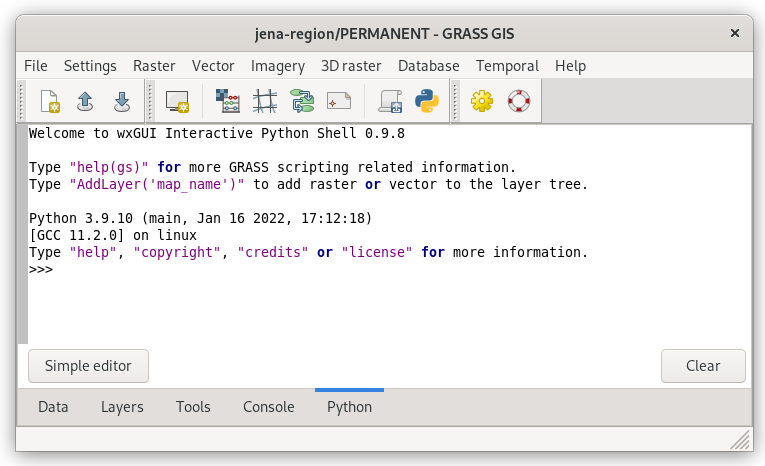
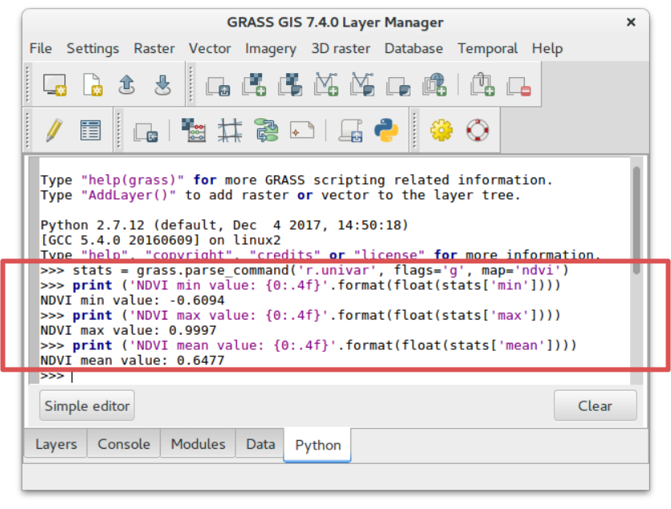
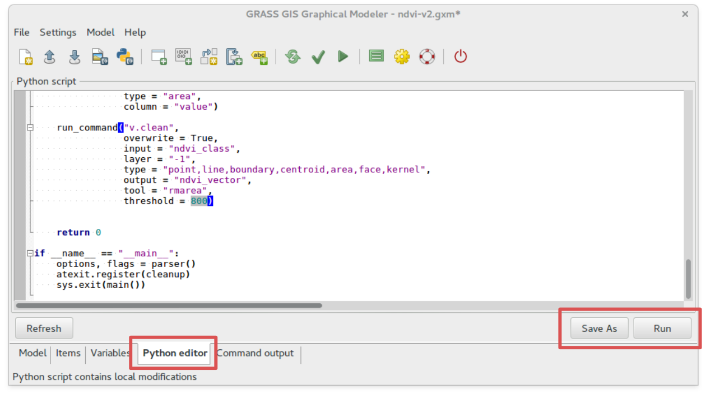

Unit 10 - Python intro
======================

:wikipedia:`Python` programming/scripting language is very popular in
the field of GIS and a science in general. Python is also the main
scripting platform for Esri products (see `arcpy
<http://pro.arcgis.com/en/pro-app/arcpy/get-started/what-is-arcpy-.htm>`__
package). GRASS is not an exception. In reality, many GRASS modules
are simple Python scripts, eg. :grasscmd:`r.mask` (see *Source Code*
section).

.. important:: Until GRASS GIS version 7.6 only Python 2 has been
   supported. Python 3 support has been introduced in GRASS GIS
   recently. The first version with full Python 3 support is GRASS GIS
   7.8 (Sep 2019).

GRASS Python environment includes various libraries, see
:grasscmd2:`GRASS documentation <libpython/index.html>` for
details. Let's focus on three main libraries related to this workshop:

* :grasscmd2:`GRASS Scripting Library <libpython/script_intro.html>`
  as entering node to Python scripting capabilities in GRASS GIS
* object-oriented (real Python) :grasscmd2:`pyGRASS
  <libpython/pygrass_index.html>`
* spatio-temporal :grasscmd2:`GRASS GIS Temporal Framework
  <libpython/temporal_framework.html>`

:grasscmd2:`PyGRASS <libpython/pygrass_index.html>` has been
originally design as an **object-oriented** Python API for GRASS
GIS. This is a major difference to :grasscmd2:`GRASS Scripting Library
<libpython/script_intro.html>` which consists of procedures - Python
functions. It is important to highlight that PyGRASS has not been
designed as replacement of GRASS Scripting Library, the both libraries
are living next to each other. It is up to the user (you) which
library use in his/her scripts. It's also possible to compine the both
libraries in one script.
  
Let's do our first steps towards Python scripting in GRASS GIS using
Layer Manager's :item:`Python` tab.

   Python shell in Layer Manager.
            
As initial step we try to script a simple computation workflow below:

#. Set computation extent to Jena city region, align region to Sentinel bands
#. Extend computation region by 1km offset
#. Set mask based on cloud vector map
#. Compute NDVI
#. Compute NDVI values statistics, print min, max and mean NDVI values

The workflow turns into bunch of GRASS commands (map names shorten):

.. code-block:: bash

   # 1.
   g.region vector=jena_boundary align=B04_10m
   # 2.
   g.region n=n+1000 s=s-1000 e=e+1000 w=w-1000             
   # 3.
   r.mask -i vector=MaskFeature
   # 4.
   i.vi red=B04_10m output=ndvi viname=ndvi nir=B08_10m             
   # 5.
   r.univar map=ndvi

.. tip:: GRASS modules run from :item:`Console` and GUI dialogs can be
   logged into file by :item:`Log file` (click to start/stop
   logging). Logged commands can be used as a starting point for your
   first Python script.

   .. figure:: ../images/units/10/layer-manager-log-file.svg
               
      Log GRASS commands into file.         
            
These commands will be turned into Python syntax. In this unit **GRASS
Scripting Library** will be used since GUI Python tab already includes
this library. Only basic syntax will be explained. In next units we
will switch to more "Pythonic" **PyGRASS** library.

.. _python-code:

GRASS commands can be run by :grass-script:`core.run_command` function.

.. code-block:: python
                
   # 1.
   grass.run_command('g.region', vector='jena_boundary', align='L2A_T32UPB_20170706T102021_B04_10m')
   # 2.
   grass.run_command('g.region', n='n+1000', s='s-1000', e='e+1000', w='w-1000')
   # 3.
   grass.run_command('r.mask', flags='i', vector='MaskFeature', overwrite=True)
   # 4.
   grass.run_command('i.vi', red='L2A_T32UPB_20170706T102021_B04_10m', output='ndvi',
                     viname='ndvi', nir='L2A_T32UPB_20170706T102021_B08_10m', overwrite=True)
   # 5.
   grass.run_command('r.univar', map='ndvi')

.. tip:: Python shell has its history, previous commands can be browsed by
   :kbd:`Alt+P`, next commands by :kbd:`Alt+N`.

Output of module :grasscmd:`r.univar` is discarded by
:grass-script:`core.run_command` function. :grasscmd:`r.univar` must
be run by :grass-script:`core.read_command` which returns an output of
the command. But it is still not perfect, statistics is printed to
standard output. It would be feasible to process command output as
Python object, a directory. This requires to:

* run :grasscmd:`r.univar` with :param:`-g` to enable shell script
  (parse-able) output
* use :grass-script:`core.parse_command` function which parses output
  and store result as a directory object

.. code-block:: python
                
   # 5.
   stats = grass.parse_command('r.univar', flags='g', map='ndvi')
   print ('NDVI min value: {0:.4f}'.format(float(stats['min'])))
   print ('NDVI max value: {0:.4f}'.format(float(stats['max'])))
   print ('NDVI mean value: {0:.4f}'.format(float(stats['mean'])))

   Running Python code in Layer Manager.   

Resultant NDVI raster map can be displayed easily by calling
``AddLayer()`` function directly from Python shell.

.. code-block:: python

   AddLayer('ndvi')                
   
.. _modeler-python:
            
Graphical Modeler and Python
----------------------------

A model created in Graphical Modeler can be easily turned into Python
script. Let's open the one of models created in :doc:`09`:
`ndvi-v2.gxm <../_static/models/ndvi-v2.gxm>`__ and switch to
:item:`Python editor` tab.

Generated Python script can be easily modified in built-in simple
editor.
           

   
   Python editor integrated in Graphical Modeler. Python code can be run or
   saved into file.
