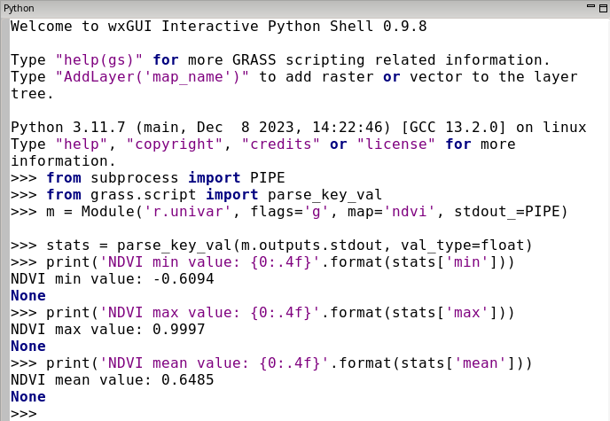
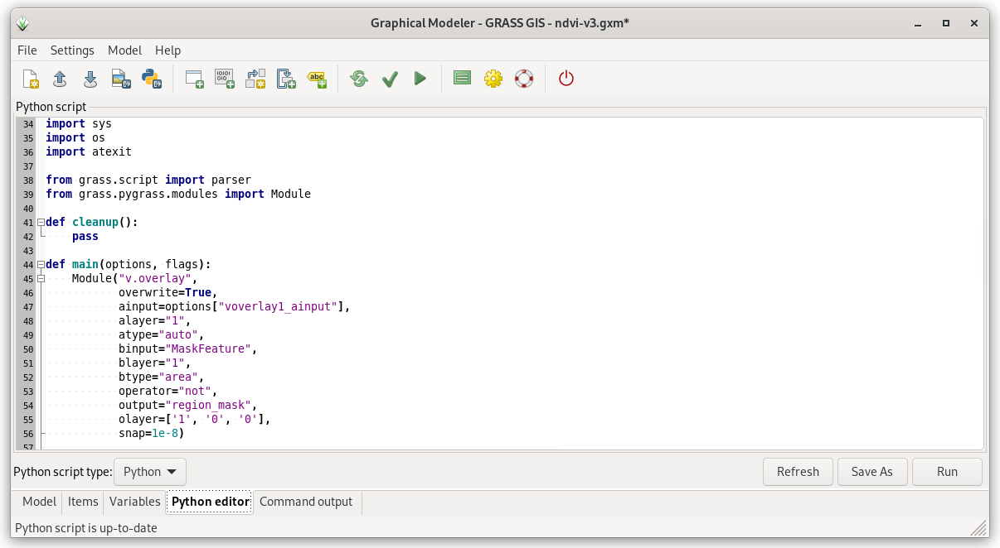

Unit 10 - Python intro
======================

:wikipedia:`Python <Python (programming language)>` programming
language is very popular in the field of GIS and data science in
general. Python is also the main scripting platform for Esri products
(see `arcpy
<http://pro.arcgis.com/en/pro-app/arcpy/get-started/what-is-arcpy-.htm>`__
package). GRASS is not an exception. In reality, many GRASS modules
are basically Python scripts, eg. :grasscmd:`r.mask` (see *Source
Code* section).

GRASS Python environment consists various libraries, see
:grasscmd2:`GRASS documentation <libpython/index.html>` for
details. Let's focus on three main libraries related to this workshop:

* :grasscmd2:`GRASS Script Package <libpython/script_intro.html>`
  as entering node to Python scripting capabilities in GRASS GIS
* object-oriented (native for Python) :grasscmd2:`pyGRASS
  <libpython/pygrass_index.html>`
* spatio-temporal :grasscmd2:`GRASS GIS Temporal Framework
  <libpython/temporal_framework.html>`

:grasscmd2:`PyGRASS <libpython/pygrass_index.html>` is designed as an
**object-oriented** Python API for GRASS GIS. This is a major
difference to GRASS Script Package which consists of procedures - Python
functions. It is important to highlight that PyGRASS is not a
replacement for GRASS Script Package. The both packages are living
next to each other. It is up to a user which package will use in
his/her scripts. It's also possible to compine both packages in one
single script (not recommended).
  
Let's do our first steps towards Python scripting in :item:`Python`
tab.

.. figure:: ../images/units/10/layer-manager-python.png
   :class: middle
           
   Interactive prompt in :item:`Python` tab.
            
Let's perform a simple computation workflow below in Python:

#. Set computation extent based on Jena city region, align
   computational region to Sentinel bands
#. Extend computation region by 1km offset
#. Set mask based on cloud vector map
#. Compute NDVI
#. Compute NDVI values statistics, print min, max and mean NDVI values

The workflow is represented by a set of GRASS commands (map names shorten):

.. code-block:: bash

   # 1.
   g.region vector=jena_boundary align=B04_10m
   # 2.
   g.region n=n+1000 s=s-1000 e=e+1000 w=w-1000             
   # 3.
   r.mask -i vector=MaskFeature
   # 4.
   i.vi red=B04_10m output=ndvi viname=ndvi nir=B08_10m             
   # 5.
   r.univar map=ndvi

.. tip:: GRASS modules run from :item:`Console` or GUI dialogs are
   logged by commands history. This history may be exported by
   :item:`Export history` button in :item:`Console` tab. Logged
   commands can be used as a starting point for your first Python
   script. The commands just need to be changed to satisfy Python
   syntax. Let's learn how to do it :-)

   .. figure:: ../images/units/10/history-panel.png
      :class: large
              
      GRASS GIS 8.4 comes with much better command history management.
            
Python code may be interactively run from :item:`Python` tab. In the
following units PyGRASS API will be systematically used.

.. _python-code:

GRASS commands can be run in by :pygrass-modules:`Module` object.

.. code-block:: python

   from grass.pygrass.modules import Module
   
   # 1.
   Module('g.region', vector='jena_boundary', align='L2A_T32UPB_20170706T102021_B04_10m')
   # 2.
   Module('g.region', n='n+1000', s='s-1000', e='e+1000', w='w-1000')
   # 3.
   Module('r.mask', flags='i', vector='MaskFeature', overwrite=True)
   # 4.
   Module('i.vi', red='L2A_T32UPB_20170706T102021_B04_10m', output='ndvi',
          viname='ndvi', nir='L2A_T32UPB_20170706T102021_B08_10m', overwrite=True)
   # 5.
   from subprocess import PIPE
   m = Module('r.univar', map='ndvi', stdout_=PIPE)
   print(m.outputs.stdout)

.. tip:: Python shell has also its history, previous commands can be browsed by
   :kbd:`Alt+P`, next commands by :kbd:`Alt+N`.

To catch output of :grasscmd:`r.univar` tool ``stdout_=PIPE`` must be
provided. But it is still not perfect, statistics is printed to
standard output and cannot be processed by Python commands. It would
be feasible to retrieve command's output as Python object, a
dictionary. This can be done by:

* running :grasscmd:`r.univar` with :param:`-g` to enable shell script
  (parse-able) output
* and using :grass-script:`core.parse_key_val` function which parses
  output and store result as a Python dictionary object

.. code-block:: python
                
   # 5.
   from grass.script import parse_key_val
   
   m = Module('r.univar', flags='g', map='ndvi', stdout_=PIPE)
   stats = parse_key_val(m.outputs.stdout, val_type=float)
   print('NDVI min value: {0:.4f}'.format(stats['min']))
   print('NDVI max value: {0:.4f}'.format(stats['max']))
   print('NDVI mean value: {0:.4f}'.format(stats['mean']))

           
   Running Python code in :item:`Python` tab.

Resultant NDVI raster map can be displayed easily by calling
``AddLayer()`` function directly from Python shell.

.. code-block:: python

   AddLayer('ndvi')                

.. _modeler-python:
            
Graphical Modeler and Python
----------------------------

Model created in Graphical Modeler can be easily converted into Python
script. Let's open the model created in :doc:`09`: `ndvi-v3.gxm
<../_static/models/ndvi-v3.gxm>`__ and switch to :item:`Python editor`
tab.

   
   Python editor integrated in Graphical Modeler. Python code can be
   modified, run or saved into file (:file:`ndvi-v3.py`).
