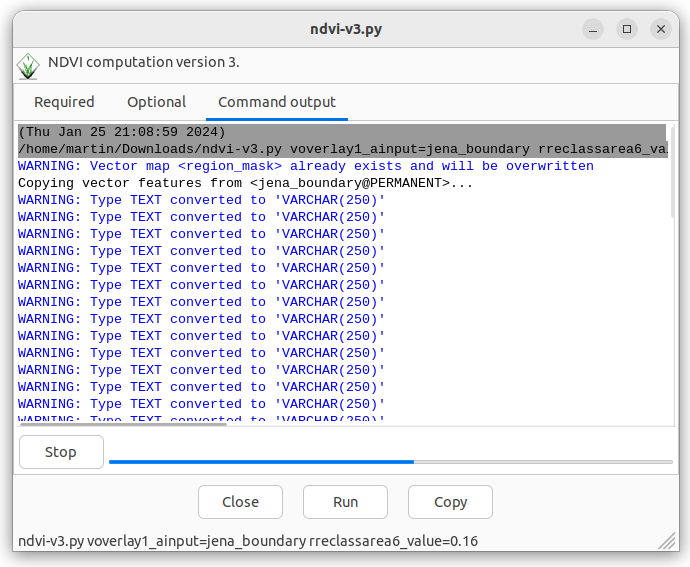

Unit 11 - PyGRASS scripting
===========================

Let's start with a Python script created by *Graphical modeler* in
:ref:`Unit 10 <modeler-python>`. Before saving the
script remove the lines below to avoid generating GUI dialogs when
launching the script (will be explained in :doc:`12`).

.. code-block:: python

   #%module
   #% description: NDVI model version 2
   #%end

Then run a script from Layer Manager |grass-script-load| :sup:`Launch
user-defined script` main toolbar.

.. note:: Before starting a script GRASS can ask you to add script
   directory path into GRASS_ADDON_PATH. It can be useful if you will
   run script(s) from this directory more often. Then you don't need
   to define full path to the scripts, its name will be enough.
   
   .. figure:: ../images/units/11/addon-path.png
      :class: small
           
      Register script directory into GRASS Addon Path.

After selecting a script to run, the command output will be printed in
Layer Manager :item:`Console` tab.
      

   Script output printed in Layer Manager Console.

Python script generated by Graphical Modeler is based on GRASS
Scripting Library. As a first step the script will be rewritten into
PyGRASS syntax.

PyGRASS syntax
--------------

Open exported Python script by your favorite editor or if your do not
have any just use GRASS-integrated Python editor |grass-python| :sub:`Open
a simple Python code editor`.

.. figure:: ../images/units/11/editor.png

   Simple GRASS Python code editor in action.

Load script by |grass-open| :sup:`Open` and replace every occurence of
:grass-script:`core.run_command` function by PyGRASS
equivalent. PyGRASS allows calling GRASS modules similarly as GRASS
Scripting Library does (see :doc:`10`). The module caller is
represented by :pygrass-modules:`Module` class. In contrast to GRASS
Scripting Library which defines several routines to run module
(:grass-script:`core.run_command`, :grass-script:`core.read_command`,
or :grass-script:`core.feed_command`) in PyGRASS there is only one
caller technique.

Replace all occurrence of :grass-script:`core.run_command` function by
:pygrass-modules:`Module` caller, see example below.

.. code-block:: python

   from grass.script import run_command

   run_command("v.overlay",
                overwrite = True,
                ainput = "jena_boundary@PERMANENT",
                alayer = "1",
                atype = "auto",
                binput = "MaskFeature@PERMANENT",
                blayer = "1",
                btype = "area",
                operator = "not",
                output = "region_mask",
                olayer = "1,0,0",
                snap = 1e-8)
by

.. code-block:: python

   from grass.pygrass.modules import Module

   Module("v.overlay",
          overwrite = True,
          ainput = "jena_boundary@PERMANENT",
          alayer = "1",
          atype = "auto",
          binput = "MaskFeature@PERMANENT",
          blayer = "1",
          btype = "area",
          operator = "not",
          output = "region_mask",
          olayer = "1,0,0",
          snap = 1e-8)
                 
.. warning:: There are some caveats. Mupliple options given as a string in
   GRASS Scripting Library must be given as a list of strings
   in PyGRASS, see :grasscmd:`v.clean` example below.

   .. code-block:: python

      run_command("v.clean",
                  ...
                  type = "point,line,boundary,centroid,area,face,kernel",
                  ...
                         
   .. code-block:: python
                          
      Module("v.clean",
             ...
             type = ["point","line","boundary","centroid","area","face","kernel"],
             ...

In the next step the script will be improved by printing NDVI value
statistics (be aware of indentation), see :ref:`Unit 10
<python-code>`.

.. literalinclude:: ../_static/scripts/ndvi-v2.py
   :language: python
   :lines:  87-94

.. note:: Import relevant functions

   .. literalinclude:: ../_static/scripts/ndvi-v2.py
      :language: python
      :lines:  19-21
   
Launch script by |grass-execute| :sup:`Run` and check out an output in
Layer Manager :item:`Console` tab.

.. figure:: ../images/units/11/run-script.svg
   :class: middle
        
   Run script from Python editor.

Statistics
----------

Also NDVI classes statistics could be reported. Area size can be
computed by :grasscmd:`v.report`.

.. literalinclude:: ../_static/scripts/ndvi-v2.py
   :language: python
   :lines:  96-105

Output of :grasscmd:`v.report` module need to be parsed. Unfortunately
the command does not offer a shell script output similarly to
:grasscmd:`r.univar`. Python fuctions like ``splitlines()`` and
``split()`` can be used.

At the end NDVI zonal statistics for each class can be computed:

* zonal statistics can be computed by :grasscmd:`v.rast.stats` and
  stored in attribute table
* attributes can be printed by :grasscmd:`v.db.select`

.. todo:: Can be simplified since this statistics is already reported
   by :grasscmd:`v.report`
          
.. literalinclude:: ../_static/scripts/ndvi-v2.py
   :language: python
   :lines:  107-116
                
Example of script output below.

::

   --------------------------------------------------------------------------------
   NDVI value statistics
   --------------------------------------------------------------------------------
   NDVI min value: -0.6094
   NDVI max value: 0.9997
   NDVI mean value: 0.6485
   --------------------------------------------------------------------------------
   NDVI class statistics
   --------------------------------------------------------------------------------
   NDVI class 1: 271.3 ha
   NDVI class 2: 2438.7 ha
   NDVI class 3: 7561.0 ha
   --------------------------------------------------------------------------------
   NDVI class 1: -0.4340 (min) 0.7404 (max) 0.0514 (mean)
   NDVI class 2: -0.1738 (min) 0.8547 (max) 0.3262 (mean)
   NDVI class 3: -0.6094 (min) 0.9997 (max) 0.7740 (mean)
        
.. tip:: In order to simplify testing and increase code readability
   our code could be split into two functions: ``compute()`` and
   ``stats()``.

   .. code-block:: python

      def main(options, flags):
          compute(options)
          stats(options)
      
          return 0

Sample script to download: `ndvi-v2.py <../_static/scripts/ndvi-v2.py>`__

