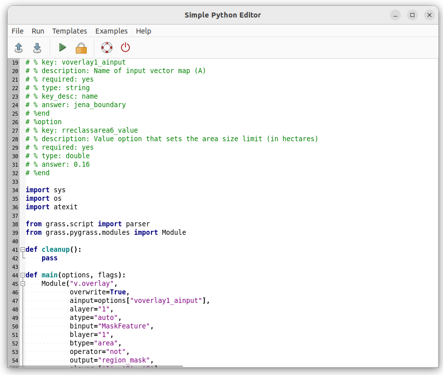

Unit 11 - PyGRASS scripting
===========================

Let's start with a Python script created by Graphical Modeler in
:ref:`Unit 10 <modeler-python>`. Run this script from the main toolbar
by |grass-script-load| :sup:`Launch user-defined script`.

.. note:: Before starting the script GRASS will ask about adding a
   script directory path into GRASS_ADDON_PATH. It can be useful if
   you will run script(s) from this directory more often. Then you
   don't need to define full path to scripts, script name will be
   enough.
   
   .. figure:: ../images/units/11/addon-path.png

      Add script directory into GRASS Addon Path.

.. figure:: ../images/units/11/script-output.png
   :class: middle
           
   Script output is printed into :item:`Console` tab.

Open exported Python script by your favorite IDE or if your do not
have any just use GRASS-integrated Python editor |grass-python| :sub:`Open
a simple Python code editor`.

   Simple GRASS Python code editor in action.

Load script by |grass-open| :sup:`Open` and improve the script by
printing NDVI value statistics (be aware of indentation which is
crucial for Python syntax) as described in :ref:`Unit 10
<python-code>`.

.. literalinclude:: ../_static/scripts/ndvi-v3.py
   :language: python
   :lines:  104-111

.. note:: Import also relevant function

   .. literalinclude:: ../_static/scripts/ndvi-v3.py
      :language: python
      :lines:  37,39

        
   Launch script by |grass-execute| :sup:`Run` and check out an output
   in :item:`Console` tab.

Statistics
----------

Let's add additional NDVI classes statistics computed by
:grasscmd:`r.stats`:

.. code-block:: bash

   r.stats -ian input=ndvi_class_filled

In Python:

.. literalinclude:: ../_static/scripts/ndvi-v3.py
   :language: python
   :lines:  113-122

Output of :grasscmd:`r.stats` tool need to be parsed. Unfortunately
the command does not offer a shell script output similarly to
:grasscmd:`r.univar`. This may be solved by Python functions like
``splitlines()`` and ``split()``.

Additionally let's compute also zonal statistics (min, max, mean) for each NDVI
class. This could be computed by :grasscmd:`r.stats.zonal` for each
object-based statistic (min, max, mean). Alternatively raster classes may be converted to vector by :grasscmd:`r.to.vect` and statistics may be computed by :grasscmd:`v.rast.stats` as shown below.

.. note:: Unfortunately :grasscmd:`r.grow.distance`
          is producing floating-point (DCELL) raster data by default. So first,
          let's convert :map:`ndvi_class_filled` from floating-point (DCELL) to
          integer. 

.. code-block:: bash

   r.mapcalc expression="ndvi_class_filled_i = int(ndvi_class_filled)"
   r.to.vect -v input=ndvi_class_filled_i output=ndvi_class_filled type=area
   v.rast.stats -c map=ndvi_class_filled raster=ndvi column_prefix=ndvi method=minimum,maximum,average

In Python:

.. literalinclude:: ../_static/scripts/ndvi-v3.py
   :language: python
   :lines:  124-137
                
Example of script output below.

::

   --------------------------------------------------------------------------------
   NDVI value statistics
   --------------------------------------------------------------------------------
   NDVI min value: -0.6094
   NDVI max value: 0.9997
   NDVI mean value: 0.6485
   --------------------------------------------------------------------------------
   NDVI class statistics
   --------------------------------------------------------------------------------
   NDVI class 1: 273.7 ha
   NDVI class 2: 2437.7 ha
   NDVI class 3: 7559.7 ha
   --------------------------------------------------------------------------------
   NDVI class 1: -0.4340 (min) 0.7133 (max) 0.0514 (mean)
   NDVI class 2: -0.4537 (min) 0.9989 (max) 0.3262 (mean)
   NDVI class 3: -0.6094 (min) 0.9997 (max) 0.7740 (mean)

Sample script to download: `ndvi-v3.py <../_static/scripts/ndvi-v3.py>`__

.. task:: In order to simplify testing and improve code readability
   split code into two Python functions: ``compute()`` and ``stats()``.

   .. code-block:: python

      def main(options, flags):
          compute(options)
          stats(options)
      
          return 0

.. task:: Solve issue with statistics which do not follow class
          definition: eg. minimum value of class 3 (-0.6) is out of
          range (0.6 to 1.0). This is caused by removing small areas
          and filling holes by adjacent class.
