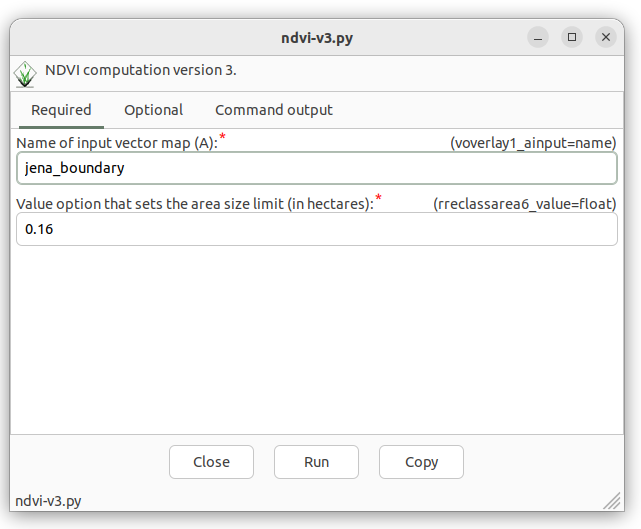

Unit 12 - Script tuning
=======================

In :doc:`10` and :doc:`11` we gain basic knowledge of
:grasscmd2:`GRASS Scripting Library <libpython/script_intro.html>`, we
know how to run GRASS modules using different functions
(:grass-script:`core.run_command`, :grass-script:`core.read_command`,
and :grass-script:`core.parse_command`). We are also able to parse
module output in simply way. Beside :grass-script:`core` package the
GRASS Scripting Library also offers useful functions which can
simplify our scripts.

* :grasscmd2:`db <libpython/script.html#module-script.db>` Database
  related functions
* :grasscmd2:`raster <libpython/script.html#module-script.raster>`
  Raster related functions
* :grasscmd2:`raster3d <libpython/script.html#module-script.raster3d>`
  Raster3d related functions
* :grasscmd2:`vector <libpython/script.html#module-script.vector>` Vector
  related functions

In our case we could replace :grasscmd:`v.db.select` caller by
:grass-script:`vector.vector_db_select` function. In other worlds
replace code below

.. code-block:: python
                
    # v.db.select: don't print column names (-c)
    ret = read_command('v.db.select', flags='c', map='ndvi_vector', separator='comma')
    for line in ret.splitlines():
        # parse line (eg. 1,,-0.433962264150943,0.740350877192983,0.051388909449992)
        cat,label,min,max,mean = line.split(',')
        print ('NDVI class {0}: {1:.4f} (min) {2:.4f} (max) {3:.4f} (mean)'.format(
        cat, float(min), float(max), float(mean)))

by

.. code-block:: python

    from grass.script.vector import vector_db_select
    data = vector_db_select('ndvi_vector')
    for vals in data['values'].itervalues():
        # unfortunately we need to cast values by float
        print ('NDVI class {0}: {1:.4f} (min) {2:.4f} (max) {3:.4f} (mean)'.format(
        vals[0], float(vals[2]), float(vals[3]), float(vals[4])))               

There is one problem with our script, some modules
(:grasscmd:`r.recode`, :grasscmd:`r.colors`) uses hardcoded path to
input files. This will not work when running script on different
computer as we know. See code below (concretely :option:`rules`
options).

.. code-block:: python

    run_command("r.recode",
                overwrite = True,
                input = "ndvi",
                output = "ndvi_class",
                rules = "/home/landa/geodata/jena/models/reclass.txt")

    run_command("r.colors",
                map = "ndvi_class",
                rules = "/home/landa/geodata/jena/models/colors.txt")

By GRASS Scripting Library we can define content of input file as a
string object and transfer it to the command via standard input. This
operation is allowed by :grass-script:`core.feed_command` function.

.. code-block:: python

     p1 = feed_command("r.recode",
                       overwrite = True,
                       input = "ndvi",
                       output = "ndvi_class",
                       rules = "-")
     p1.stdin.write("""-1:0.1:1
 0.1:0.5:2
 0.5:1:3""")
     p1.stdin.close()
     p1.wait()

     p2 = feed_command("r.colors",
                       map = "ndvi_class",
                       rules = "-")
     p2.stdin.write("""1 grey
 2 255 255 0
 3 green""")
     p2.stdin.close()
     p2.wait()

First a command object is created, input string written to stdin,
closed and than the command finally performed by ``wait()``.
     
We can also define cleanup routine which removes all intermediate data
when compution is finished.

.. code-block:: python

   def cleanup():
       run_command('g.remove', flags='f', name='region_mask', type='vector')

User input
----------

Our script lacks user input, all the input paramaters are
hardcoded. We have to modify our script similarly as we did for model
:doc:`09`. Do you remember our first modification of model in :doc:`11`?

Let's add previously removed lines back to the script.

.. code-block:: python

   #%module
   #% description: NDVI model version 2
   #%end                

After running a script, a magic is done, and GUI dialog appears. This
dialog was generated from few lines above. Since we defined only
module description and no parameters, the dialog offers only global
flags like :param:`--verbose` or :param:`--quiet`.

      
   Generated GUI dialog of our script.

Let's define few parameters:

* ``region``: vector map defining a region (required)
* ``clouds``: vector map with cloud mask features (optional)
* ``red``: input red channel (required)
* ``nir``: input nir channel (required)
* ``threshold``: threshold for removing small areas (optional)
* ``basename``: basename for output maps (required)

Related lines can look like as below.
  
.. literalinclude:: ../_static/scripts/ndvi-v3.py
   :language: python
   :lines:  18-41

.. figure:: ../images/units/12/ndvi-dialog-params.png

   GUI dialog including input options.
   
In the script we have still input parameters hardcoded, eg.

.. code-block:: python

   run_command("v.overlay",
               overwrite = True,
               ainput = "jena_boundary@PERMANENT",
               binput = "MaskFeature@PERMANENT",
               operator = "not",
               output = "region_mask")

The input parameters are accesible by ``options`` and ``flags``
objects which are generated by ``parse()`` function.

.. code-block:: python

   options, flags = parser()

Options and flags are dictionaries, where parameters are accessible by
option keys, see example below.

.. code-block:: python

   run_command("v.overlay",
               overwrite = True,
               ainput = options["region"],
               binput = options["clouds"],
               operator = "not",
               output = "region_mask")

The :param:`clouds` option is not mandatory, so we will perform
:grasscmd:`v.overlay` module only when this option is given.
   
.. literalinclude:: ../_static/scripts/ndvi-v3.py
   :language: python
   :lines:  58-72
    
All other generated maps will be removed when computation finished.

.. literalinclude:: ../_static/scripts/ndvi-v3.py
   :language: python
   :lines:  51-55

.. figure:: ../images/units/12/call-ndvi-script.png
   :class: large
	   
   NDVI script in action.

Sample script to download: `ndvi-v3.py <../_static/scripts/ndvi-v3.py>`__
