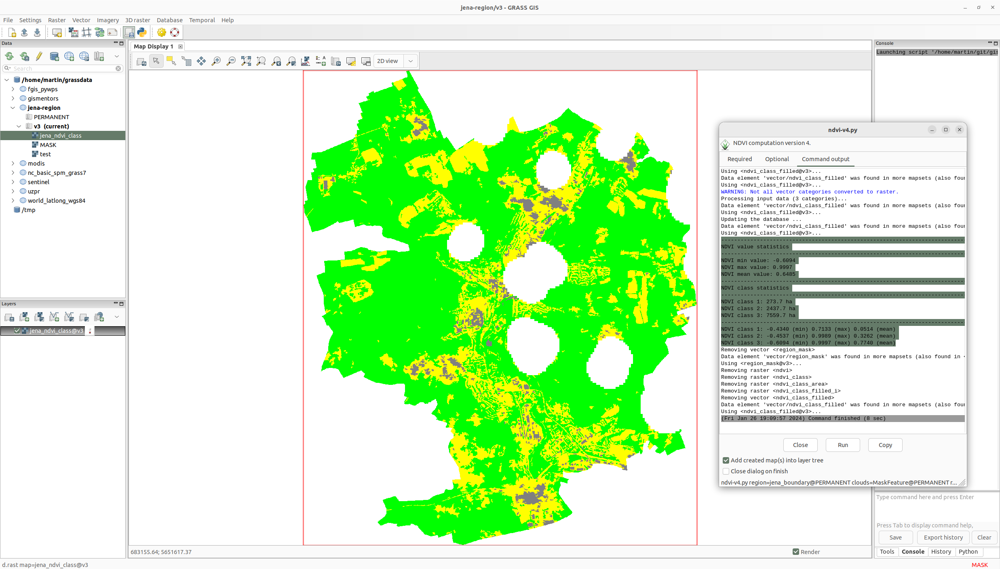

Unit 12 - Script User Interface
===============================

Standard input
--------------

There is one problem with our script from :doc:`11`. Some modules
(:grasscmd:`r.recode`, :grasscmd:`r.colors`) uses hardcoded paths
to input files. This will not work when running script on different
computer as we know. See code below (concretely :option:`rules`
options).

.. literalinclude:: ../_static/scripts/ndvi-v2.py
   :language: python
   :lines:  60-68

By PyGRASS a content of input file can be defined as a string object
and transfered to the command via standard input (see ``stdin_``, see
sample code below.

.. literalinclude:: ../_static/scripts/ndvi-v3.py
   :language: python
   :lines:  90-100

Note that most of GRASS modules allows sending data via standard input
by option value ``-`` (dash). Here both commands with ``rules=-``
option.

We can also define cleanup routine which removes intermediate data by
:grasscmd:`g.remove` when compution is finished.

.. code-block:: python

   def cleanup():
       Module('g.remove', flags='f', name='region_mask', type='vector')

User interface (UI)
-------------------

The script lacks user input, all input paramaters are hardcoded. We
have to modify our script similarly as we did for model :ref:`Unit 09
<model-parameterization>` by its parameterization. Remember a first
modification of script generated by Graphical Modeler in :doc:`11`.

At first add previously removed lines back to the script.

.. code-block:: python

   #%module
   #% description: NDVI model version 2
   #%end                

With these lines included a magic will happen, a standardized GUI
dialog appears. Since only module description was defined and no
parameters, the dialog offers only global flags like
:param:`--verbose` or :param:`--quiet`.

.. figure:: ../images/units/12/ndvi-dialog.png
   :class: small
      
   Generated GUI dialog.

Let's define parameters below:

* ``region``: vector map defining a computation region (required)
* ``clouds``: vector map with cloud mask features (optional)
* ``red``: input red channel (required)
* ``nir``: input nir channel (required)
* ``threshold``: threshold for removing small areas (optional)
* ``basename``: basename for output maps (required)

Related lines can look like as below.
  
.. literalinclude:: ../_static/scripts/ndvi-v3.py
   :language: python
   :lines:  15-40

   GUI dialog with input options.
   
In the script input parameters are still hardcoded, eg.

.. literalinclude:: ../_static/scripts/ndvi-v2.py
   :language: python
   :lines:  28-30

The input parameters are accesible by ``options`` and ``flags``
objects which are generated by ``parse()`` function.

.. literalinclude:: ../_static/scripts/ndvi-v2.py
   :language: python
   :lines:  121

Options and flags are dictionaries, where parameters are accessible by
option keys, see example below.

.. literalinclude:: ../_static/scripts/ndvi-v3.py
   :language: python
   :lines:  58-60

All other generated maps will be removed when computation finished.

.. literalinclude:: ../_static/scripts/ndvi-v3.py
   :language: python
   :lines:  52-56

   
   Improved NDVI script in action.

Sample script to download: `ndvi-v3.py <../_static/scripts/ndvi-v3.py>`__
