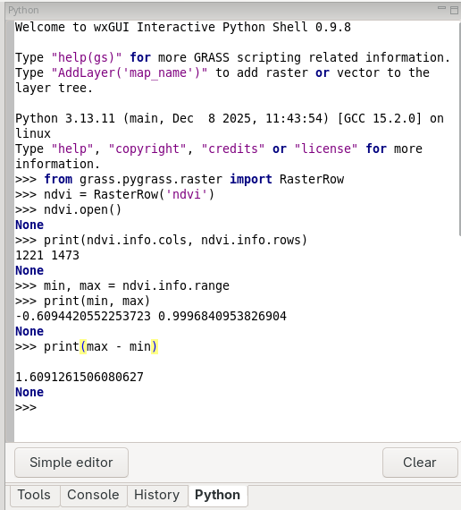

Unit 13 - PyGRASS intro
=======================

:grasscmd2:`PyGRASS <libpython/pygrass_index.html>` has been design as
an **object-oriented** Python API to GRASS. This is a major difference
to :grasscmd2:`GRASS Scripting Library <libpython/script_intro.html>`
which consists of procedures - Python functions. It is important to
mention that PyGRASS has not been designed as replacement of GRASS
Scripting Library, the both libraries are living next to each
other. It is up to the user (you) which library use in his/her
scripts. It's also possible to compine the both libraries in one
script.

We open raster map as Python object by :pygrass-raster:`RasterRow`.

.. code-block:: python

   from grass.pygrass import raster
   ndvi = raster.RasterRow('ndvi')

Raster map will be open by ``open()`` method, basic information like
number of columns and rows, min and max value, range printed.
   
.. code-block:: python

   ndvi.open()
   print (ndvi.info.cols, ndvi.info.rows)
   min, max = ndvi.info.range
   print (min, max)             
   print (max-min)
                

   Running PyGRASS code in Python tab of Layer Manager.

Don't forget to close the raster map.

.. code-block:: python

   ndvi.close()

In next part we create a simple PyGRASS script for computing basic
univariate raster statistics.

.. literalinclude:: ../_static/scripts/ndvi-pygrass-univar.py
   :language: python

.. note:: Compare computation speed of your simple script with
   :grasscmd:`r.univar` module.

Sample script to download: `ndvi-pygrass-univar.py
<../_static/scripts/ndvi-pygrass-univar.py>`__
                   
