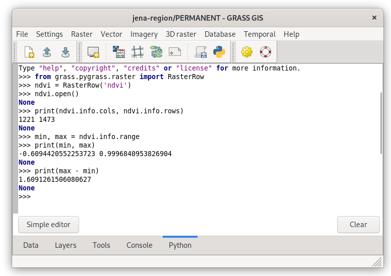

Unit 13 - PyGRASS intro
=======================

:grasscmd2:`PyGRASS <libpython/pygrass_index.html>` has been design as
an **object-oriented** Python API to GRASS. This is major difference
to :grasscmd2:`GRASS Scripting Library <libpython/script_intro.html>`
which consists of procedures - Python functions. PyGRASS has not been
designed as replacement of GRASS Scripting Library, both libraries are
living next to each other. It's up to the user which library use in
his/her user scripts. It's also possible to compine both libraries in
one script.

We open raster map as Python object by :pygrass-raster:`RasterRow`.

.. code-block:: python

   from grass.pygrass import raster
   ndvi = raster.RasterRow('ndvi')

Raster map will open by ``open()``, basic information like number of
columns and rows printed, min or max value, range, etc.
   
.. code-block:: python

   ndvi.open()
   print (ndvi.info.cols, ndvi.info.rows)
   min, max = ndvi.info.range
   print (min, max)             
   print (max-min)
                

   Running PyGRASS code in Python tab.

Don't forget to close the raster map.

.. code-block:: python

   ndvi.close()

In next part we create a simple PyGRASS script for computing basic
univariante raster statistics.

.. literalinclude:: ../_static/scripts/ndvi-pygrass-univar.py
   :language: python

.. note:: Compare computation speed of your simple script with
   :grasscmd:`r.univar` module.

.. todo:: Extend?

                   
