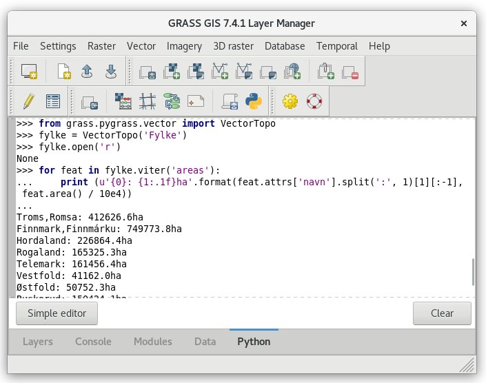

Unit 14 - PyGRASS Vector Access
===============================

PyGRASS allows directly accessing native GRASS raster and vector maps
in the sense of Python objects. This unit shows how to deal with GRASS
vector data by PyGRASS API, see :doc:`13` for raster data.

Vector data
-----------

Vector map can be treated by :pygrass-vector:`Vector` when dealing
with basic vector primitives (points, lines, boundaries, centroids) or
by :pygrass-vector:`VectorTopo` which allows accessing topological
primitives like areas or isles. See :ref:`vector-topo-section` section
for details.

Example below prints nicely format region names and their area size in
hectares.

.. code-block:: python
                
   from grass.pygrass.vector import VectorTopo
   fylke = VectorTopo('Fylke')
   fylke.open('r')
   
   for feat in fylke.viter('areas'):
       print (u'{0}: {1:.1f}ha'.format(feat.attrs['navn'].split(':', 1)[1][:-1], feat.area() / 10e4))
   
   fylke.close()

   PyGRASS vector example in action.

Writing vector data
--------------------

As for raster also for vector it is possible to create vector layer using
PyGRASS. In the next example we are going to create a point vector data with
attribute table. Let's see how to do that

.. code-block:: python

   from grass.pygrass.vector.geometry import Point

   # create the columns definition
   cols = [(u'cat',   'INTEGER PRIMARY KEY'),
           (u'name',  'VARCHAR')]
   # start new vector with columns definition
   new = VectorTopo('pois')
   new.open('w', tab_cols=cols, overwrite=True)
   # add points
   point0 = Point(597241.89, 6643036.03)
   point1 = Point(592409.49, 6655332.75)
   new.write(point0, ('Oslo', ))
   new.write(point1, ('Studenterhytta', ))
   # commit attributes, otherwise they will be not saved
   new.table.conn.commit()
   # close the vector
   new.close()

Topology access example
-----------------------

In the following example is presented how to access vector topological
primitives directly using PyGRASS. It requires full understanding of
GRASS topological model, see :ref:`vector-topo-section` section in
:doc:`03`.

Sample script below prints for each county (vector map :map:`Fylke`
imported in :doc:`03`) number of its neighbours.

#. Vector map :map:`Fylke` is open on line :lcode:`10` by
   :pygrass-vector:`VectorTopo` and its method ``open()``.
#. Features (areas in this case) are sequentially read by ``for`` loop
   on line :lcode:`12`. Areas are interated by ``viter()`` function.
#. For each feature (ie. county) its boudaries are looped, see line
   :lcode:`14`. Each boundary has two neighbours (line :lcode:`15`): on
   the left and right side (``-1`` for no area).

.. note:: To avoid unicode error when lauching the script from GRASS
          GUI, few lines are added to a beginnging of the script, see
          lines :lcode:`3-5`.
   
.. literalinclude:: ../_static/scripts/neighbours.py
   :language: python
   :linenos:
   :emphasize-lines: 3-5, 10, 12, 14, 15

Possible output:

::

   Troms,Romsa              : 2
   Finnmark,Finnmárku       : 1
   Hordaland                : 4
