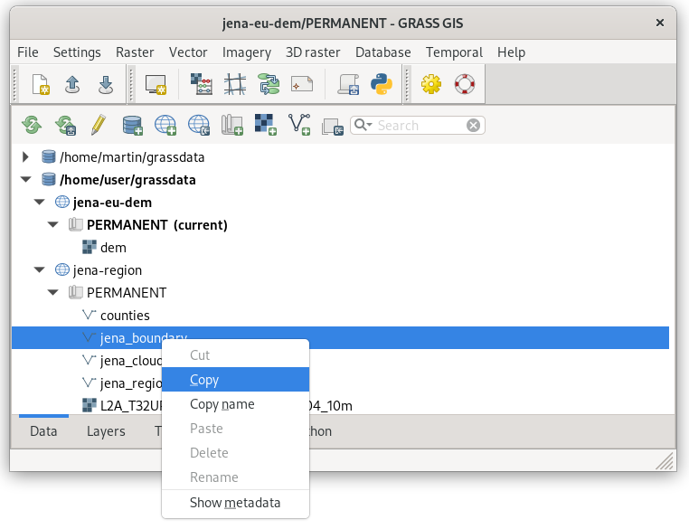

Unit 15 - DTM reprojection
==========================

In this unit EU-DEM global dataset provided by `Copernicus programme
<https://www.eea.europa.eu/data-and-maps/data/copernicus-land-monitoring-service-eu-dem#tab-gis-data>`__
will be used. Jena region is covered by tile E40N30. Be aware that
EU-DEM tiles covers large regions (4GB per tile).

Normally :grasscmd:`r.import` could be used to import and
automatically reproject data into target location. In this case there
is no need to import into GRASS a whole big DEM tile. By using ``-r``
flag of :grasscmd:`r.in.gdal` GRASS module only a subregion covering
AOI could be imported. Unfortunately :grasscmd:`r.import` do not offer
such flag. In this unit manual reprojection will be presented. A new
location for imported data (:epsg:`4258`) must be created and data
reprojected into target *jena-region* (:epsg:`32632`) location manually.

.. note:: In order to save space of disk the original EU-DEM tile was
   clipped by larger region than Jena AOI. Modified tile is available
   from :file:`geodata/eu-dem` directory.

Create location for data import
-------------------------------

EU-DEM dataset is provided in ETRS-89 (:epsg:`4258`). Start a new
GRASS session and create a new location *jena-eu-dem* based on input
:file:`geodata/eu-dem/dem_sample.tif` data (similarly as done in
:ref:`Unit 02 <create-location>`). Skip data import provided by
location wizard since only subregion defined by Jena city region is
planned to be imported.

.. figure:: ../images/units/15/create-location-0.png

   Define name for a new location.
   
Location will be created based on input sample DEM file (*Read
projection and datum terms from a georeferenced data file*).

.. figure:: ../images/units/15/create-location-1.png

   Create a new location based on a sample DEM file.

.. figure:: ../images/units/15/create-location-2.svg
	      
   Don't import input data from Location Wizard.

Enter new location (PERMANENT mapset) and reproject Jena region vector
map by :grasscmd:`v.proj` (:menuselection:`Vector --> Develop vector
map --> Reproject vector map from different GRASS location`) or simply
from :item:`Data` tab in Layer Manager just by copying and pasting the
maps, see :numref:`data-reproject-fig`.

.. _data-reproject-fig:

   Easy and quick way to reproject (copy-and-paste) raster or vector
   maps across locations from :item:`Data` tab in Layer Manager.

.. code-block:: bash

   v.proj location=jena-region mapset=PERMANENT input=jena_boundary

Before importing DEM set computation region extent based on
reprojected Jena city region.
      
.. figure:: ../images/units/15/region-extent.png
   :class: large
	   
   Set computational region extent based on Jena city region.

Launch :grasscmd:`r.in.gdal` (:menuselection:`File --> Import raster
data --> Import of common raster formats`) to import DEM tile, don't
forget to enable :option:`-r` flag.

.. code-block:: bash

   r.in.gdal -r input=/home/user/geodata/eu-dem/dem_sample.tif output=dem 

.. figure:: ../images/units/15/dem-imported.png
   :class: large
	   
   Imported DEM limited to current region extent. Displayed with
   ``elevation`` color table.

Reproject DEM into target location
----------------------------------
   
Now switch back to *jena-region* location (:menuselection:`Settings
--> GRASS working environment --> Change location and mapset`).

.. figure:: ../images/units/15/switch-location.png
   :class: small
	   
   Switch GRASS to jena-region location and PERMANENT mapset.

Reproject DEM from *jena-eu-dem* location by :grasscmd:`r.proj`
(:menuselection:`Raster --> Develop raster map --> Reproject raster
map from different GRASS location`) or directly from :item:`Data` tab
in Layer Manager. Set desired resolution (25m) and choose appropriate
resampling method (in our case *bilinear*).

.. note:: If a mask is enabled, it's good idea to remove it before
   importing.

.. figure:: ../images/units/15/data-reproject-raster.png
   :class: small
	   
   Reproject raster data in Layer Manager.
  
Example of reprojecting raster data using :grasscmd:`r.proj` command
below.

.. code-block:: bash
		
   r.proj location=jena-eu-dem mapset=PERMANENT input=dem method=bilinear resolution=25

.. figure:: ../images/units/15/dem-3d.svg
   :class: large
	   
   DTM in 3D view.
