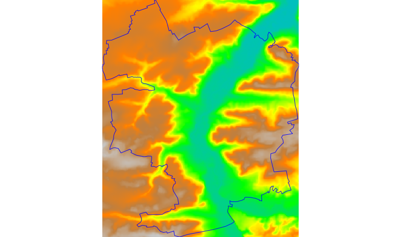
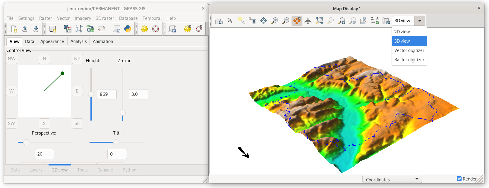

Unit 15 - Data reprojection
===========================

In this unit EU-DEM global dataset provided by `Copernicus programme
<https://www.eea.europa.eu/data-and-maps/data/copernicus-land-monitoring-service-eu-dem#tab-gis-data>`__
will be used. Jena region is covered by tile E40N30. Be aware that
EU-DEM tiles covers large regions (4GB per tile).

.. important:: Note that a new Copernicus DEM product is available from
   `Copernicus Data Space Ecosystem
   <https://dataspace.copernicus.eu/explore-data/data-collections/copernicus-contributing-missions/collections-description/COP-DEM>`__.

The DEM tile can be imported and automatically reprojected into the
target project (*jena-region*) similarly as other input data used in
this course. However, it is unnecessary to import the entire DEM tile
into GRASS; only the portion covering the area of interest (AOI) is
required. By using the ``-r`` flag of the :grasscmd:`r.in.gdal` tool,
it is possible to import only a subregion corresponding to the
AOI. Unfortunately, the :grasscmd:`r.import` module does not provide
this option. For this reason, the data are reprojected manually. The
input data are first imported into a new project (ETRS89-extended /
LAEA Europe, :epsg:`3035`) and subsequently reprojected into the
target *jena-region* (WGS 84 / UTM zone 32N, :epsg:`32632`).

.. note:: In order to save disk space the original EU-DEM tile was
   clipped by larger region than Jena AOI. Modified tile is available
   from :file:`eu-dem` directory.

Create project for data import
-------------------------------

EU-DEM dataset is provided in ETRS89-extended / LAEA Europe
(:epsg:`3035`). Create a new GRASS project *jena-eu-dem* based on
input :file:`eu-dem/dem_sample.tif` file as described in :ref:`Unit 02
<create-project>`) or from EPSG code.

.. important:: Skip data import provided by
               project wizard since only subregion defined by Jena city region is
               planned to be imported.

Enter new project (PERMANENT mapset) and copy (ie. reproject)
:map:`jena_boundary` into the current project.

.. _data-reproject-fig:

.. figure:: ../images/units/15/data-reproject.png
           

           
   Copy :map:`jena_boundary` vector map from `jena-region` project
   (:epsg:`32632`) to the current project (:epsg:`3035`).

.. figure:: ../images/units/15/data-reproject-dialog.png
   :class: small
           
   Reprojection and default maximum segment must be confirmed.
   
.. note:: The same operation can be done by :grasscmd:`v.proj`:

   .. code-block:: bash
                          
      v.proj project=jena-region mapset=PERMANENT input=jena_boundary

Before importing DEM set computation region extent based on
reprojected Jena city region.
      
.. figure:: ../images/units/15/region-extent.png
   :class: large
	   
   Set computational region extent based on Jena city region.

Launch :grasscmd:`r.in.gdal` (:menuselection:`File --> Import raster
data --> Import of common raster formats`) to import DEM tile, don't
forget to enable :option:`-r` flag.

.. code-block:: bash

   r.in.gdal -r input=geodata/eu-dem/dem_sample.tif output=dem 

           
   Imported DEM limited to current region extent. Visualized using
   ``elevation`` color table.

Reproject DEM into target project
----------------------------------

Now switch back to *jena-region* (target) project (PERMANENT mapset).

.. _switch-project:

.. figure:: ../images/units/15/switch-project.png
	   
   Switch to jena-region project and PERMANENT mapset from
   :item:`Data` tab.

Reproject DEM from *jena-eu-dem* project by copying in :item:`Data`
tab. Set desired resolution (25m) and choose appropriate resampling
method (in our case *bilinear*).

.. note:: If a mask is enabled, it's good idea to remove it before
   importing.

.. figure:: ../images/units/15/data-reproject-raster.png
   :class: small
	   
   Reproject raster data by specifying target resolution and
   resampling method.
  
.. note:: The same operation can be done by :grasscmd:`r.proj`:

   .. code-block:: bash
		
      r.proj project=jena-eu-dem mapset=PERMANENT input=dem method=bilinear resolution=25

	   
   Imported DEM in 3D view. Jena city region by blue color.
