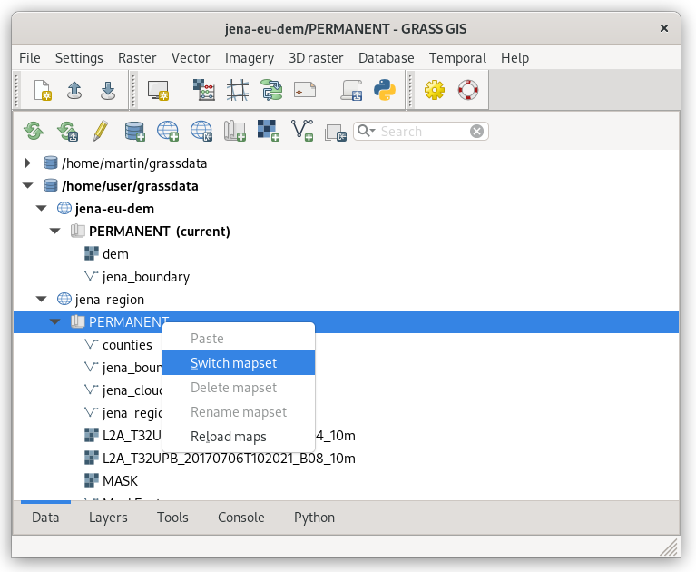
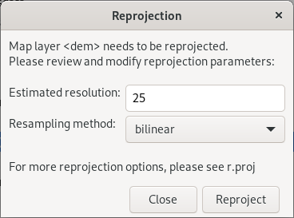

Unit 15 - Reprojection
======================

In order to perform simple flooding simulation (see :doc:`16`) we need
digital elevation model (DEM) for our area of interest (AOI), Jena
city region. There are several options like global DEM datasets (SRTM,
EU-DEM, ...), local DEMs created as product of laser scanning
techniques.

In our example we will use EU-DEM global dataset provided by
`Copernicus programme
<https://www.eea.europa.eu/data-and-maps/data/copernicus-land-monitoring-service-eu-dem#tab-gis-data>`__. Let's
download tile covering our region (E40N30), be aware data are quite
big (4GB), see note below. There is no need to import into GRASS the
whole big DEM tile. By using ``-r`` flag of :grasscmd:`r.in.gdal` we
can import just a subregion covering our AOI. Unfortunately
:grasscmd:`r.import` do not offer such flag. So we need to create a
new location for imported data and reproject data to target location
(*jena-utm*) manually.

.. note:: For simplification the downloaded data clipped larger region
   than our AOI is available in sample dataset, check
   :file:`eu-dem` folder for details.

   For those who are interested, sample raster file was created by
   GDAL utility :program:`gdal_translate`, see command below.
   
   .. code-block:: bash

      gdal_translate -of GTiff -projwin 11 51.5 12 50.5 -projwin_srs EPSG:4326
      eu_dem_v11_E40N30.TIF eu_dem_sample.tif

.. todo:: add link to sample dataset

EU-DEM dataset is provided in ETRS-89 (:epsg:`3035`). Let's start GRASS and
create a new location based on input data (similarly as we did in
:ref:`Unit 02 <create-location>`).

.. figure:: ../images/units/15/create-location-0.png

   Define name for new location.
   
Location will be created based on input sample DEM file (*Read
projection and datum terms from a georeferenced data file*).

.. figure:: ../images/units/15/create-location-1.png

   Create new location based on sample DEM file.

.. important:: We will skip automatic import since we want to import
   just subregion defined by Jena city area.

   .. figure:: ../images/units/15/create-location-2.svg
      :class: small
	      
      Don't import input data.

Enter new location (PERMANENT mapset) and reproject Jena city region
vector map by :grasscmd:`v.proj` (:menuselection:`Vector --> Develop
vector map --> Reproject vector map from different GRASS location`).

.. code-block:: bash

   v.proj location=jena-utm mapset=PERMANENT input=jena_boundary

.. tip:: In GRASS 7.4 you can easily reproject maps between different
   locations also from :item:`Data` tab in Layer Manager just by
   copying and pasting.

   .. figure:: ../images/units/15/data-reproject.png

      Easy and quick way how to reproject (copy-and-paste) raster and
      vector map in :item:`Data` tab from Layer Manager.
      
Before importing DEM set computation region extent based on
reprojected Jena city region.

.. figure:: ../images/units/15/region-extent.png
   :class: large
	   
   Set region extent based on Jena city region.
   
After this step import process can be started. Launch
:grasscmd:`r.in.gdal` (:menuselection:`File --> Import raster data -->
Import of common raster formats`), don't forget to enable ``-r`` flag.

.. code-block:: bash

   r.in.gdal -r input=/path/to/eu_dem_sample.tif output=dem 

.. figure:: ../images/units/15/dem-imported.png
   :class: large
	   
   Imported DEM limited to current region extent. Displayed with color
   table ``elevation``.

Now we can switch back to our *jena-utm* location
:menuselection:`Settings --> GRASS working environment --> Change
location and mapset`.

	   
   Switch GRASS to jena-utm location and PERMANENT mapset.

And reproject DEM from *jena-eu-dem* location by :grasscmd:`r.proj`
(:menuselection:`Raster --> Develop raster map --> Reproject raster
map from different GRASS location`) or directly from :item:`Data` tab
in Layer Manager. Set desired resolution (25m) and choose appropriate
resampling method (in our case *bilinear*).

.. note:: If you have a mask enabled, it's good idea to remove it
          before importing.

	   
   Reproject raster data in Layer Manager.

Example of reprojecting raster data using :grasscmd:`r.proj` command below.

.. code-block:: bash
		
   r.proj location=jena-eu-dem mapset=PERMANENT input=dem method=bilinear resolution=25

.. figure:: ../images/units/15/dem-3d.svg
   :class: large
	   
   Reprojected DEM display in 3D view.
