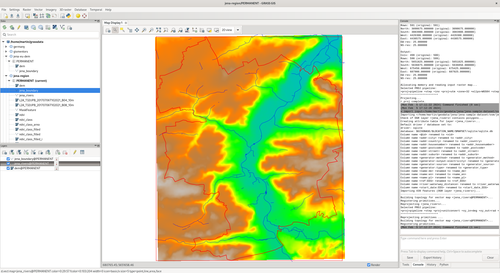
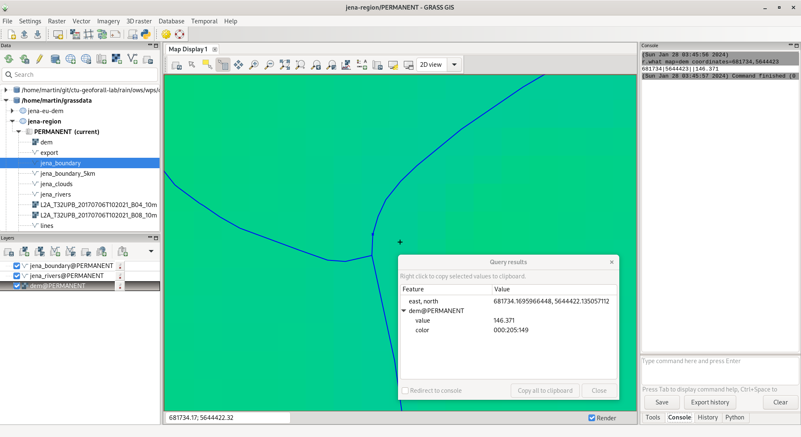

Unit 16 - Flooding simulation
=============================

Beside DEM (see :doc:`15`) also river streams are required. Such data
can be downloaded from OSM database similarly as done in :doc:`02`
in the case of Jena city region.

.. note::
   
   .. code-block:: xml
		   
      [bbox:50.85374080,11.50084754,50.98991003,11.67463202];
      (
      way
      ["waterway"="river"];
      way
      ["waterway"="stream"]
      );
      /*added by auto repair*/
      (._;>;);
      /*end of auto repair*/
      out;

   .. code-block:: bash

      ogr2ogr -f GPKG jena_rivers.gpkg -a_srs EPSG:4326 -t_srs EPSG:32632 /vsicurl_streaming/"\
      http://overpass-api.de/api/interpreter?data=%5Bbbox%3A50%2E85374080%2C11%2E50084754%2C50%2\
      E98991003%2C11%2E67463202%5D%3B%28way%5B%22waterway%22%3D%22river%22%5D%3Bway%5B%22waterway\
      %22%3D%22stream%22%5D%3B%29%3B%28%2E%5F%3B%3E%3B%29%3Bout%3B%0A" lines

For simplification pre-processed river streams are included in sample
dataset as :file:`geodata/osm/jena-rivers.gpkg` file.

	   
   DEM, Jena boundary and rivers provided by OSM.

Flooding can be easily simulated by :grasscmd:`r.lake` module which
fills a lake to a target water level from a given start point or seed
raster. The resulting raster map contains cells with values
representing lake depth (NULL for all other cells beyond the lake).

The :grasscmd:`r.lake` requires seeds coordinates and water level to
be defined. The coordinates can be set also interactively as
:numref:`r-lake-coord` shows.

.. _r-lake-coord:

.. figure:: ../images/units/16/r-lake-coords.png
   :class: large
	   
   Set seed coordinates interactively from map display.

Height of seed point can be determined by querying DEM map layer
|grass-info| :sup:`Query raster/vector map(s)` from Map Display
toolbar (see :numref:`dem-what`) or directly using :grasscmd:`r.what`
module:

.. code-block:: bash

   r.what map=dem coordinates=681734,5644423
   
.. _dem-what:

           
   Query DEM layer for an elevation value.

.. _create-mapset:
   
.. note:: Before running :grasscmd:`r.lake` let's start **organizing
   our work**. Till now we used PERMANENT mapsets only. There is input
   data like DEM, Jena city region, cloud mask vector map, Sentinel
   bands, results of NDVI computation and so on. Data organization can
   be improved by using multiple mapsets. Let's create a new mapset
   *flooding* in the current location *jena-region*. New mapset from
   :item:`Data` tab or by :grasscmd:`g.mapset` module.

   .. figure:: ../images/units/16/create_mapset.png
      :class: middle
           
      Create a new mapset in :item:`Data` tab.
         
Before starting computation the computation region have to be set
based on :map:`dem` raster map.

.. code-block:: bash

   g.region raster=dem
   
.. code-block:: bash
                
   r.lake elevation=dem water_level=150 lake=lake coordinates=681734,5644423

.. figure:: ../images/units/16/r-lake-150.png
   :class: large
           
   Flooding simulation on water level 150m, OSM WMS as basemap.

.. figure:: ../images/units/16/r-lake-150-3d.png
   :class: large
           
   Flooding similation in 3D view.
