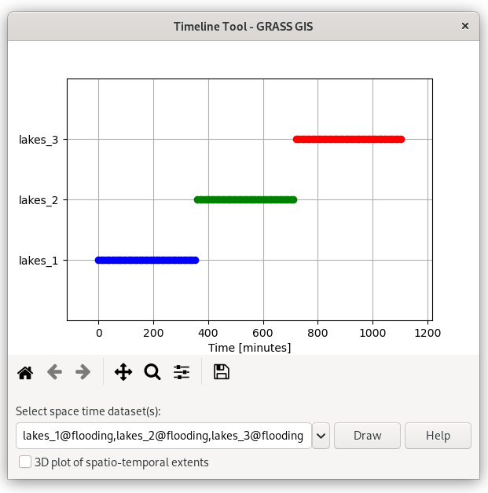

Unit 17 - Spatio-temporal intro
===============================

GRASS GIS comes in version 7 with high quality tools for
spatio-temporal data processing, see :grasscmd:`GRASS documentation
<temporalintro>` for details.

GRASS introduces three special datatypes that are designed to handle
time series data:

* *Space time raster datasets* (``strds``) for managing raster map
  time series.
* *Space time 3D raster datasets* (``str3ds``) for managing 3D raster
  map time series.
* *Space time vector datasets* (``stvds``) for managing vector map time
  series.
            
Spatio-temporal flooding simulation
-----------------------------------

Module :grasscmd:`r.lake` itself allows to generating only one output
raster map within one run. This limitation is surpassed by addon
:grasscmdaddons:`r.lake.series`.

.. _grass-addons:
                
.. note:: Addons modules are not internal part of GRASS installation
   but can be easily installed by :grasscmd:`g.extension`
   (:menuselection:`Settings --> Addons extensions --> Install
   extension from addons`).

   .. figure:: ../images/units/17/g-extension.png

      Install :grasscmdaddons:`r.lake.series` GRASS Addon.

:grasscmdaddons:`r.lake.series` module outputs multiple raster maps
registered in space-time raster dataset.

.. code-block:: bash

   r.lake.series elevation=dem out=lakes start_water_level=134 end_water_level=145 \
    water_level_step=0.1 coordinates=686668,5650664 \
    time_step=10 nproc=3 

In the example above we created space-time series between water levels
134 and 145 with step 0.1 m. Time step is 10 min. To increase
computation speed we used three CPU cores. The result is stored in
raster space-time dataset named :map:`lakes`.

Basic information about output space-time dataset can be obtained by
:grasscmd:`t.info` command.

.. code-block:: bash

   t.info input=lakes

::
   
   ...
   +-------------------- Relative time -----------------------------------------+
   | Start time:................. 1
   | End time:................... 1101
   | Relative time unit:......... minutes
   | Granularity:................ 10
   | Temporal type of maps:...... point
   ...
    
Time topology information can be obtained by :grasscmd:`t.topology`.

.. code-block:: bash

   t.topology input=lakes

::

   ...
   +-------------------- Temporal topology -------------------------------------+
   ...
   | Number of points: .......... 111
   | Number of gaps: ............ 110
   | Granularity: ............... 10
   ...
   
Space-time Data Querying
^^^^^^^^^^^^^^^^^^^^^^^^

By :grasscmd:`t.rast.list` can be printed raster maps within given
time period. In the example below are printed raster maps within the
first hour of simulated flooding.

.. code-block:: bash

   t.rast.list input=lakes order=start_time where="start_time < 60"

Univariate statistic can be calculated by :grasscmd:`t.rast.univar`,
in example below statistics is computed only for the first hour of
flooding.

.. code-block:: bash

   t.rast.univar input=lakes where="start_time < 60"

::

   id|start|end|mean|min|max|mean_of_abs|stddev|variance|coeff_var|sum|null_cells|cells
   lakes_134.0@flooding|1|None|0.211415510911208|0.007537841796875|0.738616943359375|...
   lakes_134.1@flooding|11|None|0.397385983853727|0.000823974609375|1.14051818847656|...
   lakes_134.2@flooding|21|None|0.445528310686884|0.0003814697265625|1.24050903320312|...
   lakes_134.3@flooding|31|None|0.502563093844781|0.0012054443359375|1.34051513671875|...
   lakes_134.4@flooding|41|None|0.564594079032162|0.0021820068359375|1.44050598144531|...
   lakes_134.5@flooding|51|None|0.582153865733045|0.0008697509765625|1.54051208496094|...

Data aggregation can be performed by :grasscmd:`t.rast.aggregate`. In
the example below data is aggregated by 1 hour.

.. code-block:: bash

   t.rast.aggregate input=lakes output=lakes_h basename=ag granularity=60 nproc=3

The command generates a new space time dataset which can be used for
subsequent analysis like univariate statistics:

.. code-block:: bash

   t.rast.univar input=lakes_h

::

   id|start|end|mean|min|max|mean_of_abs|stddev|variance|coeff_var|sum|null_cells|cells
   ag_00001@flooding|1|61|0.431898174745821|0.0008697509765625|1.34051208496094|...
   ...
   ag_00019@flooding|1081|1141|5.69696318836018|4.57763671875e-05|11.9405110677083|...

Space-time Data Extracting
^^^^^^^^^^^^^^^^^^^^^^^^^^

Raster space-time data can be extract into new datasets using
:grasscmd:`t.rast.extract`. In the example below three new datasets
are created for the first, second and third six hours of flooding.

.. code-block:: bash
		
   t.rast.extract input=lakes where="start_time > 0 and start_time < 361" output=lakes_1
   t.rast.extract input=lakes where="start_time > 360 and start_time < 720" output=lakes_2
   t.rast.extract input=lakes where="start_time > 720" output=lakes_3         

Aggregation into single raster output can be performed by
:grasscmd:`t.rast.series`:

.. code-block:: bash
                
   t.rast.series input=lakes_1 output=lakes_1_avg method=average

Let's print univariate statistics for generated raster output by
:grasscmd:`r.univar`:

.. code-block:: bash

   r.univar map=lakes_1_avg

::

   minimum: 0.00152588
   maximum: 2.93515
   range: 2.93362
   mean: 1.0993

.. _st-animation:
      
Space-time Data Visualization
^^^^^^^^^^^^^^^^^^^^^^^^^^^^^

Time series can be visualized by specialized tool
:grasscmd:`g.gui.timeline`. Example below.

.. code-block:: bash
                
   g.gui.timeline inputs=lakes_1,lakes_2,lakes_3

   Timeline tool showing three space-time datasets.
   
And finally, a simple animation can be created by
:grasscmd:`g.gui.animation` (:menuselection:`File --> Animation
tool`), see :numref:`flooding-animation`.

.. code-block:: bash

   g.gui.animation strds=lakes

.. _flooding-animation:

.. figure:: ../images/units/17/flooding-anim.gif
   :class: large
   
   Example of flooding animation.
