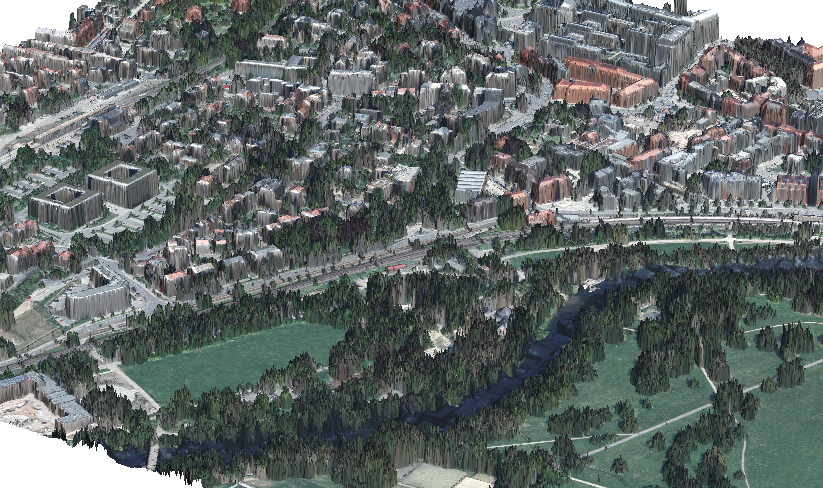

Unit 18 - Lidar, DTM interpolation
==================================

LiDAR data used in this unit can be found in :file:`lidar`
directory. Data is stored in LAZ format (compressed LAS format).

.. note:: There is open Lidar data for Thuringia region available, see
   related `blog
   <https://rapidlasso.com/2017/01/09/second-german-state-goes-open-lidar/>`__
   by rapidlasso GmbH. Go to `Download Höhendaten
   <http://www.geoportal-th.de/de-de/Downloadbereiche/Download-Offene-Geodaten-Th%C3%BCringen/Download-H%C3%B6hendaten>`__,
   choose region in map viewer and download selected tiles.

Sample data for this unit are located in :file:`lidar` directory.
   

Data import
-----------

For importing LAS/LAZ data there are available two GRASS modules:

* :grasscmd:`r.in.lidar` for importing point cloud data as raster map
* :grasscmd:`v.in.lidar` for importing point cloud data as vector point map

.. note:: GRASS requires `libLAS <https://liblas.org/>`__ library for
   reading LAS data. For compressed LAS (LAZ) there is another
   dependency, a `laszip <https://laszip.org/>`__ library.

   Basic metadata can be obtained by command line utility ``lasinfo``
   which is part of libLAS library.

   .. code-block:: bash

      lasinfo las_681_5644_1_th_2014-2019.laz

      ...
      Min X Y Z:                   681000.000 5644000.000 -43.382
      Max X Y Z:                   681999.990 5644999.990 968.621
      ...

   There is also a new generation of Lidar modules based on `PDAL
   <https://pdal.io/>`__ library: :grasscmd:`r.in.pdal` and
   :grasscmd:`v.in.pdal`. 

.. important:: Unfortunately on MS Windows PDAL-based modules are
   missing due to compilation problems (`#1821
   <https://github.com/OSGeo/grass/issues/1821>`__) and libLAS-based
   modules lack compression support.

   Data can be converted from LAZ to LAS by :program:`pdal`
   command-line tool:

   .. code-block:: sh

      pdal translate las_681_5644_1_th_2014-2019.laz las_681_5644_1_th_2014-2019.las
               
Vector import
^^^^^^^^^^^^^

Let's create a new GRASS location *jena-lidar* defined by
:epsg:`25832`.

   Create a new GRASS location by specifying EPSG code (*Select CRS
   from a list by EPSG or description*).

Let's import selected tile into GRASS as vector point map. By
:param:`-t` flag creation of attribute table is skipped. By
:param:`-b` flag also building :ref:`topology <vector-topo-section>`
will be skipped (no topology is required for point data). The import
process will be significantly faster.  Information about data SRS can
be missing, in this case use :param:`-o` flag to skip projection
check.

.. code-block:: bash
                
   v.in.lidar -otb input=lidar/las_681_5644_1_th_2014-2019.las output=las_681_5644

Note that computational region is ignored when importing data using
:grasscmd:`v.in.lidar`.

Overall point density can be checked by :grasscmd:`v.outlier`. Note
that :grasscmd:`v.outlier` is working in the current computation
region(!). It means that computational region must be set based on imported
data. Since building topology was skipped by :param:`-b` flag, the map
extent must be computed by scanning all points in input vector
map. That is reason why :grasscmd:`g.region` can run for a while.

.. code-block:: bash

   g.region vector=las_681_5644
   v.outlier -e input=las_681_5644

::

   Estimated point density: 8.937
   Estimated mean distance between points: 0.3345

Point density is calculated for map (square) unit.

Basic metadata can be printed by :grasscmd:`v.info` (since no topology
is built, the module must scan all points in the map):

.. code-block:: bash
                   
   v.info map=las_681_5644

::
   
   ...
   |   Number of points:       8936470         Number of centroids:  0          |
   ...
   |   Map is 3D:              Yes                                              |
   ...
   |   Projection: UTM (zone 32)                                                |
   |                                                                            |
   |               N:        5644999.99    S:           5644000                 |
   |               E:         681999.99    W:            681000                 |
   |               B:           -43.382    T:           968.621                 |
   ...

Raster import
^^^^^^^^^^^^^

Input point cloud can be imported by :grasscmd:`r.in.lidar` into
raster map. Flag :param:`-e` extends current computational region to
cover all imported points. Otherwise user would need to set up
computational region by :grasscmd:`g.region` before importing
data. Spatial resolution for output raster map is defined by
:param:`resolution` option. By default, for cells with more points
involved, the value is computed by mean value, see :param:`method`
option. Cells covered by no points will get NULL (no-data) value assigned.
   
.. code-block:: bash

   r.in.lidar -oe input=/home/martin/lidar/las_681_5644_1_th_2014-2019.las output=las_681_5644 resolution=1

Basic metadata about created raster map can be obtained by
:grasscmd:`r.info`.

.. code-block:: bash

   r.info map=las_681_5644

::
   
   ...
   |            N:    5645000    S:    5644000   Res:     1                     |
   |            E:     682000    W:     681000   Res:     1                     |
   |   Range of data:    min = 65.51301  max = 346.671                          |
   ...

.. figure:: ../images/units/18/import-rast-vect.png
   :class: middle
           
   Imported data as vector points. Raster map with 1m resolution in the
   background.

Filling gaps
------------

There are several GRASS modules for filling gaps in raster maps like
:grasscmd:`r.fillnulls` or :grasscmd:`r.fill.stats`. The first module
is based on spline interpolation, the second fills gaps with
interpolated values using IDW. Let's use the second module which fill
nulls rapidly compared to :grasscmd:`r.fillnulls`. By :option:`-k`
flag it is ensured that original values will be kept untouched. Only
cells with no-data value will be modified.

.. code-block:: bash

   r.fill.stats -k input=las_681_5644 output=las_681_5644_filled

           
   NULL values (on left part) filled by :grasscmd:`r.fill.stats`
   (right part).

.. task::

   Note that only cells in given distance (3 cells by default, see
   :option:`distance` option) are processed, see :numref:`lidar-gaps`.

   .. _lidar-gaps:

   .. figure:: ../images/units/18/rast-gaps.png
      :class: middle
           
      Cells out of distance not filled.

   Try to enlarge :option:`distance` option and re-run
   :grasscmd:`r.fill.stats`.

.. _edge-detection:

High resolution DSM
-------------------

Digital Surface Model (DSM) can be interpolated by
:grasscmd:`v.surf.rst` using regularized spline with tension
approximation. Output resolution set to 0.5 meter. The computation can
be really slow. The computation time becomes more reasonable by
running in parallel, see :option:`nprocs` option.

.. code-block:: bash

   g.region vector=las_681_5644 res=0.5 -pa
   v.surf.rst input=las_681_5644 elevation=dsm_681_5644 npmin=80 tension=20 smooth=1 nprocs=6

.. task:: Try also to set higher npmin to reduce artifacts.
      

   
   DSM in 3D view. Orthophoto downloaded from `Geoportal-Th.de
   <http://www.geoportal-th.de/de-de/Downloadbereiche/Download-Offene-Geodaten-Th%C3%BCringen/Download-Luftbilder-und-Orthophotos>`__
   (tile 32680_5644).

.. tip:: GRASS imports/links RGB image as separate bands. Color
   composition can be displayed using :grasscmd:`d.rgb`. By
   :grasscmd:`r.composite` it is possible to create color composite as
   a new raster map.
   
.. task:: Similarly can built Digital Terrain Model (DTM) from
   filtered terrain only points by *edge detection*.

   The filter aims to recognize and extract attached and detached object
   (such as buildings, bridges, power lines, trees, etc.) in order to
   create a Digital Terrain Model. (source:
   :grasscmd:`v.lidar.edgedetection` manual page) Example of simple
   workflow based on :grasscmd:`v.lidar.edgedetection`,
   :grasscmd:`v.lidar.growing` and :grasscmd:`v.lidar.correction`
   below. Note that edge detection is usually a time and RAM consuming task.
   
   .. code-block:: bash

      v.lidar.edgedetection input=las_681_5644 output=edge_681_5644 ew_step=8 ns_step=8 lambda_g=0.5
      v.in.lidar -otb input=las_681_5644_1_th_2014-2019.las output=las_681_5644_first return_filter=first
      v.lidar.growing input=edge_681_5644 output=grow_681_5644 first=las_681_5644_first
      v.lidar.correction input=grow_681_5644 output=corr_681_5644 terrain=terr_681_5644

   .. figure:: ../images/units/18/terrain-only-points.png

      Filtered terrain points only.

