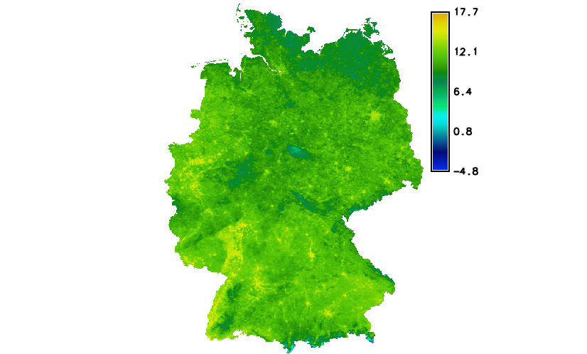
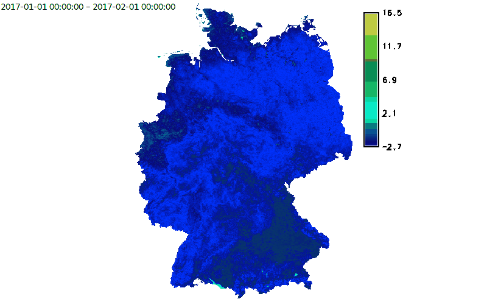

Unit 19 - MODIS ST
==================

In this section we will perform time-series based LST reconstruction
(see :ref:`Unit 18 <modis-lst>`). As we already know GRASS enables
time-series data handling thanks to :grasscmd:`temporal data
processing framework <temporalintro>`.

In :doc:`18` we have :ref:`imported <modis-import>` MODIS data into
GRASS by :grasscmdaddons:`r.modis.import`. The command was called with
``-w`` flag and ``outfile`` parameter to generate special file which
can be later used for creating space-time raster dataset (strds).

Creation of space time dataset including basic operations is explained
in :doc:`17`. Here we just apply our knowledge on MODIS dataset.

At first we will create a new space time raster dataset by
:grasscmd:`t.create`.

.. code-block:: bash

   t.create output=modis title="MODIS 2017" desc="MODIS data for Germany"

In the next step will register to the dataset imported MODIS data by
:grasscmd:`t.register`. We run this command twice, once for Aqua data
than for Terra data.

.. code-block:: bash
                
   t.register input=modis file=h18v03_04/tlist-mod.txt
   t.register input=modis file=h18v03_04/tlist-myd.txt

Let's check basic metedata about created dataset:

.. code-block:: bash

   t.info input=modis

::

   ...
   | Start time:................. 2017-01-01 00:00:00
   | End time:................... 2018-01-04 00:00:00
   ...
   | Number of registered maps:.. 184

.. _t-register-file:
   
.. note:: We are using composed product from the daily 1-kilometer LST
   product (MOD11A1/MYD11A1) and stored on a 1-km Sinusoidal grid as
   the average values of clear-sky LSTs during an 8-day period.

   ::
      
      MOD11A2.A2017297_mosaic_LST_Day_1km|2017-10-24|2017-11-01

Data querying
-------------

For querying space time raster dataset is designed
:grasscmd:`t.rast.list`. Let's print raster data covering March 2017.

.. code-block:: bash
                
   t.rast.list input=modis order=start_time \
   where="start_time > '2017-03-01' and start_time < '2017-04-01'"

Univariate statistics can be computed by :grasscmd:`t.rast.univar`
(note that such commands are running in the current computation region
similarly as :grasscmd:`r.univar` does).

.. code-block:: bash
                
   t.rast.univar input=modis where="start_time > '2017-03-01' and start_time < '2017-04-01'"

::
   
   id|start|end|mean|min|max|mean_of_abs|stddev|variance|coeff_var|sum|null_cells|cells
   ...|2017-03-06 00:00:00|2017-03-14 00:00:00|11127.9119722696|0|14548|11127.9119722696|...

As we can see we have to convert DN into Celsius scale as we done for
selected data in :ref:`Unit 18 <modis-dn-c>`. Instead of running
:grasscmd:`r.mapcalc` we can use temporal command
:grasscmd:`t.rast.mapcalc` which applies map algebra to all the maps
registered in input space time dataset.

.. tip:: Many of temporal data processing modules (``t.*``) support
   parallelization (see ``nproc`` option).

.. code-block:: bash
      
   t.rast.mapcalc input=modis output=modis_c nproc=3 basename=c \
   expression="tile_c = if(modis != 0, modis * 0.02 - 273.15, null())"
                
The command will create new space time raster dataset with raster maps
in Celsius scale. Since new raster map will be created, the command
requires to define ``basename`` for them. Note that new raster
maps will be produced in current computation region with mask
respected.

.. code-block:: bash

   t.rast.univar input=modis_c where="start_time > '2017-03-01' and start_time < '2017-04-01'"

Looks better.

::
   
   id|start|end|mean|min|max|mean_of_abs|stddev|variance|coeff_var|sum|null_cells|cells
   c_033@PERMANENT|2017-03-06 00:00:00|2017-03-14 00:00:00|8.38271624724276|-20.35|17.81|...

.. tip:: Color table can be easily set by :grasscmd:`t.rast.colors`
         similarly as :grasscmd:`r.colors` does for single raster
         map.
            
Data aggregation
----------------

We can aggregate data monthly by using :grasscmd:`t.rast.aggregate`.

.. code-block:: bash
                          
   t.rast.aggregate input=modis_c output=modis_cm basename=cm granularity="1 months" nproc=3

Statistics can be computed by :grasscmd:`t.rast.univar`.

.. code-block:: bash
                
   t.rast.univar modis_cm

Example for July and August only.

.. code-block:: bash

   t.rast.univar modis_cm where="start_time > '2017-07-01' and start_time < '2017-09-01'"

Data extraction
---------------

A new space time dataset only with subset of data can be created by
:grasscmd:`t.rast.extract`. Example for the four seasons below.

.. code-block:: bash
                          
   t.rast.extract input=modis_c where="start_time > '2017-03-01' and start_time < '2017-06-01'" \
   output=modis_spring

   t.rast.extract input=modis_c where="start_time > '2017-06-01' and start_time < '2017-09-01'" \
   output=modis_summer
                
   t.rast.extract input=modis_c where="start_time > '2017-09-01' and start_time < '2017-12-01'" \
   output=modis_autumn
                
   t.rast.extract input=modis_c where="start_time > '2017-12-01' or start_time < '2017-03-01'" \
   output=modis_winter

By the next command :grasscmd:`r.rast.series`, we will compute average
temperature for each seasons.

.. code-block:: bash
                
   t.rast.series input=modis_spring output=modis_spring_avg method=average
   t.rast.series input=modis_summer output=modis_summer_avg method=average
   t.rast.series input=modis_autumn output=modis_autumn_avg method=average
   t.rast.series input=modis_winter output=modis_winter_avg method=average

Four new raster maps are created, let's print univariate statistics
for spring by using :grasscmd:`r.univar`.
   
.. code-block:: bash

   r.univar modis_spring_avg

::

   minimum: -3.51545
   maximum: 17.6643
   range: 21.1797
   mean: 10.7001

   Average temperature for spring 2017.

Data visualization
------------------

In :ref:`Unit 17 <st-animation>` have been presented basic GRASS tools
for temporal data visualization: :grasscmd:`g.gui.timeline` and
:grasscmd:`g.gui.animation`. See animation example below.

   Monthly aggregated dataset animation.
