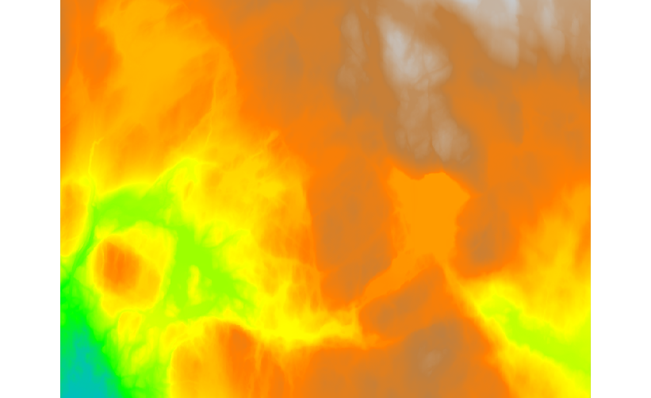
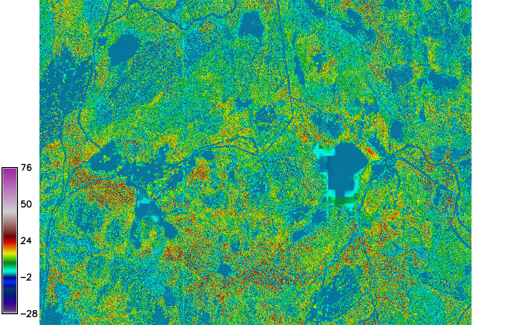

Unit 19 - DSM script parallelization
====================================

This unit is focused on **parallel computing**. Sample script
below produces seamless DSM (Digital Terrain Model, see :doc:`18`)
from bunch of LAS/LAZ files. Computation will be split into tiles and
performed in parallel.

DSM interpolation in parallel
-----------------------------

User interface defines two parameters, :param:`directory` (line
:lcode:`6`) for input directory with input LAS/LAZ files, and
:param:`elevation` (line :lcode:`9`) name for output elevation raster
map mosaics. The resolution of output DSM is defined by
:param:`resolution` parameter (line :lcode:`13`). And finally number
of processes running in parallel will be controlled by :param:`nproc`
(line :lcode:`18`) parameter.

A script consists of three main functions:

1. ``import_files()`` to import input LAS/LAZ files (line
:lcode:`33`). Import process can be performed in parallel by
:pygrass-modules:`ParallelModuleQueue` from PyGRASS library (see
:doc:`11` for PyGRASS introduction), lines :lcode:`37, 42, 54-55, 57`.

2. ``create_dsm_tiles()`` to compute DSM per tile (line :lcode:`64`)
using :grasscmd:`v.surf.rst`. DSM tiles need to be computed with a
reasonable overlap in order to create seamless mosaics, see
:lcode:`70-73`. Tiles can be processed in parallel too, see
:param:`nproc` option on line :lcode:`79`.

3. ``patch_tiles()`` to patch DSM tiles together by
:grasscmd:`r.series`, see :lcode:`83`. From overlapping cell values is
computed an average value. This is main reason why :grasscmd:`r.patch`
is not used here.
  
.. literalinclude:: ../_static/scripts/create-dsm.py
   :language: python
   :linenos:
   :emphasize-lines: 6, 9, 13, 18, 33, 37, 42, 54-55, 57, 64, 70-73, 79, 83

Sample script to download: `create-dsm.py <../_static/scripts/create-dsm.py>`__

.. note::

	The script is taking a long time with all the tiles from
	:file:`lidar` directory. Choose few tiles
	for testing.
	

   
   DSM created from all available tiles.

..   
   .. todo:: update
          
.. _dmt-comparision:

Canopy Height Model
-------------------

In this session we will compute the Canopy Height Model (CHM), as the
difference between interpolated DSM and imported EU-DEM (DTM) from
:doc:`15`.

The CHM is computed using :grasscmd:`r.mapcalc`, executing the difference between
DSM and DTM.

.. code-block:: bash

   r.mapcalc expression="chm = dtm_laz - dem"

   
   The CHM map.

.. task:: Note that DSM created from Lidar data and EU-DEM have
   completely different qualitative characteristics. For a reasonable
   result it would be necessary to substitute DEM from another
   qualitatively similar source like DSM.

