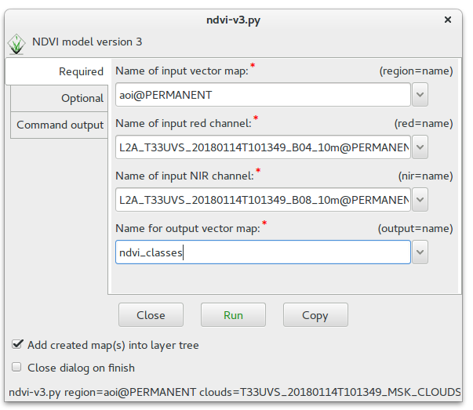

Unit 20 - Sentinel downloader
=============================

There are plenty of libraries or tools which enable downloading
Sentinel products from `Copernicus Open Access Hub
<https://scihub.copernicus.eu/>`__.

One of such tool will be introduced in this unit. For GRASS GIS there
is available :grasscmdaddons:`r.sentinel` Addon extension. It consists
of two GRASS modules:

* :grasscmdaddons:`r.sentinel.download` and
* :grasscmdaddons:`r.sentinel.import`  

Let's install this addon by using :grasscmd:`g.extension` and try it
out (more about installing addons in :ref:`Unit 17
<grass-addons>`). Note that :grasscmdaddons:`r.sentinel.download`
requires also `sentinelsat library
<https://pypi.python.org/pypi/sentinelsat>`__ to be installed.

.. todo:: fix link (GRASS-side) - r.sentinel

.. code-block:: bash

   pip install sentinelsat
   g.extension extension=r.sentinel
  
Let's download suitable Sentinel product for you favorite place and
perform for simplicity NDVI calculation as described in :doc:`05` and
implemented as a Python script in :doc:`12`.

At first we need to define our area of interest. In our case AOI
region will be downloaded from OpenStreetMap database, similarly as we
did for Jena city region in :doc:`02`. Go to http://overpass-turbo.eu,
enter query (:menuselection:`Run`) similar as below and download data
directly (:menuselection:`Export --> Data --> download as GeoJSON`).

.. code:: xml

   (
   relation
   ["boundary"="administrative"]
   ["admin_level"="8"]
   ["name"="Litoměřice"]
   );
   /*added by auto repair*/
   (._;>;);
   /*end of auto repair*/
   out;

Create a new GRASS location in UTM zone of your region. In our case
UTM zone 33N :epsg:`32633`), see :ref:`Unit 18 <create-location-epsg>`
for details.

.. note:: If you are not scared of terminal, you can easily create a
   new location from command line. In example below a new location
   *myregion-sentinel* is created in :file:`/opt/grassdata`.

   .. code-block:: bash
                         
      grass -c EPSG:32633 /opt/grassdata/myregion-sentinel

   GRASS will start with PERMANENT as current mapset.
         
Enter new GRASS session and import our area of interest (see notes
about import in :doc:`03`).

.. code-block:: bash

   v.import input=export.geojson out=aoi

Now we can search for suitable Sentinel products. In our case we will
prefer `Sentinel-2 L2A products
<https://www.sentinel-hub.com/blog/sentinel-2-l2a-products-available-sentinel-hub>`__,
we don't want to compute atmospheric corrections on our own at this
moment. Let's search for latest available product by
:grasscmd:`r.sentinel.download`. At first with ``-l`` flag given, just
to print results, download procedure will be performed later. In order
to search and download Sentinel products, you have to create an user
account in Copernicus Open Access Hub, see manual page of the module
for details.

.. code-block:: bash

   r.sentinel.download -l map=aoi producttype=S2MSI2Ap user=xxx password=xxx 
          
Result of search below.

::

   2 Sentinel product(s) found
   4cfab7d-2a1a-4d60-b8a7-c5e9d74f1bee 2018-01-14T10:13:49Z  5% S2MSI2Ap
   27ad33ac-d3b4-4488-ad25-d2abec035f5d 2018-01-06T10:04:01Z 26% S2MSI2Ap

By default the module returns products for last 60 days. Let's change
search period by ``start`` and ``end`` options. To be sure that our
AOI is fully covered by a Sentinel product we also set
``area_relation`` option. We can also limit products by ``clouds`` coverage
percentage threshold.

.. code-block:: bash
                
   r.sentinel.download -l map=aoi producttype=S2MSI2Ap user=opengeolabs password=sentinel4ogl \
   start=2017-01-01 end=2018-02-05 area_relation=Contains clouds=10

::

   1 Sentinel product(s) found
   a4cfab7d-2a1a-4d60-b8a7-c5e9d74f1bee 2018-01-14T10:13:49Z  5% S2MSI2Ap

.. tip:: If more products have been found you can limit search by
   ``limit`` option.

Let's download desired product(s). Just remove ``-l`` flag and add
``output`` options with path to output directory where data should be
saved.

.. code-block:: bash
                
   r.sentinel.download map=aoi producttype=S2MSI2Ap user=opengeolabs password=sentinel4ogl \
   start=2017-01-01 end=2018-02-05 area_relation=Contains clouds=10 limit=1 output=/opt/geodata/sentinel

When download is successfully finished we can import data by
:grasscmdaddons:`r.sentinel.import`. The command will import **all**
Sentinel bands from ``input`` directory recursively. Sentinel bands to
be imported can be optionally filtered by ``pattern`` option. In
example below only 4th and 8th bands in 10m resolution will be
imported. By default input data are imported into GRASS format,
alternatively data can be linked (see :ref:`Unit 03 <link-external>`) if
``-l`` is given. It's also useful to import cloud mask features by
``-c`` flag.

.. code-block:: bash

   r.sentinel.import -l -c input=/opt/geodata/sentinel pattern="B0[4|8]_10m"
   
Now start our NDVI sample script created in :doc:`12`, enter input
parameters and run.
   

        
   Run NDVI script to compute classes.

.. figure:: ../images/units/20/ndvi-classes-ltm.png
   :class: middle
        
   Resultant NDVI classes for AOI.
