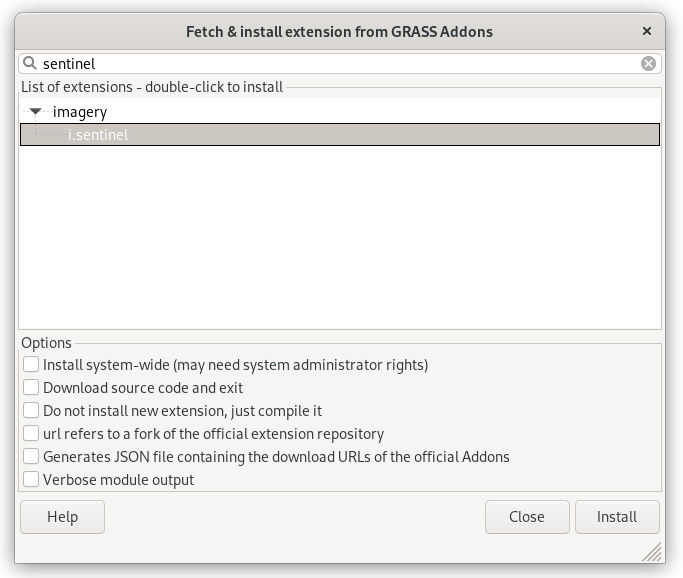
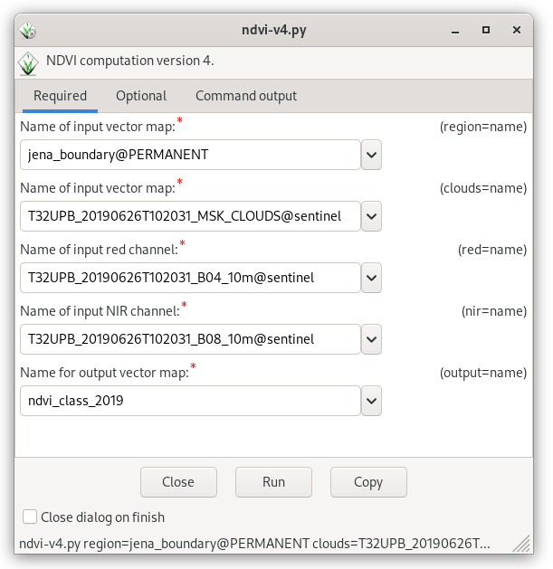

Unit 20 - Sentinel downloader
=============================

There are plenty of libraries or tools which allow downloading
Sentinel products.

For GRASS GIS there is the :grasscmdaddons:`i.sentinel` toolbox.
It consists of six GRASS addon modules:

* :grasscmdaddons:`i.sentinel.coverage`
* :grasscmdaddons:`i.sentinel.download`
* :grasscmdaddons:`i.sentinel.parallel.download`  
* :grasscmdaddons:`i.sentinel.import`
* :grasscmdaddons:`i.sentinel.preproc`
* :grasscmdaddons:`i.sentinel.mask`

The addon can be installed by :grasscmd:`g.extension` or from the main menu
:menuselection:`Settings --> Addons extensions --> Install extension
from addons`.

.. code-block:: bash

   g.extension extension=i.sentinel

   Install :grasscmdaddons:`i.sentinel` GRASS Addon.

.. note:: Note that :grasscmdaddons:`i.sentinel.download` requires
   also `sentinelsat <https://pypi.python.org/pypi/sentinelsat>`__ to
   be installed. It can be easily installed from the :item:`Console`
   tab by entering the command below.
	
   .. code-block:: bash
	
      python3 -m pip install sentinelsat pandas

.. important:: Copernicus Open Access Hub was closed at the end of
   October 2023 (`source
   <https://scihub.copernicus.eu/>`__). Copernicus Sentinel data are
   now available in the Copernicus Data Space Ecosystem (CDSE). **Currently,
   sentinelsat package is not compatible with the new CDSE.** See `sentinelsat Github repository
   <https://github.com/sentinelsat/sentinelsat?tab=readme-ov-file#sentinelsat>`__
   for details. See also related `GRASS issue
   <https://github.com/OSGeo/grass-addons/issues/883>`__ reported on
   GitHub.

:ref:`Switch <switch-location>` to `jena-region` location which was created in :doc:`02`.

Download data
-------------

Let's download suitable Sentinel products for our area of interest
(AOI) and perform the NDVI calculation as described in :doc:`05`
(implemented as a model in :doc:`08` or as a Python script in
:doc:`11`). AOI region is defined by Jena city region created in
:doc:`03`. `Sentinel-2 L2A products
<https://sentinels.copernicus.eu/web/sentinel/user-guides/sentinel-2-msi/product-types/level-2a/>`__
will be used to avoid computing atmospheric corrections.

.. important:: Pre-downloaded Sentinel scenes are available in the
   sample dataset (directory :file:`sentinel/2019`). Readers can
   continue with :ref:`importing sample data <sentinel-import>`.

Let's search for the latest available product by means of
:grasscmdaddons:`i.sentinel.download`. Setting the :param:`-l` flag, the result will only
be printed. The download procedure will be performed later. In order to
search and download Sentinel products from the Copernicus Open Access Hub, 
you have to create an account first. See the manual page of
:grasscmdaddons:`i.sentinel.download` module for details. Create a new text
file :file:`sentinel.txt` containing two lines (username and
password).

.. note::
   To get username and password you need to register at the 
   `Copernicus Open Access Hub <https://scihub.copernicus.eu/>`__,
   see `Register new account <https://scihub.copernicus.eu/dhus/#/self-registration>`__
   page for signing up.

.. code-block:: bash

   i.sentinel.download -l map=jena_boundary producttype=S2MSI2A settings=sentinel.txt

::

   11 Sentinel product(s) found
   37438a05-f795-4e77-b68e-3a3c0ec5f04b ... 2022-01-06T10:23:19Z  4% S2MSI2A 1.08 GB
   b4bc9d3b-1e1a-4cfd-bd01-14c21a596e8a ... 2022-02-05T10:21:19Z 64% S2MSI2A 1.03 GB
   f2a604a6-8e50-4c62-b98b-22077365df7a ... 2022-01-21T10:23:31Z 65% S2MSI2A 933.01 MB
   ...

By default the module returns products for the last 60 days. Let's
change the search period setting :param:`start` and :param:`end`
options. To be sure that our AOI is fully covered by a Sentinel
product we also set :param:`area_relation` option.  We will also limit
products by :param:`clouds` coverage percentage threshold
       
.. code-block:: bash
                
   i.sentinel.download -l map=jena_boundary producttype=S2MSI2A settings=sentinel.txt \
   start=2021-04-01 end=2021-10-01 area_relation=Contains clouds=10

::

   6 Sentinel product(s) found
   a844500a-049f-46a3-92de-bcda2c38fc3c ... 2021-05-31T10:15:59Z  2% S2MSI2A 1.09 GB
   d5b73db9-0acf-401d-9bf4-a6f199df1119 ... 2021-09-08T10:15:59Z  3% S2MSI2A 1.09 GB
   b00d5dfd-9cce-48c6-a011-fd46b85de814 ... 2021-09-03T10:20:21Z  3% S2MSI2A 1.09 GB
   ...

..
   .. tip:: If more products have been found you can limit search by
   :param:`limit` option.

Let's download the desired product(s). Just remove the :param:`-l` flag and
add the :param:`output` option in order to define the path to the output directory
where data should be saved.

.. code-block:: bash

   i.sentinel.download map=jena_boundary producttype=S2MSI2A settings=sentinel.txt \
   start=2021-04-01 end=2021-10-01 area_relation=Contains clouds=10 \
   limit=1 output=geodata/sentinel/2021

.. note:: Note all products are NOT available online. In this case the
   module fails with ``Product
   a844500a-049f-46a3-92de-bcda2c38fc3c is not
   online. Triggering retrieval from long term archive.`` error
   message. Try to download affected product in the next days.

Import data
-----------

.. _sentinel-import:

Before importing or linking Sentinel data try to print a list of
filtered raster files including projection match (second column, 1 for
match otherwise 0). If the CRS of input data differs from the current location
consider reprojection (:param:`-r`) or creating a new location for
import.

Data will be imported into the GRASS location by means of the
:grasscmdaddons:`i.sentinel.import` tool. The command will import
**all** Sentinel bands from :param:`input` directory
recursively. Before importing data let's check content of the input
directory by :param:`-p` flag. The import procedure will be limited to
the 4th and 8th bands in 10m spatial resolution by :param:`pattern`
option.

.. code-block:: bash
 
   i.sentinel.import -p input=geodata/sentinel/2019 pattern="20190626T102031_B0[4|8]_10m"

::

   ...L2A_T32UPB_A020940_20190626T102028/IMG_DATA/R10m/T32UPB_20190626T102031_B08_10m.jp2 1 (EPSG: 32632)
   ...L2A_T32UPB_A020940_20190626T102028/IMG_DATA/R10m/T32UPB_20190626T102031_B04_10m.jp2 1 (EPSG: 32632)

By default, input data are imported into GRASS data format.
Alternatively, data can be linked if :param:`-l` is given. It is also
useful to import cloud mask vector features by :param:`-c` flag. 

.. code-block:: bash

   i.sentinel.import -l -c input=geodata/sentinel/2019 pattern="20190626T102031_B0[4|8]_10m"

.. note:: Cloud mask is computed by
   :grasscmdaddons:`i.sentinel.import`, the module doesn't use cloud
   mask product stored in a SAFE directory.

.. todo:: Fix :grasscmdaddons:`i.sentinel.import` :option:`-c` flag to
          respect :option:`pattern` parameter.
          
Now launch the NDVI sample script created in :doc:`12` (`ndvi-v4.py
<../_static/scripts/ndvi-v4.py>`__) in order to compute NDVI classes.
   

        
   Run script to compute NDVI classes.

.. figure:: ../images/units/20/ndvi-classes.png
   :class: large
        
   Computed NDVI classes for given AOI.
