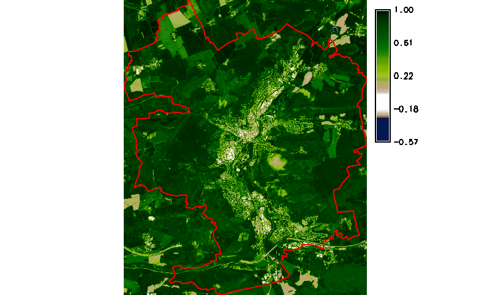
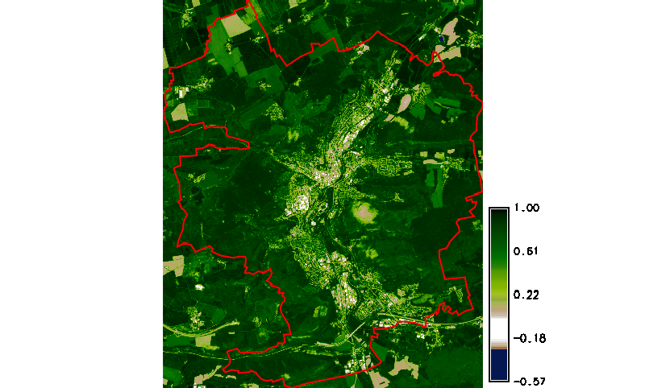

Unit 21 - Sentinel spatio-temporal
==================================

Create a new mapset in *jena-region* location, eg. *sentinel-ndvi*
(:menuselection:`Settings --> GRASS working enviroment --> Create new
mapset`).

Let's download Sentinel L2A products for spring/summer
2019. There are 7 products available as shown below.

.. code-block:: bash
                
   i.sentinel.download -l settings=sentinel.txt map=jena_boundary area_relation=Contains \
   start=2019-04-01 end=2019-10-31 producttype=S2MSI2A clouds=10

::
   
   7 Sentinel product(s) found
   a0ae6f58-4890-4382-bbd8-571874bfc65e 2019-06-26T10:20:31Z  1% S2MSI2A
   caa11e7b-454d-4301-86b9-4c11659cc8a1 2019-04-17T10:20:31Z  3% S2MSI2A
   31ad53f4-146a-41a8-bce6-d9e99dfd7f66 2019-04-22T10:20:29Z  3% S2MSI2A
   e6ecc89f-0a06-498b-9e8d-354d1e8ead4e 2019-10-14T10:20:31Z  5% S2MSI2A
   3fe2df76-019d-4611-8ffb-560683ae4500 2019-08-25T10:20:31Z  6% S2MSI2A
   be91b224-0d6c-45d0-95a5-5cf5743a349e 2019-09-04T10:20:21Z  7% S2MSI2A
   60149bc8-5ab0-4a79-b964-24672739d5b9 2019-04-07T10:20:21Z  9% S2MSI2A

Download selected Sentinel scenes:

.. code-block:: bash
                
   i.sentinel.download settings=sentinel.txt map=jena_boundary area_relation=Contains \
   start=2019-04-01 end=2019-10-31 producttype=S2MSI2A clouds=10 \
   output=geodata/sentinel/2019
   
.. note:: Pre-downloaded Sentinel scenes are available in the sample
   dataset :file:`geodata/sentinel/2019`.

Data can be imported by :grasscmd:`i.sentinel.import` similarly as
done in :doc:`20`. At fisrt check list of bands to be imported by
:param:`-p` flag. Since NDVI is going to be computed only 4th and 8th
band are selected.

.. code-block:: bash

   i.sentinel.import -p input=/home/user/geodata/sentinel/2019 pattern="B0(4|8)_10m"
   
   i.sentinel.import -l -c input=/home/user/geodata/sentinel/2019 pattern="B0(4|8)_10m"

.. note:: In GRASS GIS 7.9 use :option:`register_output` in order to
   create timestamps directly.

   .. code-block:: bash

      i.sentinel.import -l -c input=/home/user/geodata/sentinel/2019 pattern="B0(4|8)_10m" \
      register_output=/home/user/sentinel-timestamps.txt

   Otherwise follow cookbook below. Unfortunately there are no
   timestamps for imported maps required by
   :grasscmd:`t.register`. For this purpose a simple Python script has
   been designed.

   .. literalinclude:: ../_static/scripts/sentinel-timestamp.py
      :language: python
      :linenos:
      :emphasize-lines: 27, 30

   Timestamps can be easily determined from raster map name, for example
   *L2A_T32UPB_A021941_20190904T102045* raster map will be timestamped by
   *2019-09-04 10:20:45*, see line :lcode:`30`.

   Sample script to download: `sentinel-timestamp.py
   <../_static/scripts/sentinel-timestamp.py>`__

   By running this script a timestamp file will be produced.

   .. code-block:: bash

      sentinel-timestamp.py output=sentinel-timestamps.txt

At this moment a new space time dataset can be created by
:grasscmd:`t.create` and all imported Sentinel bands registered by
:grasscmd:`t.register`.

.. code-block:: bash

   t.create output=sentinel title="Sentinel L2A 2019" desc="Jena region"
   t.register input=sentinel file=sentinel-timestamps.txt

Let's check basic metadata (:grasscmd:`t.info`) and list of registered
maps (:grasscmd:`t.rast.list`).

.. code-block:: bash

   t.info input=sentinel

::

   ...
   | Start time:................. 2017-05-06 10:50:31
   | End time:................... 2017-07-05 10:50:32
   ...
   | Number of registered maps:.. 8

.. code-block:: bash

   t.rast.list input=sentinel

::

   name|mapset|start_time|end_time
   L2A_T32VNM_20170506T105031_B04_10m|sentinel-st-ndvi|2017-05-06 10:50:31|2017-05-06 10:50:32
   L2A_T32VNM_20170506T105031_B08_10m|sentinel-st-ndvi|2017-05-06 10:50:31|2017-05-06 10:50:32
   L2A_T32VNM_20170523T104031_B04_10m|sentinel-st-ndvi|2017-05-23 10:40:31|2017-05-23 10:40:32
   
NDVI ST computation
-------------------

For NDVI computation 4th and 8th bands are required (:doc:`05`). Map
algebra is performed in the case of spatio-temporal data by
:grasscmd:`t.rast.mapcalc` which requires data separated into
spatio-temporal datasets (see example in :doc:`22`). Such datasets can
be prepared by :grasscmd:`t.rast.extract`.

.. code-block:: bash

   t.rast.extract input=sentinel where="name like '%B04%'" output=b4
   t.rast.extract input=sentinel where="name like '%B08%'" output=b8

Let's check content of the new datasets by :grasscmd:`t.rast.list`.

.. code-block:: bash

   t.rast.list input=b4
   t.rast.list input=b8

Set computational region by :grasscmd:`g.region` including mask for
area of interest by :grasscmd:`r.mask`.

.. code-block:: bash

   g.region vector=jena_boundary align=T32UPB_20190407T102021_B04_10m
   r.mask vector=jena_boundary

NDVI (see :doc:`05`) computation on spatio-temporal datasets can be
performed in parallel (:param:`nproc`).
          
.. code-block:: bash

   t.rast.mapcalc input=b4,b8 output=ndvi \
   expression="ndvi = float(b8 - b4) / ( b8 + b4 )" \
   basename=ndvi nproc=3

When computation is finished *ndvi* color table can be by
:grasscmd:`t.rast.colors`.

.. code-block:: bash

   t.rast.colors input=ndvi color=ndvi

   Simple NDVI animation (no clouds mask applied) created by
   :grasscmd:`g.gui.animation`.

.. note:: Load data as multiple raster maps instead of space time
          dataset. There is problem with sampling related to trick
          with endtime mentioned above.

Cloud mask
^^^^^^^^^^

The result is not perfect enough. At least cloud mask should be
applied before NDVI computation. This operation can be easily solved
by applying new space time dataset containing computed raster masks. A
sample Python script has been designed for this purpose below. The
script also produces a timestamp file similarly to
:file:`sentinel-timestamp.py`. Such mask can be created by
:grasscmd:`r.mask`, see line :lcode:`30`. But in this case a mask
should be kept for further usage. Note that :grasscmd:`r.mask` module
produces normal raster map with unique name *MASK*. To disable mask it
is enough to rename *MASK* map by :grasscmd:`g.rename`, see line
:lcode:`43`.

.. literalinclude:: ../_static/scripts/sentinel-cloud-mask.py
   :language: python
   :linenos:
   :emphasize-lines: 30, 43

Sample script to download: `sentinel-cloud-mask.py
<../_static/scripts/sentinel-cloud-mask.py>`__
	     
.. code-block:: bash
		
   sentinel-cloud-mask.py map=jena_boundary output=cloud-timestamps.txt

Now we can create a new space time dataset with raster cloud masks
registered.

.. code-block:: bash

   t.create output=clouds title="Sentinel L2A 2019 (clouds)" desc="Jena region"
   t.register input=clouds file=clouds-timestamps.txt

And apply modified expression for map algebra.

.. code-block:: bash

   t.rast.mapcalc input=b4,b8,clouds output=ndvi \
   expression="ndvi = if(isnull(clouds), null(), float(b8 - b4) / ( b8 + b4 ))" \
   basename=ndvi nproc=3

   t.rast.colors in=ndvi color=ndvi

   Simple NDVI animation with clouds mask applied.

   
