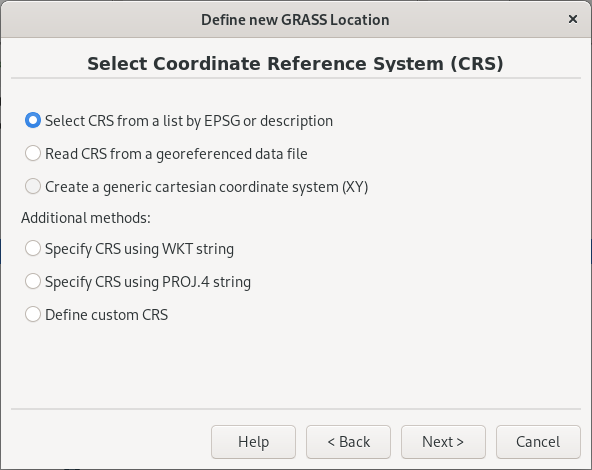

Unit 24 - MODIS
===============

The **Moderate Resolution Imaging Spectroradiometer**
(:wikipedia:`MODIS`) is a 36-channel from visible to thermal-infrared
sensor that was launched as part of the Terra satellite payload in
December 1999 and Aqua satellite in May 2002. The Terra satellite
passes twice a day (at 10:30am and 22:30pm local time), the Aqua
satellite also passes twice a day (at 01:30am and 13:30pm local
time). (source: `GRASS Wiki
<https://grasswiki.osgeo.org/wiki/MODIS>`__)

Our area of interest, Germany, is covered by two MODIS tiles (see
`MODLAND grid
<https://modis-land.gsfc.nasa.gov/MODLAND_grid.html>`__):

* h18v03
* h18v04

MODIS data is provided in 3 projections (Sinusoidal, Lambert Azimuthal
Equal-Area, and Geographic). For our purpose, data will be reprojected
to ETRS89 / LAEA Europe :epsg:`3035`.

.. _create-location-epsg:

Create a new GRASS location *germany-modis* (see :ref:`Unit 02
<create-location>`) using EPSG code (*Select CRS from a list by EPSG
or description*).

   Create a new location based on EPSG code.

.. figure:: ../images/units/24/create-location-epsg-1.png

   Enter EPSG code.

Enter a new GRASS session (PERMANENT mapset) and install
:grasscmdaddons:`i.modis` addons extension (more about installing
addons in :ref:`Unit 17 <grass-addons>`) for downloading and importing
MODIS data (note that you have to install also `pyMODIS Python Library
<http://www.pymodis.org/>`__). Run two commands below in
:item:`Console` tab.

.. code-block:: bash

   python3 -m pip install pymodis
   g.extension extension=i.modis

GRASS MODIS addon consists of two modules:

* :grasscmdaddons:`i.modis.download` and
* :grasscmdaddons:`i.modis.import`

Download data
-------------

.. important:: Pre-downloaded MODIS data (year 2019) is available in the
   sample dataset `jena-sample-data-modis.7z
   <https://geo.fsv.cvut.cz/geoforall/grass-gis-workshop-jena/2022/jena-sample-data-modis.7z>`__
   (1.0GB) :file:`geodata/modis`. Readers can continue with
   :ref:`importing sample data <modis-import>`.

Let's download desired tiles (h18v03 and h18v04) for year 2021 by
:grasscmdaddons:`i.modis.download`. 
  
Land Surface Temperature eight day 1 Km (Terra/Aqua) product will be
downloaded.

.. code-block:: bash

   i.modis.download settings=settings.txt folder=/home/user/geodata/modis/h18v03_04 \
   tiles=h18v03,h18v04 \
   product=lst_aqua_eight_1000,lst_terra_eight_1000 \
   startday=2021-01-01 endday=2021-12-31

.. note:: Output folder (:file:`h18v03_04` in this case) must exists,
   otherwise the module will fail.
             
   File :file:`settings.txt` contains two lines: *username* and
   *password* for accessing MODIS download service.

   Please read `pyModis documentation
   <http://www.pymodis.org/info.html#user-and-password>`__ how to
   register and set up your account.

.. _modis-import:

Import data
-----------
          
Input MODIS data can be imported and reprojected into target location
by :grasscmdaddons:`i.modis.import`.

.. code-block:: bash

   i.modis.import -mw files=/home/user/geodata/modis/h18v03_04/listfileMOD11A2.006.txt \
   spectral='( 1 0 0 0 1 0 0 0 0 0 0 0 )' outfile=tlist-mod.txt

   i.modis.import -mw files=/home/user/geodata/modis/h18v03_04/listfileMYD11A2.006.txt \
   spectral='( 1 0 0 0 1 0 0 0 0 0 0 0 )' outfile=tlist-myd.txt

If ``-m`` flag is given mosaic from input tiles is created
automatically, see :numref:`modis-mosaics`.

.. _modis-mosaics:

.. figure:: ../images/units/24/modis-mosaics.png
   :class: large
        
   Data mosaic created from h18v03 and h18v04 tiles.
   
.. _modis-lst:
   
LST
---

In this section **Land Surface Temperature** (LST) analysis will be
perfmored for Germany. 

Let's start by importing Germany administrative border located in the
sample dataset :file:`osm/germany_boundary.gpkg`.

.. note:: Administrative border of Germany has been downloaded from
   OSM database.
          
   .. code-block:: xml

      (
      relation
      ["boundary"="administrative"]
      ["admin_level"="2"]
      ["name"="Deutschland"]
      );
      /*added by auto repair*/
      (._;>;);
      /*end of auto repair*/
      out;

   .. code-block:: bash

      ogr2ogr -f GPKG germany_boundary.gpkg -a_srs EPSG:4326 -t_srs EPSG:3035 /vsicurl_streaming/"\
      http://overpass-api.de/api/interpreter?data=%28relation%5B%22boundary%22%3D%22\
      administrative%22%5D%5B%22admin%5Flevel%22%3D%222%22%5D%5B%22name%22%3D%22Deutschland\
      %22%5D%3B%29%3B%28%2E%5F%3B%3E%3B%29%3Bout%3B%0A" lines

The input file contains national border represented by linestring, see
:numref:`germany-boundary` left part. Mask can be created only from
area features (polygons). Input data have to be polygonized. This will
be performed by two GRASS operations:

* change line border to *boundary* by :grasscmd:`v.type`
  (in GRASS topological model, an area is composition of boundaries
  and centroid, see :ref:`Unit 03 <vector-topo-section>`)
* add centroid by :grasscmd:`v.centroids`

.. code-block:: bash

   v.type input=germany_boundary output=germany_b from_type=line to_type=boundary
   v.centroids input=germany_b output=germany

.. _germany-boundary:
   
.. figure:: ../images/units/24/germany_line_area.png
   :class: large
        
   Germany national boundary as linestring on left and as polygon
   (area) on right part.

Mask will be created by :grasscmd:`r.mask`. Don't forget that
computational region must be set before creating a mask. Computational
region will be defined by Germany vector map and aligned by the input
MODIS data by :grasscmd:`g.region`.

.. code-block:: bash

   g.region vector=germany align=MOD11A2.A2019001_mosaic_LST_Day_1km
   r.mask vector=germany

Let's check range values of our LST data by :grasscmd:`r.info` module:

.. code-block:: bash

   r.info -r map=MOD11A2.A2019001_mosaic_LST_Day_1km

::

   min=0
   max=14418    

.. _modis-dn-c:
  
In order to determine LST from input data, digital values (DN) must be
converted into Celsius or Kelvin scale.

.. math::

   C = DN * 0.02 - 273.15

Conversion to Celsium scale can be done by :grasscmd:`r.mapcalc` (see
also :doc:`05`). It's also suitable to replace zero values with
no-data value (NULL value in GRASS terminology).

.. code-block:: bash
                
   r.mapcalc expression="MOD11A2.A2019001_mosaic_LST_Day_1km_c = \
   if(MOD11A2.A2019001_mosaic_LST_Day_1km != 0, \
   MOD11A2.A2019001_mosaic_LST_Day_1km * 0.02 - 273.15, null())"

Let's check range values of new LST data layer.

.. code-block:: bash

   r.info -r map=MOD11A2.A2017001_mosaic_LST_Day_1km_celsius

::

   min=-26.65
   max=8.09000000000003

.. figure:: ../images/units/24/lst-c.png
   :class: large
        
   LST reconstruction for Germany in Celsius scale (color table
   ``celsius`` applied).
