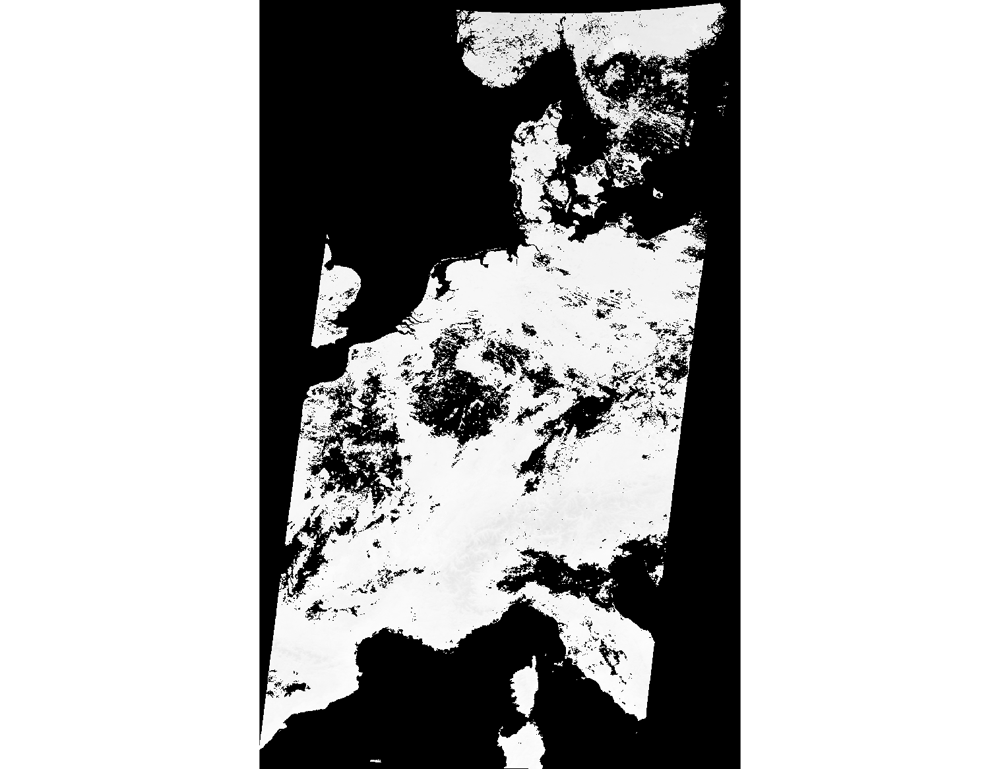

Unit 24 - MODIS
===============

There are two satellites, Aqua and Terra which carry the MODIS sensor
as payload. The **Moderate Resolution Imaging Spectroradiometer**
(:wikipedia-en:`MODIS`) is a 36-channel from visible to
thermal-infrared sensor that was launched as part of the Terra
satellite payload in December 1999 and Aqua satellite (May 2002). The
Terra satellite passes twice a day (at about 10:30am, and 22:30pm
local time), also the Aqua satellite passes twice a day (at about
01:30am, and 13:30pm local time). (source: `GRASS Wiki
<https://grasswiki.osgeo.org/wiki/MODIS>`__)

Our area of interest, Germany, is covered by two tiles (see `MODLAND
grid <https://modis-land.gsfc.nasa.gov/MODLAND_grid.html>`__):

* h18v03
* h18v04

Download and import
-------------------

Data are provided in 3 projections (Sinusoidal, Lambert Azimuthal
Equal-Area, and Geographic). For our purpose, data will be reprojected
to ETRS89 / LAEA Europe :epsg:`3035`.

.. _create-location-epsg:

At first, a new GRASS location need to be created (see :ref:`Unit 02
<create-location>`). It can be easily done by using EPSG code (*Select
EPSG code of spatial reference system*).

.. figure:: ../images/units/24/create-location-epsg-0.svg

   Create a new location based on EPSG code.

.. figure:: ../images/units/24/create-location-epsg-1.png

   Enter EPSG code.

Enter a new GRASS session (PERMANENT mapset) and install
:grasscmdaddons:`i.modis` addons extension (more about installing
addons in :ref:`Unit 17 <grass-addons>`) for downloading and importing
MODIS data (note that you have to install also `pyMODIS Python Library
<http://www.pymodis.org/>`__).

.. code-block:: bash

   pip install pymodis
   g.extension extension=i.modis

GRASS MODIS addon consists of two modules:

* :grasscmdaddons:`i.modis.download` and
* :grasscmdaddons:`i.modis.import`

Let's download desired tiles (h18v03 and h18v04) for year 2017. We are
interested about LST products (both Aqua and Terra satellites).

.. note:: Already downloaded MODIS can be found in sample dataset
   (`download 7z-archive
   <http://geo102.fsv.cvut.cz/geoforall/grass-gis-workshop-jena-2018/jena-sample-data.7z>`__)
   in :file:`modis/h18v03_04` folder. Or alternatively you can use
   GRASS location with imported data
   (:file:`grassdata/germany-modis.tar.gz`) and continue with
   :ref:`LST computation <modis-lst>`.
  
.. code-block:: bash

   i.modis.download settings=settings.txt folder=h18v03_04 tiles=h18v03,h18v04 \
   product=lst_aqua_eight_1000,lst_terra_eight_1000 \
   startday=2019-01-01 endday=2019-12-31

.. note:: Output folder (:file:`h18v03_04` in this case) must exists,
   otherwise the module will fail.
             
   File :file:`settings.txt` contains two lines: *username* and
   *password* for accessing MODIS download service.

Then we can import data including reprojection into our location.

.. _modis-import:

.. code-block:: bash

   i.modis.import -mw files=h18v03_04/listfileMOD11A2.006.txt \
   spectral='( 1 0 0 0 1 0 0 0 0 0 0 0 )' outfile=h18v03_04/tlist-mod.txt

   i.modis.import -mw files=h18v03_04/listfileMYD11A2.006.txt \
   spectral='( 1 0 0 0 1 0 0 0 0 0 0 0 )' outfile=h18v03_04/tlist-myd.txt

If ``-m`` flag is given, the import tool creates mosaics from tiles
automatically, see :numref:`modis-mosaics`.

.. _modis-mosaics:

        
   Final mosaics created from h18v03 and h18v04 tiles.

.. _modis-lst:
   
LST
---

In this section we will perform **Land Surface Temperature** (LST)
analysis in Germany region. At first we will import layer with Germany
administrative border. This data can be found in sample datasets
(`download 7z-archive
<http://geo102.fsv.cvut.cz/geoforall/grass-gis-workshop-jena-2018/jena-sample-data.7z>`__):
:file:`osm/germany_boundary.gpkg`.

.. note:: Administrative border of Germany has been downloaded from
   OSM database.
          
   .. code-block:: xml

      (
      relation
      ["boundary"="administrative"]
      ["admin_level"="2"]
      ["name"="Deutschland"]
      );
      /*added by auto repair*/
      (._;>;);
      /*end of auto repair*/
      out;

   .. code-block:: bash

      ogr2ogr -f GPKG germany_boundary.gpkg -a_srs EPSG:4326 -t_srs EPSG:3035 /vsicurl_streaming/"\
      http://overpass-api.de/api/interpreter?data=%28relation%5B%22boundary%22%3D%22\
      administrative%22%5D%5B%22admin%5Flevel%22%3D%222%22%5D%5B%22name%22%3D%22Deutschland\
      %22%5D%3B%29%3B%28%2E%5F%3B%3E%3B%29%3Bout%3B%0A" lines

Let's import the boundary of Germany into our mapset. The input file
contains national border represented by linestring, see
:numref:`germany-boundary` left part. It's complication since a mask
can be set only from areal features (polygons). We need to polygonize
input data. This will be performed by two GRASS operations:

* change line border to *boundary* by :grasscmd:`v.type`
  (in GRASS topological model, an area is composition of boundaries
  and centroid, see :ref:`Unit 03 <grass-topo>`)
* add centroid by :grasscmd:`v.centroids`

.. code-block:: bash

   v.type input=germany output=germany_b from_type=line to_type=boundary
   v.centroids input=germany_b output=germany_boundary

.. _germany-boundary:
   
.. figure:: ../images/units/24/germany_line_area.png
   :class: middle
        
   Germany national boundary as linestring on left and as polygon
   (area) on right part.

Now we can create a desired mask (:grasscmd:`r.mask`). Don't forget
that a mask is created in the current computation region. First you
set computation extent based on Germany vector map and than align
computation grid to input data by :grasscmd:`g.region`.

.. code-block:: bash

   g.region vector=germany_boundary align=MOD11A2.A2017001_mosaic_LST_Day_1km
   r.mask vector=germany_boundary

Let's check range values of our LST data (by :grasscmd:`r.info` module
or from Layer Manager, see :ref:`Unit 03 <raster-metadata>`).

.. code-block:: bash

   r.info -r map=MOD11A2.A2017001_mosaic_LST_Day_1km

::

  min=0
  max=14411    

.. _modis-dn-c:
  
The values do not appear to be temperature. In order to determine LST
from input data, digital values (DN) must be converted into Celsius or
Kelvin scale.

.. math::

   C = DN * 0.02 - 273.15

Conversion to Celsium scale can be done by :grasscmd:`r.mapcalc` (see
:doc:`05` for basic information about map algebra in GRASS). It's also
suitable to replace zero values with no-data value (NULL values in
GRASS terminology).

Example (replace :map:`tile` with real map name):
   
.. code-block:: bash
                
   r.mapcalc expression="tile_c = if(tile != 0, tile * 0.02 - 273.15, null())"

.. figure:: ../images/units/24/lst-c.png
   :class: middle
        
   LST reconstruction for Germany in Celsius scale (color table
   ``celsius`` applied).
