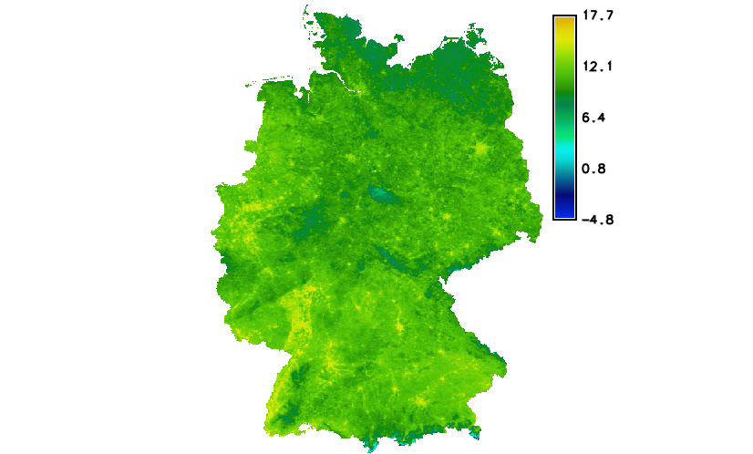
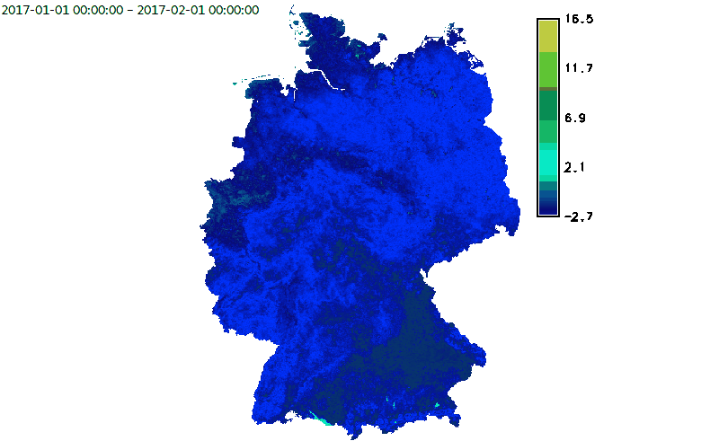

Unit 25 - MODIS ST
==================

In this unit time-series computation based LST reconstruction will be
performed.

In :doc:`24` the input MODIS data has been :ref:`imported
<modis-import>` into GRASS by :grasscmdaddons:`i.modis.import`. The
command was called with :param:`-w` flag and :param:`outfile`
parameter to generate timestamp file which can be later used for
creating space-time raster dataset (strds).

Creation of space time dataset including basic operations is explained
in :doc:`17`.

A new space time raster datasets is created by :grasscmd:`t.create`.

.. code-block:: bash

   t.create output=modis title="MODIS 2019" desc="MODIS data for Germany"

In the next step imported MODIS data is registered into space time
dataset by :grasscmd:`t.register`. The command needs to be run
twice, once for Aqua data than for Terra data.

.. code-block:: bash
                
   t.register input=modis file=tlist-mod.txt
   t.register input=modis file=tlist-myd.txt

Let's check basic metedata about created dataset by
:grasscmd:`t.info`.

.. code-block:: bash

   t.info input=modis

::

   ...
   | Start time:................. 2019-01-01 00:00:00
   | End time:................... 2020-01-04 00:00:00
   ...
   | Number of registered maps:.. 184

.. _t-register-file:
   
.. note:: See granularity. In this case a composed product from the
   daily 1-kilometer LST product (MOD11A1/MYD11A1) stored on a 1-km
   Sinusoidal grid as the average values of clear-sky LSTs during an
   8-day period is used.

   ::
      
      MOD11A2.A2019297_mosaic_LST_Day_1km|2019-10-24|2019-11-01

.. todo     
   It is possible to see our spatio-temporal dataset also graphically
   using :grasscmd:`g.gui.timeline` (:menuselection:`Temporal --> GUI
   tools --> Timeline tool`).

   .. figure:: ../images/units/21/timeline.png
   :class: large

   Download MODIS data presented by Timeline tool.
      
Data querying
-------------

List of registered raster maps in spatio-temporal dataset can be
printed by :grasscmd:`t.rast.list`. Here only relevant data from March
2019 will be listed.

.. code-block:: bash
                
   t.rast.list input=modis order=start_time \
   where="start_time > '2019-03-01' and start_time < '2019-04-01'"

In the next example only raster maps coming from Aqua satellite are
printed.

.. code-block:: bash

   t.rast.list input=modis order=start_time where="name LIKE 'MYD%'"

Univariate statistics can be calculated by :grasscmd:`t.rast.univar`.
In example below statistics only for March 2019 is calculated. Note
that the command is running in the current computation region
similarly as :grasscmd:`r.univar` does.

.. code-block:: bash
                
   t.rast.univar input=modis where="start_time > '2019-03-01' and start_time < '2019-04-01'"

::
   
   id|start|end|mean|min|max|mean_of_abs|stddev|variance|coeff_var|sum|null_cells|cells
   ...|2019-03-06 00:00:00|2019-03-14 00:00:00|11127.9119722696|0|14548|11127.9119722696|...

Data extracting
---------------

Raster spatio-temporal data can be extracted into new dataset using
:grasscmd:`t.rast.extract`. In the example below are created four new
datasets containing data of different satellite and datetime.

.. code-block:: bash

   t.rast.extract input=modis where="name LIKE 'MOD%LST_Day_1km'" output=modis_terra_day
   t.rast.extract input=modis where="name LIKE 'MOD%LST_Night_1km'" output=modis_terra_night
   t.rast.extract input=modis where="name LIKE 'MYD%LST_Day_1km'" output=modis_aqua_day
   t.rast.extract input=modis where="name LIKE 'MYD%LST_Night_1km'" output=modis_aqua_night

.. code-block:: bash

   t.info input=modis_terra_day

Map algebra
-----------

Digital numbers (DN) need to be converted into Celsius scale
similarly as done in :ref:`Unit 24 <modis-dn-c>`. Instead of running
:grasscmd:`r.mapcalc` repeatedly there is a specialized temporal
command :grasscmd:`t.rast.mapcalc` which applies map algebra to all
the maps registered in input space time dataset.

.. tip::
   Many temporal data processing modules (``t.*``) support
   parallelization (see :param:`nproc` option).

.. code-block:: bash
      
   t.rast.mapcalc input=modis output=modis_c nproc=3 basename=c \
   expression="if(modis != 0, modis * 0.02 - 273.15, null())"

The command will create a new space time raster dataset with raster
maps in Celsius scale. Since new raster maps will be created, the
command requires to define :param:`basename` for them. Note that new
raster maps will be produced in the current computation region with mask
respected.

.. code-block:: bash

   t.rast.univar input=modis_c where="start_time > '2019-03-01' and start_time < '2019-04-01'"

::
   
   id|start|end|mean|min|max|mean_of_abs|stddev|variance|coeff_var|sum|null_cells|cells
   c_033@PERMANENT|2019-03-06 00:00:00|2019-03-14 00:00:00|8.38271624724276|-20.35|17.81|...

Color table for all the maps in a space time raster dataset can be
easily set by :grasscmd:`t.rast.colors` similarly as
:grasscmd:`r.colors` does for a single raster map.

.. code-block:: bash

   t.rast.colors input=modis_c color=celsius 

Data aggregation
----------------

The temporal framework enables the user to perform data aggregation in
a really simple way. The command to be used is
:grasscmd:`t.rast.aggregate`. Based on specified :param:`granularity`
a new temporal dataset with aggregated data is created.

.. code-block:: bash
                          
   t.rast.aggregate input=modis_c output=modis_cm basename=cm granularity="1 months" nproc=3

Statistics can be computed by :grasscmd:`t.rast.univar`.

.. code-block:: bash
                
   t.rast.univar modis_cm

Example for July and August only.

.. code-block:: bash

   t.rast.univar modis_cm where="start_time > '2019-07-01' and start_time < '2019-09-01'"

Data extraction
---------------

A new space time dataset only with subset of data can be created by
:grasscmd:`t.rast.extract`. Example for the four seasons below.

.. code-block:: bash
                          
   t.rast.extract input=modis_c where="start_time > '2019-03-01' and start_time < '2019-06-01'" \
   output=modis_spring

   t.rast.extract input=modis_c where="start_time > '2019-06-01' and start_time < '2019-09-01'" \
   output=modis_summer
                
   t.rast.extract input=modis_c where="start_time > '2019-09-01' and start_time < '2019-12-01'" \
   output=modis_autumn
                
   t.rast.extract input=modis_c where="start_time > '2019-12-01' or start_time < '2019-03-01'" \
   output=modis_winter

Another aggregation method is based on :grasscmd:`t.rast.series`, it
allows to aggregate space time raster dataset or part of it by various
methods. The module returns a single raster map as output. In example
below average temperature for each seasons will be computed.

.. code-block:: bash
                
   t.rast.series input=modis_spring output=modis_spring_avg method=average
   t.rast.series input=modis_summer output=modis_summer_avg method=average
   t.rast.series input=modis_autumn output=modis_autumn_avg method=average
   t.rast.series input=modis_winter output=modis_winter_avg method=average

Univariate statistics of created raster map with average temperature
values can be calculated by :grasscmd:`r.univar`.
   
.. code-block:: bash

   r.univar modis_spring_avg

::

   minimum: -3.51545
   maximum: 17.6643
   range: 21.1797
   mean: 10.7001

           
   Average temperature for spring 2019.

Data visualization
------------------

In addition to :grasscmd:`g.gui.timeline` introduced in :doc:`17`
there are other two GRASS tools for temporal data visualization:
:grasscmd:`g.gui.animation` (:menuselection:`Temporal --> GUI tools
--> Animation tool`) and :grasscmd:`g.gui.tplot`
(:menuselection:`Temporal --> GUI tools --> Temporal plot tool`).

Tool :grasscmd:`g.gui.animation` allows creating animations in
different formats, the example below showing the monthly average
values.

.. code-block:: bash

   g.gui.animation strds=modis_cm

   Monthly average dataset animation with celsius color table applied.

The second tool, :grasscmd:`g.gui.tplot`, allows plotting the time
series of defined variable of interest for a specific point or area of
a study region. In example below coordinates of Jena venue
are used.

.. code-block:: bash

   g.gui.tplot strds=modis_c coordinates=4432436.61,3091484.74

.. todo                
   .. figure:: ../images/units/22/tplot_modis.png
   :class: middle

   The plot of MODIS monthly average temperature @ Studenterhytta
