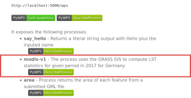

Unit 27 - PyWPS intro
=====================

`PyWPS <http://pywps.org>`__ is a server side implementation of the
`OGC Web Processing Service
<http://www.opengeospatial.org/standards/wps>`__ (OGC WPS) standard
implemented in the Python programming language.

**OGC Web Processing Service** standard provides rules for
standardizing inputs and outputs (requests and responses) for
geospatial processing services. The standard also defines how a client
can request the execution of a process, and how the output from the
process is handled. It defines an interface that facilitates the
publishing of geospatial processes and clients discovery of and
binding to those processes. The data required by the WPS can be
delivered across a network or they can be available at the
server. (source: `PyWPS documentation
<http://pywps.readthedocs.io/en/master/wps.html>`__)

This unit shows how to write your own WPS processes. The processes
will be tested in simple environment of `PyWPS demo
<https://github.com/geopython/pywps-flask>`__. `Download
<https://github.com/geopython/pywps-flask/archive/master.zip>`__ the
demo and extract into your working directory.

Install PyWPS and Flask dependency

.. code-block:: bash

   sudo pip3 install pywps flask

Go to :file:`pywps-flask` directory and start PyWPS demo server

.. code-block:: bash

   python3 demo.py

Open http://127.0.0.1:5000 in order to see all available WPS demo
processes. Let's request process description of selected process,
eg. *say_hello* process. Try to run the process by ``execute``
request.

http://localhost:5000/wps?request=Execute&service=WPS&identifier=say_hello&version=1.0.0&datainputs=name=Martin

Example of response:

.. code-block:: xml

   <wps:LiteralData uom="urn:ogc:def:uom:OGC:1.0:unity" dataType="string">
   Hello Martin
   </wps:LiteralData>
                
Let's continue with creating our own WPS process.

MODIS process
-------------

Go to :file:`pywps-flask/processes` directory and create a new process
(:file:`grassbuffer.py` can be used as a template). Example of process
below is based on the script created in :doc:`26`. Let's focus on
important parts.

Process itself is defined as a Python class, :class:`ModisV1` in this
case (line :lcode:`7`). In class constructor input (lines :lcode:`9`
and :lcode:`11`) and output parameters (line :lcode:`14`) are
defined. Every process has its identifier (line :lcode:`20`), title
and abstract. The process will operate in GRASS location defined on
line :lcode:`30`. On line :lcode:`61` is assumed that space time LST
dataset is located in PERMANENT, see :doc:`25`. For each job (executed
process by a client) PyWPS creates in this location a temporary mapset
which is deleted when process is finished. Process body is implemented
as ``_handler()`` method, see line :lcode:`40`. Resultant statistics
is stored to response output as a simple string on line :lcode:`80`.

.. literalinclude:: ../_static/scripts/modis_v1.py
   :language: python
   :linenos:
   :emphasize-lines: 7, 9, 11, 14, 20, 30, 40, 61, 80

Sample process to download: `modis_v1.py
<../_static/scripts/modis_v1.py>`__

.. _process-import:

The process has to be activated in :file:`demo.py`.

.. code-block:: python

   ...
   from processes.modis_v1 import ModisV1
   ...

   processes = [
    ...
    ModisV1(),
   ]

Stop running demo PyWPS server by :kbd:`Ctrl+C` and start again.

.. code-block:: bash

                
   python ./demo.py

You should see your ``modis-v1`` process in the list. Click on
``DescribeProcess`` to check input and outputs parameters description.

   Process modis-v1 available on PyWPS demo server.

.. important:: In order to use GRASS GIS functionality update PyWPS
   configuration. Open :file:`pywps.cfg` and set correct GRASS
   installation directory, eg.

   .. code-block:: bash
                   
      gisbase=/usr/lib/grass79

Now execute the process:

http://localhost:5000/wps?request=Execute&service=WPS&identifier=modis-v1&version=1.0.0&datainputs=start=2019-03-01;end=2019-04-01

Example of response:

.. code-block:: xml

   <wps:LiteralData dataType="string">
   Min: -8.3;Max: 12.6;Mean: 7.3
   </wps:LiteralData>

.. tip:: When something goes wrong, check :file:`logs/pywps.log` for
   details.

Try to improve process in order to return something more reasonable
than a string, eg. :wikipedia:`JSON`.
