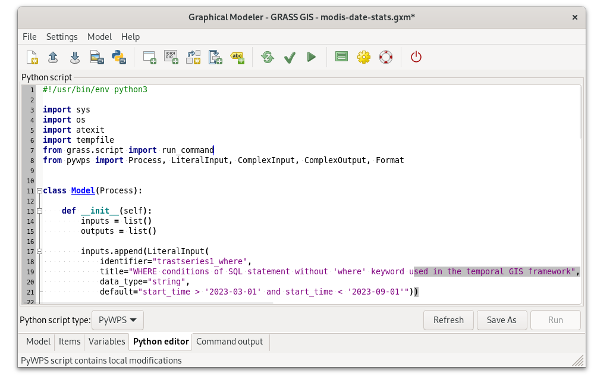

Unit 27 - PyWPS intro
=====================

`PyWPS <http://pywps.org>`__ is a server side implementation of the
`OGC Web Processing Service
<http://www.opengeospatial.org/standards/wps>`__ (OGC WPS) standard
implemented in the Python programming language.

           
   Server-client architecture.

   OGC Web Map Service example.

   
**OGC Web Processing Service** standard provides rules for
standardizing inputs and outputs (requests and responses) for
geospatial processing services. The standard also defines how a client
can request the execution of a process, and how the output from the
process is handled. It defines an interface that facilitates the
publishing of geospatial processes and clients discovery of and
binding to those processes. The data required by the WPS can be
delivered across a network or they can be available at the
server. (source: `PyWPS documentation
<http://pywps.readthedocs.io/en/master/wps.html>`__)

   OGC Web Processing Service example.

This unit shows how to write your own WPS processes. The processes
will be tested in `PyWPS demo
<https://github.com/geopython/pywps-flask>`__ environment.

.. important:: `Download PyWPS demo
   <https://github.com/geopython/pywps-flask/archive/master.zip>`__
   and extract into your working directory.

In GRASS terminal install PyWPS and its dependecies:

.. code-block:: bash

   python3 -m pip install flask==1.1.4 werkzeug==1.0.1 pywps==4.2.11 markupsafe==2.0.1

Go to :file:`pywps-flask-master` directory (by :program:`cd` command)
and start PyWPS demo server:

.. code-block:: bash

   python3 demo.py

   
   Launch PyWPS demo service from GRASS terminal.

Open http://127.0.0.1:5000 in order to see all available WPS demo
processes. Let's request process description of selected process,
eg. *say_hello* process. Try to run the process by ``execute``
request.

http://localhost:5000/wps?request=Execute&service=WPS&identifier=say_hello&version=1.0.0&datainputs=name=Martin

Example of response:

.. code-block:: xml

   <wps:LiteralData uom="urn:ogc:def:uom:OGC:1.0:unity" dataType="string">
   Hello Martin
   </wps:LiteralData>
                
Let's continue with creating our own WPS process.

MODIS process
-------------

Let's create a new process based on the model created in :doc:`26`. In
Graphical Modeler go :item:`Python editor` tab and switch Python
script type to :item:`PyWPS`. Generated process store (:item:`Save
As`) in :file:`pywps-flask-master/processes` directory.

   
   Export model as PyWPS process.

.. note:: Avoid dashes in the Python filename, use eg. :file:`modis_v1.py`.

In the next step, we will enhance the PyWPS process similar to the
Python script in :doc:`26`:

1. The option :param:`where` will be split into two options
   (:lcode:`20-23,58-60`): :param:`start` - Start date and
   :param:`end` - End date.

2. New :param:`output` parameter is defined (:lcode:`25-26`).

3. New function ``check_date()`` to validate input dates will be added
   (:lcode:`5,43-46,48-49`).

4. Output of :grasscmd:`r.univar` will be parsed and statistics
   printed (:lcode:`4,64,71,73-77`).

5. The ``Model`` class (too generic name) is renamed to ``ModisV1``
   (:lcode:`12,28,85`).
   
.. literalinclude:: ../_static/scripts/modis_v1.py
   :language: python
   :emphasize-lines: 3-5,8,9,12,15,20-23,25-26,28,30,43-46,48-49,58-60,64,71,73-77,77,85

Source code comments: process itself is defined as a Python class,
:class:`ModisV1` in this case (line :lcode:`12`). In class constructor
input (lines :lcode:`20-23`) and output parameters (line
:lcode:`25-26`) are defined. Every process has its identifier (line
:lcode:`30`), title and abstract. The process will operate in GRASS
project defined on line :lcode:`35`. On line :lcode:`53` is assumed
that space time LST dataset is located in PERMANENT, see
:doc:`25`. For each job (executed process by a client) PyWPS creates
in this project a temporary mapset which is deleted when process is
finished. Process body is implemented as ``_handler()`` method, see
line :lcode:`42`. Resultant statistics is stored to response output as
a simple string on line :lcode:`77`.

Sample process to download: `modis_v1.py
<../_static/scripts/modis_v1.py>`__

.. _process-import:

The process has to be activated in :file:`demo.py`.

.. code-block:: python

   ...
   from processes.modis_v1 import ModisV1
   ...

   processes = [
    ...
    ModisV1(),
   ]

.. note:: In the case that PyWPS is not launched from a GRASS session
   the PyWPS configuration needs to be adjusted. Open
   :file:`pywps.cfg` and define GRASS installation directory (may be
   printed by ``GISBASE`` environmental variable from a GRASS session).

Now stop running demo PyWPS server by :kbd:`Ctrl+C` and start again to
reflect changes we have done.

.. code-block:: bash

   python3 ./demo.py

You should see your ``modis-v1`` process in the list. Click on
``DescribeProcess`` to check input and outputs parameters description.

   Process modis-v1 available on PyWPS demo server.

Now execute the process:

http://localhost:5000/wps?request=Execute&service=WPS&identifier=modis-v1&version=1.0.0&datainputs=start=2023-03-01;end=2023-04-01

Example of response:

.. code-block:: xml

   <wps:LiteralData dataType="string">Min: -10.6;Max: 11.5;Mean: 3.7</wps:LiteralData>

.. tip:: When something goes wrong, check :file:`logs/pywps.log` for
   details.

.. task:: Try to improve the process in order to return something more
   reasonable than a string, eg. :wikipedia:`JSON`.
