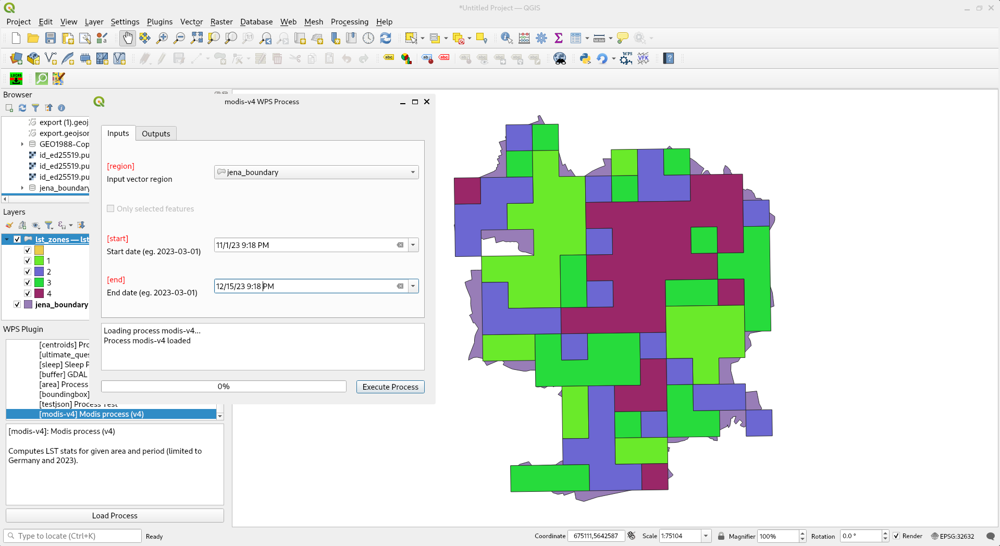

Unit 30 - PyWPS LST region zones
================================

A last (fourth) version of the process will return for input region
and dates, LST zones in vector format (:wikipedia:`GML`), see line
:lcode:`17`.  Zones are defined on line :lcode:`83` by
:grasscmd:`r.recode`. Raster classes are convert to vector by
:grasscmd:`r.to.vect` on line :lcode:`96`. Finally vector classes are
exported into GML format on line :lcode:`102` by
:grasscmd:`v.out.ogr`.

.. literalinclude:: ../_static/scripts/modis_v4.py
   :language: python
   :linenos:
   :emphasize-lines: 17, 83, 96, 102

Sample process to download: `modis_v4.py
<../_static/scripts/modis_v4.py>`__
      
Do not forget to import process as done in :ref:`Unit 27
<process-import>` and restart demo PyWPS server.

Execute process:
      
http://localhost:5000/wps?request=Execute&service=WPS&identifier=modis-v4&version=1.0.0&datainputs=start=2019-03-01;end=2019-04-01;region=@xlink:href=http://localhost:5000/static/data/jena_boundary.gpkg

.. todo:: PyWPS fails with segmentation fault
          
Compare with (output return as reference):

http://localhost:5000/wps?request=Execute&service=WPS&identifier=modis-v4&version=1.0.0&datainputs=start=2019-03-01;end=2019-04-01;region=@xlink:href=http://localhost:5000/static/data/jena_boundary.gpkg&responsedocument=zones=@asReference=true

           
   Example of WPS process consumption in QGIS using WPS client plugin.

**It is the end (of the workshop), enjoy GRASS GIS, PyWPS (and your real life)! :-)**
